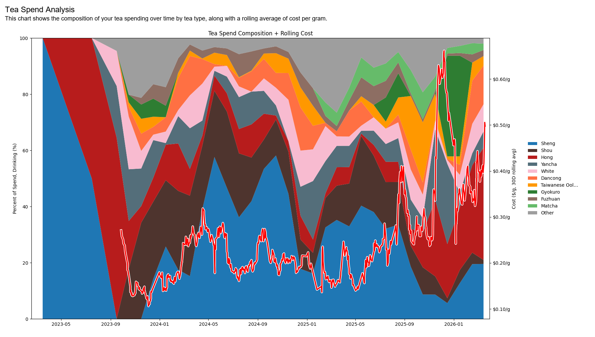

## Ratea MK2

Note: Please use the [develop](https://github.com/Rexwang8/ratea/tree/develop) branch if you want the latest, potentially broken features. Please use [main](https://github.com/Rexwang8/ratea/tree/main) branch otherwise.

Different from mk1

Attempts to track tea purchases and reviews. Can be used to generate charts.

Python 3.10+ (sorry)


## Installation

Install the required dependencies using:

```bash
pip install -r requirements.txt
```


## Run

Run with:

```

cd ratea
python src/main.py

```
*not `python ratea/src/main.py` for now, will fix later

Let me know if you can't start the application or if something displays really weirdly.

Only tested on windows 10.

Configs in `./ratea/src/config.py` 

Set UI_SCALE to 2 for 4k monitor, to 1 or 1.5 for normal monitors.


## Charting

Can also make some charts, mainly running off of pyplot.

Example:




## (Experimental) Teadb support

Teadb support works by spoofing a firefox client request and pretending to be a browser.

For this to work, you need an active teadb account token. You can get this token by going to my.teadb.org, clicking on inspect element, Console, and typing in 'localStorage'. Copy that string into the Config variable under src/config.py .

After that, you will want to update the teadb_mapping.json by manually executing `ingest_teadb_data.py` after deleting the old file, which will produce a new `teadb_raw_data.json` and `teadb_mapping.json`. This tells ratea which teas map to what remotely.

You can mess around with the code and exact mapping settings. I intend to flesh out the configs more later.

If everything works properly, you should be able to select a review in ratea then at the top bar, click "Export review to Teadb". You should see something like this.

```
Uploading review for tea_name=Wild ZSXZ Blue can to TeaDB...
No match found for 'wild zsxz blue can jundetea 2026'
Tea not found in TeaDB: Wild ZSXZ Blue can by JundeTea (2026). Please check manually if exists. (debug) fallback to w2t 2021 hot brandy tea_id and vintage_id for now, but this will need to be fixed for other teas.
Adding custom tea...
Status: 201
Created tea: {'message': 'Vintage 2026 added to existing tea "Wild ZSXZ Blue can"', 'tea': {'id': 4688, 'name': 'Wild ZSXZ Blue can', 'type': 'black', 'origin': 'China', 'tea_year': None, 'tea_producer': 'JundeTea', 'producer_id': 790, 'vendor_id': 344, 'status': 'custom', 'created_by': 248, 'created_by_user_id': 248, 'approved_by': None, 'approved_at': None, 'created_at': '2026-04-11 02:54:45', 'producer': {'id': 790, 'name': 'JundeTea', 'website': None, 'location': None}, 'vendor': {'id': 344, 'vendor_name': 'JundeTea', 'vendor_website': None, 'vendor_location': None}, 'vintage_id': 34879, 'vintage_year': '2026', 'year': '2026'}, 'is_existing_tea': True}
POST /sessions succeeded: 201
Session created successfully: {'message': 'Tasting session created successfully', 'session': {'id': 9232, 'user_id': 248, 'tea_id': 4688, 'vintage_id': 34879, 'vendor_id': None, 'session_timezone_offset': None, 'rating': 6, 'leaf_quality': None, 'sweet_intensity': 0, 'bitter_intensity': 0, 'astringency_intensity': 0, 'sour_intensity': 0, 'umami_intensity': 0, 'texture': None, 'cooling_warming': None, 'energy': None, 'body_expansion': None, 'brewing_method': 'Gongfu', 'brewing_method_other': '', 'vessel_size': 100, 'grams_used': '5.0', 'water_temp_f': 212, 'steep_time_seconds': 15, 'taste_intensities': {'sweet': 0, 'bitter': 0, 'astringency': 0, 'sour': 0, 'umami': 0}, 'flavors': [], 'notes': "JundeTea Wild Zhengshan Xiaozhong Yecha Hong\n5g 100ml gaiwan\n15, 25, 45, 75, 120, 600\n\nsmall leaf, very savory, cerealy smell, 'white sugar' as sky puts it.\n\nSurprisingly not heavy in flavor. Might try to push a touch. \n\nClear white sugar, creamy &#(;for a hong&#);, sweet, slightly grippy. Hint of wild/purple character but overall very light on that front. Junde house note of dried fruits and wood presenting pretty light as well. \n\nHarder push brings out more flavor, more wild character, more fruity notes, and is very enjoyable imo.\n\nTheres a faint bit of tomato vine sneaking up in later steeps. It doesn't really detract from the overall session but is noticable.\n\nWas expecting strong purple/bitter and got an almost dessert hong. Interesting stuff! presence of ZST qianchu puts strong competiton on the grade, so im gonna have to go with B+ instead of A-\n\nB+", 'tags': [], 'is_published': 1, 'likes_enabled': True, 'comments_enabled': True, 'created_at': '2026-04-11 03:04:01Z', 'session_date': '2026-04-10T00:00:00Z', 'tea': {'id': 4688, 'name': 'Wild ZSXZ Blue can', 'type': 'black', 'origin': 'China', 'tea_producer': 'JundeTea', 'tea_year': '2026'}, 'vintage': {'id': 34879, 'year': '2026', 'notes': None}}}
Session created for user: 248, tea_id: 4688, vintage_id: 34879, tea_name: unknown
```


Hobby project started late 2025

If you see any problems you should fix it and PR it. 

If you are complaining, inshallah they will find you.