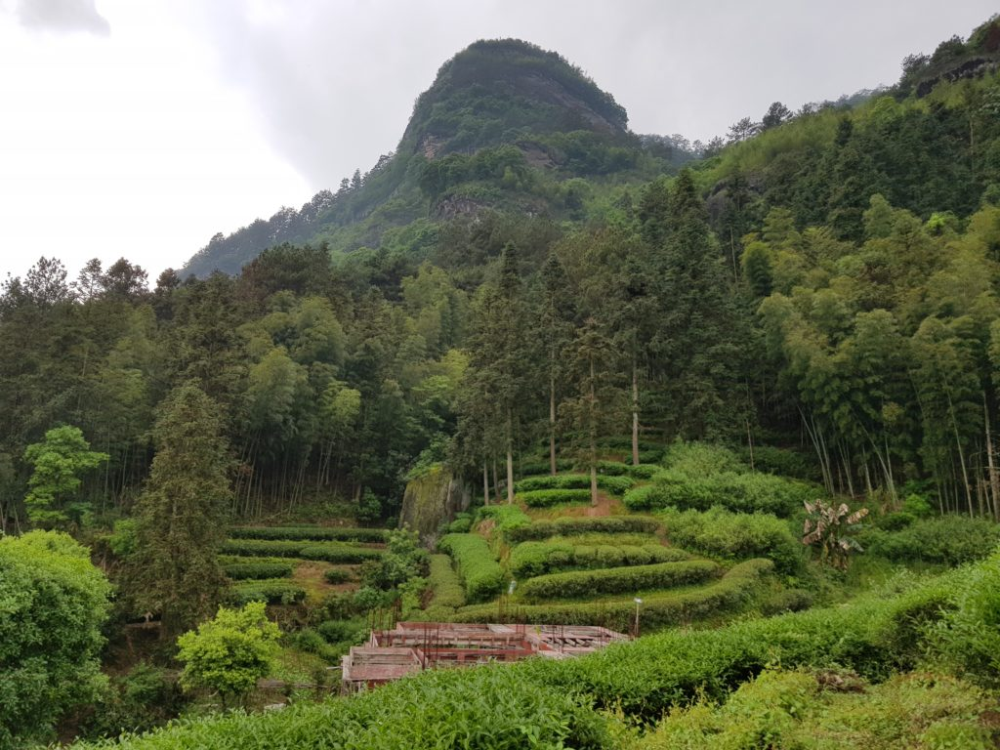

# Wuyishan

https://marshaln.com/2019/04/wuyishan/

*April 29, 2019*

---

Last time I was here in Wuyishan was about twenty years ago. I had only just started drinking tea more seriously back then, and it was also a much calmer place than now. This time, I know a little more about tea, and the place is a lot busier—it's like a giant tea mall now, with almost every single shop in town selling yancha of some kind.

On some level, most tea-producing regions are the same in East Asia. They mostly work on a small-farmer model, where individual farmers have small holdings of land with limited production capacity. Calling them "plantations" would, for the most part, be a misnomer. These are family-held farms, and most people here produce tea for their own sales.

This is, however, also a big tourist attraction because of its natural beauty, so there are a fair number of stores in town that have nothing to do with any farm. Their trade is the tourist one, and they're here to make money selling people tea. Well, everyone's here to make money selling tea, but in these cases they're traders. There's nothing wrong with that, although, as per the Longjing rule, one ought to remember that just because someone's in the production area, it doesn't mean they're making tea or have direct access to it.

I'm here to do research for my project. Thankfully, I have some contacts through friends, and I've been able to visit tea farms and factories. Like I said, some things are about the same no matter what tea region you're in. The Wuyishan area, though, has some unique properties.

---

## Understanding Wuyi Tea Regions

Wuyi tea is divided roughly into three areas:

1. **Zhengyan (正岩)** — "Proper rock" tea.
2. **Banyan (半岩)** — "Half rock" tea.
3. **Zhoucha (洲茶)** — Often translated as "island tea."

The names don't make much sense in English translation.

**Zhengyan** refers to teas grown inside the valleys and hills of the Wuyi Mountains National Park area.

**Banyan** refers to teas grown around the edges of the protected area—essentially the outskirts of the national park.

**Zhoucha** generally refers to teas grown even farther away. These teas are regional teas made in the style of Wuyi yancha, whereas Zhengyan tea is considered the "real deal."

Prices follow these classifications.

A run-of-the-mill Zhengyan tea can easily cost several thousand RMB per 500 grams, and often much more if sourced and sold to Western consumers. Better teas command multiples of those prices.

---

## The Hype Around Famous Areas

Then there are the so-called special areas: Niulan Keng, Huiyuan Keng, and others.

There's a lot of hype surrounding these names, typical of today's Chinese tea market. Prices can become extraordinarily high. Some exceptional lots have reportedly sold for the equivalent of tens of thousands of dollars per jin (500 grams), although these are often unique transactions rather than normal market prices.

Even more ordinary examples from famous locations can sell for well above ten thousand RMB per jin.

Frankly, it's a little silly.

Can the difference really be that great? Perhaps. But once you go beyond a certain price point, the incremental improvement in the drinking experience becomes increasingly marginal.

---

## The Problem of Authenticity

Then, of course, there are the fakes.

Usually, cheaper teas are passed off as more prestigious ones.

Nobody would believe a completely non-Wuyi tea sold as top-grade Zhengyan tea, but Banyan tea marketed as Zhengyan? Unless you've tasted many examples of both, you probably couldn't tell the difference.

Banyan tea is still good tea, but you'll almost never see it advertised as such.

As always, tea remains a relatively anonymous product, and it's remarkably easy to dress a tea up as something it isn't.

---

It's raining cats and dogs outside, and it's 2:40 a.m.

Time for bed.

Hopefully the rain stops so I can explore deeper into the park and see more teas tomorrow.

---

### -- Dev note, 2026 --
Sections added for clarity

--
End of file