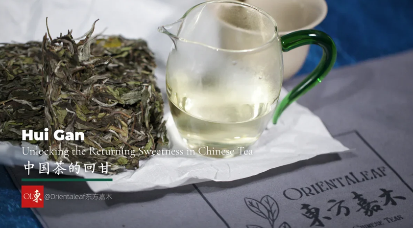
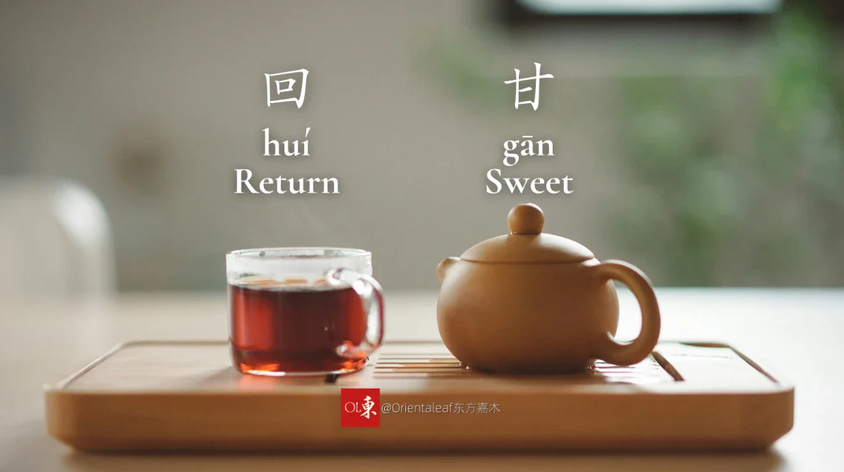
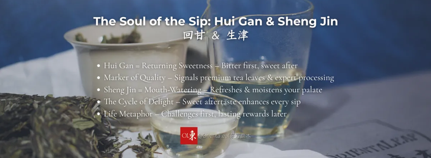
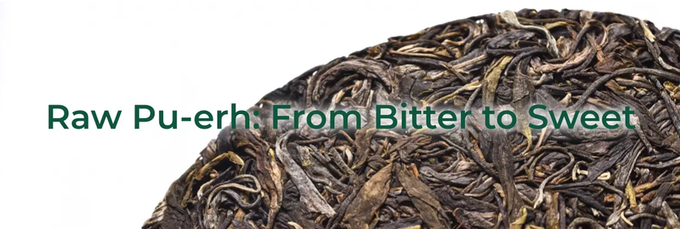
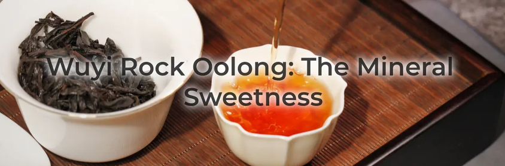
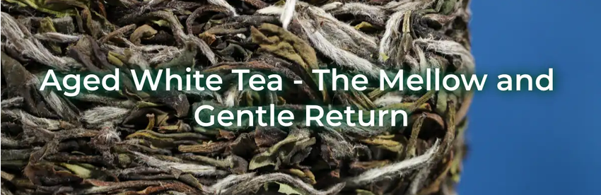
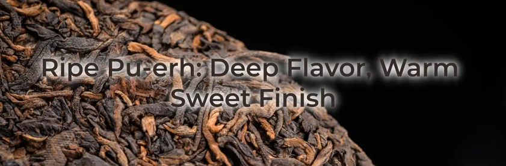
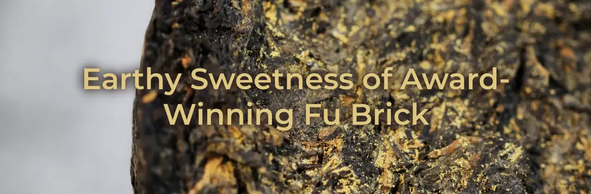

# Experience Hui Gan: The Magical Returning Sweetness of Premium Chinese Tea

https://orientaleaf.com/blogs/tea-101/hui-gan-returning-sweetness-chinese-tea

*September 6, 2025*

---

> "Sweetness returns only after bitterness departs."

## Key Takeaways

1. Hui Gan is a unique "returning sweetness" that appears after initial bitterness, mainly in the throat.
2. The strength of Hui Gan signals the quality of tea leaves and skilled processing.
3. Sheng Jin (mouth-watering sensation) often accompanies Hui Gan, enhancing the tasting experience.
4. Raw Pu-erh, Wuyi Rock Oolongs, aged White Tea, and Fu Brick teas are notable for strong Hui Gan.
5. Gongfu brewing helps reveal Hui Gan more clearly through multiple, short steepings.
6. Polyphenols and glycosides create Hui Gan by interacting with bitterness and saliva.
7. Experiencing Hui Gan reflects patience: the sweetest part comes after the initial challenge.

Tea can be bitter, sharp, or flowery. For tea lovers, there's a deeper quality called **Hui Gan (回甘)**. 
This special feeling is known as the **returning sweetness** that makes great Chinese tea stand out.

It's not just sweetness on your tongue. Hui Gan is a changing sensation that starts with a hint of bitterness and then turns into a sweet feeling in your throat. 
Many tea drinkers search for this experience when they enjoy tea.

This guide will help you understand this special quality. We will look at what Hui Gan is, why people value it, which teas have it, and how you can learn to taste it yourself.

## What Is Hui Gan? Decoding the Aromatic Echo

To enjoy Hui Gan, we need to know what it really is. It's a unique feeling different from other tastes.

### The Literal Translation: "Returning Sweetness"

The Chinese term **Hui Gan (回甘)** has a beautiful meaning:

* **回 (huí)** = to return
* **甘 (gān)** = sweet

This name fits the experience perfectly. The sweetness isn't there when you first sip the tea. It "comes back" after you swallow, starting at the back of your mouth.

### Hui Gan vs. Simple Sweetness vs. Aftertaste

People often mix up Hui Gan with other taste experiences. Here's how they differ:

| Characteristic | Simple Sweetness                                | General Aftertaste                       | Hui Gan                                                                       |
| -------------- | ----------------------------------------------- | ---------------------------------------- | ----------------------------------------------------------------------------- |
| Sensation      | A direct sweet taste                            | Any flavor that remains after swallowing | A transformative sweetness that arises from initial bitterness or astringency |
| Timing         | Immediate; fades quickly                        | Follows swallowing; may linger           | Delayed; appears seconds after swallowing and builds over time                |
| Location       | Tip and sides of the tongue                     | Throughout the mouth                     | Deep in the throat and back of the palate                                     |
| Origin         | Amino acids (such as L-theanine) or added sugar | Residual compounds from tea liquor       | A reaction involving polyphenols and glycosides                               |

Hui Gan is a special type of aftertaste. It happens because our brain processes flavors in a complex way over time, allowing the transformation from bitter to sweet.

## The Soul of the Sip: Why We Pursue Hui Gan and Sheng Jin

Why do people care so much about this returning sweetness? In Chinese tea culture, Hui Gan is more than just a pleasant taste. It signals quality and creates a deeper physical experience.

### More Than a Taste: A Marker of Quality

Strong Hui Gan almost always means you're drinking high-quality tea. 
It shows that the tea leaves contain abundant active compounds developed through excellent growing conditions and careful processing.

When you taste powerful Hui Gan, you're tasting both quality leaves and skilled craftsmanship.

### The Dynamic Duo: Hui Gan and Sheng Jin (生津)

Hui Gan is often accompanied by its partner, **Sheng Jin (生津)**, which means *generating fluid*.

Sheng Jin is the mouth-watering sensation that moistens your mouth and throat. Tea compounds trigger this physical response.

Great tea creates **Hui Gan Sheng Jin**—a cycle where the sweet aftertaste stimulates salivation, cleansing the palate and making the sweetness even more noticeable. 
The result is a refreshing and satisfying feeling.

### A Metaphor for Life

The experience of "bitter first, sweet later" reflects life's journey. It reminds us that challenges often lead to lasting rewards, adding deeper meaning to the act of drinking tea.

## A Guided Tour of Hui Gan: Teas That Shine

Some teas are especially famous for their Hui Gan.

### Raw Pu-erh (Sheng Pu-erh) – The Bold Transformer

Raw Pu-erh showcases Hui Gan clearly. It often begins bitter and drying, then transforms into a powerful sweetness in the throat. 
Young Raw Pu-erh from old trees can provide one of the strongest Hui Gan experiences.

### Oolong Tea (Especially Rock Oolongs) – The Minerally Sweet

Wuyi Rock Oolongs possess a distinctive "rock rhyme." Their Hui Gan combines sweetness with mineral character. The sensation is clear, long-lasting, refreshing, and complex.

### Aged White Tea – The Mellow and Gentle Return

As white tea ages, fresh flavors evolve into notes of honey, dried fruit, and herbs. The Hui Gan becomes soft, comforting, and honey-like, emerging smoothly after each sip.

### Ripe Pu-erh and Fu Brick Tea – The Earthy Sweetness

Good Ripe Pu-erh and Fu Brick tea have their own distinctive Hui Gan. Following their earthy, rich flavors, a warm sweetness emerges. The effect is comforting and full-bodied.

## How to Experience Hui Gan: Your Practical Tasting Guide

You need to experience Hui Gan personally to fully understand it.

### Step 1: Choose the Right Tea and Water

Start with tea known for strong Hui Gan, such as high-quality Raw Pu-erh or Wuyi Rock Oolong.

Use clean, filtered water. Poor-quality water can mask the subtle sensations you're trying to detect.

### Step 2: Pay Attention to Brewing (Gongfu Style Recommended)

The Gongfu method uses more tea leaves and shorter infusions, making Hui Gan easier to notice.

1. Rinse the leaves for 5–10 seconds.
2. Steep the first infusion for 15–20 seconds.
3. Continue with short, controlled infusions.

### Step 3: The Sip and Swallow

Take a medium sip and allow the tea to coat your entire mouth before swallowing.

Pay attention to the initial sensations:

* Bitterness
* Astringency
* Savory notes
* Floral or fruity notes

Then swallow slowly.

### Step 4: The Crucial Pause — Notice the Return

This is the key step.

After swallowing:

1. Close your mouth.
2. Breathe gently through your nose.
3. Focus on the back of your mouth and upper throat.
4. Wait patiently.

You may first notice coolness, followed by a growing sweetness. Observe both the location and intensity of the sensation.

### Step 5: Repeat and Observe

Hui Gan often becomes stronger during the second and third infusions.

Continue brewing and observe:

1. Does the sweetness become stronger?
2. Does it last longer?
3. How does it change over multiple infusions?

High-quality tea often maintains Hui Gan through many steepings.

## The Science of Sweetness: What Causes the Hui Gan Sensation?

The magic of Hui Gan comes from chemistry. It's a pleasant interaction between tea compounds and our sensory system.

### A Chemical "Trick" on Your Palate

The returning sweetness does not come from sugar.

Instead, it results from two important groups of compounds:

1. Tea polyphenols
2. Glycosides

These compounds occur naturally in tea leaves. Their concentration depends on cultivar, growing conditions, and processing methods.

### The Role of Bitterness and Astringency

When you first sip tea, bitter compounds bind to proteins in your mouth, creating bitterness and dryness.

After swallowing, saliva gradually breaks these bonds apart. As bitterness fades, sweetness becomes more noticeable through contrast.

The result is the sensation we call Hui Gan.

## Your Journey into the World of Hui Gan Begins Now

Hui Gan is more than a lingering sweet aftertaste. It is:

1. A marker of tea quality.
2. A cornerstone of Chinese tea culture.
3. A sensory skill that any tea drinker can develop.

Don't fear a tea's initial bitterness. Often, it is the pathway to a rewarding returning sweetness.

Discovering Hui Gan is one of the great joys of exploring Chinese tea.

## FAQs

### What exactly is Hui Gan in Chinese tea?

Hui Gan (回甘) literally means "returning sweetness" and refers to a unique sensation where initial bitterness transforms into a pleasant sweetness in the throat after swallowing tea.

### Which Chinese teas are best known for their Hui Gan?

Raw Pu-erh (especially from old trees), Wuyi Rock Oolongs, aged White Tea, and quality Ripe Pu-erh are among the teas most celebrated for their distinctive Hui Gan.

### How is Hui Gan different from regular sweetness or aftertaste?

Unlike immediate sweetness felt on the tongue, Hui Gan appears several seconds after swallowing, primarily in the throat, and results from interactions involving polyphenols and glycosides.

### What causes the Hui Gan sensation scientifically?

Hui Gan occurs when tea polyphenols initially contribute bitterness and astringency. As saliva reduces these effects, sweetness becomes more noticeable by contrast.

### How can beginners learn to detect Hui Gan?

1. Choose teas known for strong Hui Gan, such as Raw Pu-erh.
2. Use the Gongfu brewing method.
3. Take medium sips.
4. Pause after swallowing.
5. Focus on sensations in the back of the mouth and throat.

With practice, the returning sweetness becomes easier to recognize.

## Conclusion

Every year, thousands of tea lovers visit our tea house to enjoy a peaceful cup of authentic tea. 
Now, you can bring that same experience home and continue exploring the fascinating world of Hui Gan.

### -- RaTea Developer, 2026 --

Ignore the advertising language. The practical tasting guide and FAQ seems pretty useful.
I had some issues pinning down huigan for quite a while and it helped to drink a good bulang puerh that was unsweet, like 502 Nanqiao Double Lions.
The tea is unsweet, but the aftertaste is notably sweet. How does that happen? Huigan apparently.
Don't sweat it if you can't figure it out immediately.