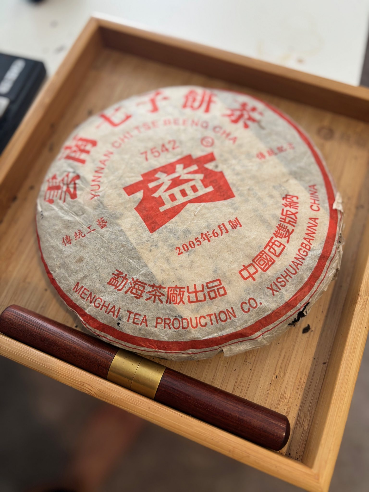
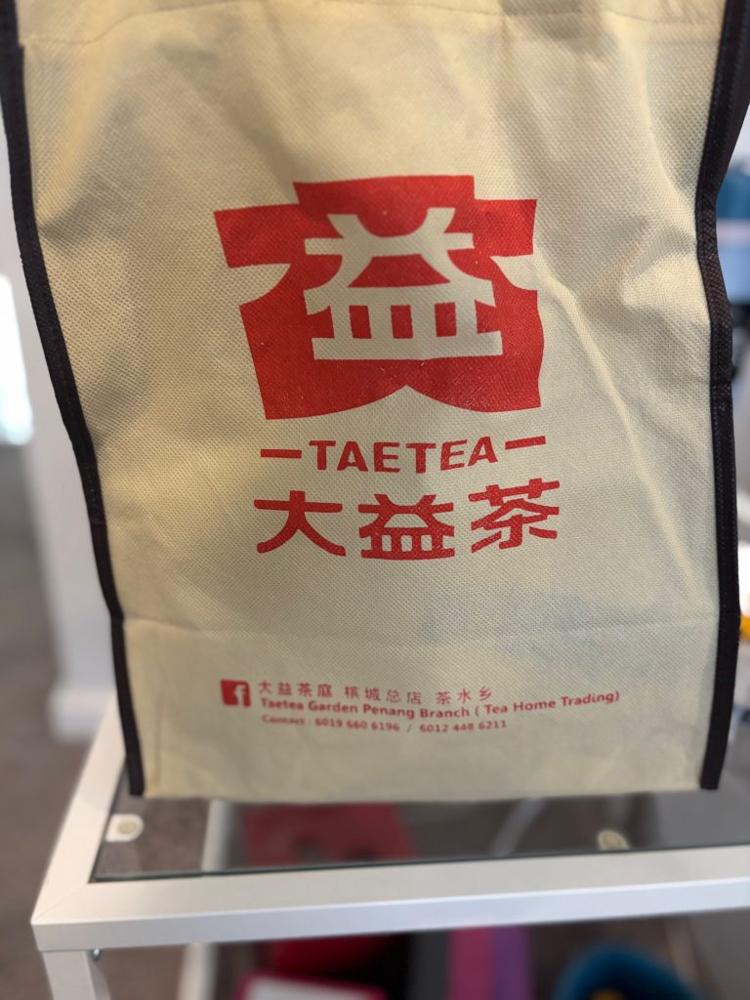

# 7542!!!! The Most Famous Digits in the Pu'erh World!

https://teadb.org/7542-the-most-famous-digits-in-the-puerh-world/

*March 31, 2026*

---

**Author:** James

Maaaa. The pu nerds are citing four digits again!

This time with the most famous recipe of them all: **7542**.

One of my regrets early on in my pu'erh journey was the heavy focus on boutique teas. I had some exposure to factory tea and more traditional pu'erh, but the pathway wasn't open toward as many different avenues of pu'erh as it is now.

I could have forced my way into more factory tea—after all, Dayi isn't exactly an unknown quantity—but I simply didn't prioritize it.

Since the return of the blog, I've had an occasionally controversial but deliberate focus on factory-related content.

---

## My History with 7542

Prior to 2026, I'd had a number of 7542s, including several of the more famous versions:

* 1988 Qing Bing (1989–1992 Dry-Stored 7542)
* 1997 Shuilan Yin
* 2001 Jianyun (Simplified Character)

Despite enjoying these teas, 7542 has never been in my regular rotation and I don't think I had a firm grasp on the recipe's evolution throughout the years.

For instance, before repeatedly drinking the recipe, I don't think I could have confidently distinguished a 2010 7542 from another generic Dayi tea.

The famous examples I'd tried were largely outside my normal budget and impractical for everyday brewing. They also aren't especially representative of the late-2000s and early-2010s versions of 7542.

I bought a tong of 2010 7542 during the pandemic, but never found it inspiring enough to drink regularly.

My goal with this project was simple:

> Dive deep and develop a better understanding of what is likely the most famous pu'erh recipe ever produced.

---

## Storage & Batch

Storage is important enough that I wanted to place this section near the beginning.

Storage is extremely important—especially for factory teas.

The original conception of this drinking report started as a blind tasting exercise, but I eventually found it too chaotic and converted it into a more conventional report.

A major reason was that storage itself is such a powerful variable.

When comparing something like a 2010 7542 versus a 2011 7542, storage can exert a larger influence than the underlying tea material.

Dayi teas change hands frequently.

Even on Taobao, the same vendor may carry multiple storage versions of the same tea.

In the end, I opted for the brute-force method:

Drink a lot of tea.

The blind tastings were still useful, but I often found myself correctly identifying the general caliber of tea while incorrectly guessing the exact production year.

Storage isn't the only complication.

Batches matter too.

Some years show only modest batch variation, while others—such as 2005 or the famous 2009 901 batch—show significant differences.

My general conclusion:

1. Storage matters more than batch.
2. Batch still matters.
3. Certain famous batches deserve their reputations.

I only included teas that are at least twelve years old.

Sorry.

### Understanding Batch Numbers

Popular recipes such as 7542 are often produced in multiple batches per year.

Typical batch suffixes:

* 01 = First batch
* 02 = Second batch
* 03 = Third batch

Example:

* **2006 7542 601** = First batch produced in 2006

---

## The Teas

### 2013 Xiaguan 7543 (C)

Starting out with a Xiaguan.

What a betrayal.

The tea is included because it represents Xiaguan's interpretation of the Dayi style.

Thanks to ghostinthetoast for sending it my way.

**Notes**

* Diesel
* Tobacco
* Dark profile
* Resinous activity
* Moderate bitterness

This doesn't really feel like a 7542.

If you're a Taobao value hunter, however, it may be worth considering.

It punches slightly above its weight.

### 2011 7542 (C)

From a Guangdong Taobao vendor.

**Notes**

* Decent body
* Grape sweetness
* Sugarcane sweetness
* Mild oxidation character
* Relatively low bitterness

Perfectly acceptable but unremarkable.

### 2011 Jin / Gold (B)

This was described to me as a superior 7542.

I understand the comparison, but it also feels distinctly different from the standard 2010–2011 7542 profile.

**Notes**

* Darker base
* Wood
* Grain
* Tobacco-heavy finish
* Stronger presence
* Sharper opening

Needs considerable additional aging.

Potentially underrated, but I'm rating it based on present performance rather than future potential.

---

*(Continue the remaining tea reviews using the same `### Tea Name (Rating)` format.)*

---

## Takeaways & Changing Over Time

The 7542 blend has changed significantly throughout the years.

I believe this happened for two primary reasons:

1. Production volume increased dramatically, reducing overall leaf quality and placing greater stress on tea gardens.
2. Market demand shifted toward teas that drink well younger and require less traditional storage.

Dayi has also gradually shifted its numbered recipes toward lower-tier material compared with what was used in earlier decades.

The result is a recipe that has become noticeably weaker over time.

### My 7542 Timeline

1. **Pre-2004**

   * Expensive but excellent.
   * Represents classic Menghai Tea Factory production.
   * Likely designed with traditional storage in mind.

2. **2004–2006**

   * Dayi reforms begin.
   * Quality remains relatively strong.
   * 2005 is especially notable.

3. **2007–2008**

   * Significant decline.
   * 2007 in particular contains many disappointing productions.

4. **2009 Onward**

   * The 901 batch is viewed by some as a return to form.
   * Most later productions are serviceable but rarely exceptional.

---

## Recommendations

### 1. Value Pick

**2010 7542 / 2011 7542**

At roughly $50, these remain solid values.

* Affordable
* Representative of modern 7542
* Good learning teas

I would not buy large quantities for long-term aging.

### 2. If You Can Afford It

**Pre-Reform 7542 (Pre-2004)**

These teas demonstrate qualities that are difficult to find in modern Dayi.

While expensive, they showcase why factory tea earned its reputation.

### 3. The Moderates

**2005–2006 7542**

The middle ground.

Not quite as powerful as the earlier era, but still clearly superior to most post-2006 productions.

Notable observations:

* 2005 > 2006
* 502 > 504
* Batch variation matters

---

## VOATO & Which 7542 Makes My Rotation?

Over the past year I've consumed a fair amount of **2005 7542 502** and it has earned a place in my rotation.

It strikes a useful balance:

* Not too expensive
* Still genuinely enjoyable

Most post-2006 productions would not pass my personal speed test.

For reference:

My average factory tea scores roughly a **B**.

The 502 sits comfortably above that baseline.

---

## Ratings Summary

| Tea                         | Rating | VOATO |
| --------------------------- | ------ | ----- |
| 2013 Xiaguan 7543           | C      | -1    |
| 2011 7542                   | C      | -1    |
| 2011 Jin                    | B      | 0     |
| 2010 7542                   | B/C    | -0.5  |
| 2009 7542 901               | B      | 0     |
| 2008 7542 807               | C      | -1    |
| 2008 7542 802 (Yee On)      | B      | 0     |
| 2007 7542 701               | C      | -1    |
| 2007 7542 704               | D      | -2    |
| 2006 7542 601               | B      | 0     |
| 2006 7542 603               | B      | 0     |
| 2005 8542 501               | B      | 0     |
| 2005 7542 501               | A      | 1     |
| 2005 7542 502               | A/B    | 0.5   |
| 2003 Purple 7542 TX         | A      | 1     |
| 2003 Purple 7542 GD         | A      | 1     |
| 2003 Purple 7542 Natural TW | A      | 1     |
| 2003 Blue 7542              | A      | 1     |
| 2001 Traditional Yun 7542   | A      | 1     |
| 2001 Simplified Yun 7542    | S      | 2     |
| 1999 Dawen 7542             | A      | 1     |

---

Stay tuned for even more Menghai Tea Factory propaganda in 2026!

---

### -- Dev note, 2026 --

Sections added for clarity

--
End of file