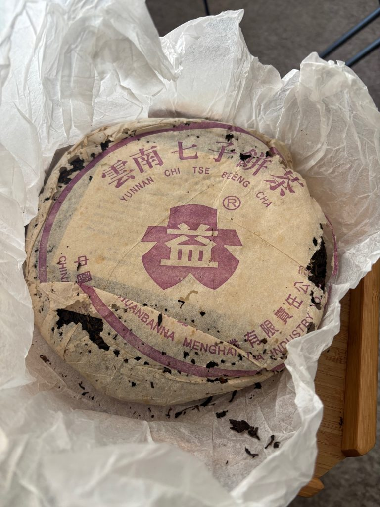

# 7542!!!! The Most Famous Digits in the Pu'erh World!

https://teadb.org/7542-the-most-famous-digits-in-the-puerh-world/

Please open the text file seperately to open the links

*March 31, 2026*

---

**Author:** James

Maaaa. The pu nerds are citing four digits again!

This time with the most famous recipe of them all: **7542**.

One of my regrets early on in my pu'erh journey was the heavy focus on boutique teas. I had some exposure to factory tea and more traditional pu'erh, but the pathway wasn't open toward as many different avenues of pu'erh as it is now.

I could have forced my way into more factory tea—after all, Dayi isn't exactly an unknown quantity—but I simply didn't prioritize it.

Since the return of the blog, I've had an occasionally controversial but deliberate focus on factory-related content.

---

## My History with 7542

Prior to 2026, I'd had a number of 7542s, including several of the more famous versions:

* 1988 Qing Bing (1989–1992 Dry-Stored 7542)
* 1997 Shuilan Yin
* 2001 Jianyun (Simplified Character)

Despite enjoying these teas, 7542 has never been in my regular rotation and I don't think I had a firm grasp on the recipe's evolution throughout the years.

For instance, before repeatedly drinking the recipe, I don't think I could have confidently distinguished a 2010 7542 from another generic Dayi tea.

The famous examples I'd tried were largely outside my normal budget and impractical for everyday brewing. They also aren't especially representative of the late-2000s and early-2010s versions of 7542.

I bought a tong of 2010 7542 during the pandemic, but never found it inspiring enough to drink regularly.

My goal with this project was simple:

> Dive deep and develop a better understanding of what is likely the most famous pu'erh recipe ever produced.

---

## Storage & Batch

Storage is important enough that I wanted to place this section near the beginning.

Storage is extremely important—especially for factory teas.

The original conception of this drinking report started as a blind tasting exercise, but I eventually found it too chaotic and converted it into a more conventional report.

A major reason was that storage itself is such a powerful variable.

When comparing something like a 2010 7542 versus a 2011 7542, storage can exert a larger influence than the underlying tea material.

Dayi teas change hands frequently.

Even on Taobao, the same vendor may carry multiple storage versions of the same tea.

In the end, I opted for the brute-force method:

Drink a lot of tea.

The blind tastings were still useful, but I often found myself correctly identifying the general caliber of tea while incorrectly guessing the exact production year.

Storage isn't the only complication.

Batches matter too.

Some years show only modest batch variation, while others—such as 2005 or the famous 2009 901 batch—show significant differences.

My general conclusion:

1. Storage matters more than batch.
2. Batch still matters.
3. Certain famous batches deserve their reputations.

I only included teas that are at least twelve years old.

Sorry.

### Understanding Batch Numbers

Popular recipes such as 7542 are often produced in multiple batches per year.

Typical batch suffixes:

* 01 = First batch
* 02 = Second batch
* 03 = Third batch

Example:

* **2006 7542 601** = First batch produced in 2006

---

## The Teas

### 2013 Xiaguan 7543 (C)

Starting out with a Xiaguan. What a betrayal! The tea is featured because it is XG riffing on Dayi. Thanks to ghostinthetoast for sending it my way.

Diesel, tobacco. Fairly dark. There's some texture here that makes it feel non-standard. Good resinous activity, moderately bitter, and the body is mostly just moderate. This does not really feel like a 7542. If you are a Taobao-enjoying value maxxer, this may be worth a pickup. I do think it punches a bit above its weight.

### 2011 7542 (C)

From a Guangdong Taobao vendor. This is OK. Has a decent body and some grape/sugarcane sweetness that might indicate a bit of oxidation. Not a ton of bitterness. It evens out to a bit more of a standard profile as it brews out.

### 2011 Jin / Gold (B)

I'd had this described to me as a superior 7542 and to some extent I get that, but this also feels quite different from the 7542s of 2010/2011 and frankly would benefit considerably from more time. Perhaps it is closer to some of the more acclaimed batches such as the 2005s.

This has a darker base, like the Xiaguan. Has some wood and grain but becomes very tobacco dominant as it brews. The tea feels bigger and a bit sharper up front. It's really not bad, but needs a lot of time even compared with the rest of the set. Decently strong mouthfeel and presence.

This has the potential to rise in my rating, but I grade based on how the tea is now, not its future.

### 2010 7542 1001 (B/C)

This has gotten quite a bit of circulation in the West, mostly thanks to Teas We Like and more recently Quiche.

The tea, sort of like the 2011, has a grape-like, sugarcane sweetness in the initial steeps. It becomes a bit more properly what you'd expect from a 7542 as it brews out. Sturdy body, fairly mild bitterness.

Due to the crazy prices of Dayi in 2020–2022, I do see why something like this would stand out as an affordable, good-enough tea, although I think there's virtually no chance this reaches the levels of even something like the 601 7542.

### 2009 7542 901 (B)

This is an interesting one. It demands a significantly higher price than later batches from 2009 as well as the surrounding years.

Alex of Taiwan Tea Odyssey compared this with other 7542s and found it was a bit more boutique-feeling. Drinking these in close succession, I agree that it is different than the other years. The tea offers better pungency and more texture that become quite obvious brewed side by side.

Is it worth the price difference? If you are remotely value-oriented, not in my opinion. But it does seem like a more likely bet than the 2007–2008 or 2010-onward 7542s.

I'd also say it is a different beast than the Jin.

### 2008 7542 807 (C)

From Taobao. Teas like this are extremely inexpensive right now (under $30 on Taobao), although you'll need to suffer through potentially drier storage.

It has a sturdy body but is still pretty green. More sugarcane, florals, nutty notes. Sort of like the 2007s, it feels a bit shallower than the 2005–2006 teas.

### 2008 7542 802 (B)

Can post-reform Dayi hold up to good old traditional storage? Yee On decided to find out.

While the tea is nothing special, the answer is mostly yes. It offers more or less exactly what you'd expect: a pungent tea that has been smoothed out by age. There's a relatively low amount of sweetness, but there's good body and a strong textured mouthfeel.

### 2007 7542 704 (D)

Rough, rough, rough!

This was from TSH a few years ago and was frankly just too green and feels too weak and thin. 2007 has a pretty awful reputation and I can see why.

The 704 7542 has a sugarcane-like taste accompanied by sourness. Very unimpressive.

I do have a hard time attributing blame between storage and material, but it's likely both in this case.

### 2007 7542 701 (C)

Sent by Mr. Green, who got it from Taishunhe. Thank you!

It feels shallower than the 2005/2006 teas with a smaller body. A bit less sweetness on this one as well, but it does feel at least stronger and in a bit better spot than the 704.

The woody pungency does remind me of the earlier years; it just lacks more of the expansive feeling. Certainly weaker, thinner, more taxed material in this one.

### 2006 7542 603 (B)

Pretty similar to the 502 and 504 in structure.

There's a strong pungency up front that gives the tea a really strong mouthfeel before it starts to level off. This one is a little drier stored than those two, so it gives a little less wet wood and chocolate and a bit more incense.

### 2006 7542 601 (B)

From Taishunhe. Relatively dry stored.

The profile is a bit clearer and better than the 603, but not enough for me to raise its rating. Still has a bit of plum, antique wood, and resin. A decent enough aftertaste.

Solid tea.

It isn't quite as big as the 502, but there is some resemblance. I'd easily take this over the 2007, 2008, and 2010 examples I've tried.

Although maybe the 901 could beat it. Not sure.

### 2005 8542 501 (B)

From brigmbg on Discord, and previously from Mr. Jin. Thank you, sir!

This is a bit drier stored than the 502 and 504 7542s I own. Tobacco, wood, a bit sharper, grassier, with a narrower profile.

It's still pretty classical and I'd definitely take it over some crappier 7542s. This particular one needs some more time, but it has nice enough structure and I think it's a pretty good value for the price.

### 2005 7542 501 (A)

The fancy white-thread one. Thank you, Toby!

This is nice—nicer than the 502 and priced accordingly.

Basically it offers a somewhat similar structure to the 502, but is more potent. While it isn't necessarily overwhelmingly bitter, it has a stronger mouthfeel, resinous activity, and an impressive intensity with more mouth coating.

It almost leaves an anesthetic numbing feel by the end of the session. Absolutely a tea that would be hard to follow in a session.

The depth of the aftertaste is also good and it coats further into the throat than the 502.

It's interesting because it is clearly a very good tea, but I'm not sure it is quite the same as the earlier era either. I can't quite put my finger on it, but the strength of it is quite unique.

### 2005 7542 502 (A/B)

I am quite happy with this one and have quickly drunk down a good chunk of a cake.

Thick, textured mouthfeel. Woody, chocolatey, antique, slightly wet wood. It has a strong taste to it and is quite straightforward.

I've always been more of an 8582 guy, but part of that is the lack of availability of teas like this, which unfortunately remain somewhat difficult to find.

### 2005 7542 504 (B)

How is the 502 better?

It is simply stronger and richer compared with the thinner 504. Otherwise these teas are pretty similar.

This has also undergone a bit danker storage. Pretty ready to drink now.

---

### 2003 Purple Dayi GD 7542 (A)

Guangdong stored.

I really like this tea. It has good strength and I think it'll continue to age well. Probably stronger than the Traditional Yun, with good bitterness that all converts.

Great, engaging texture. Lots of sweetness and salivation. Depending on the session, it can have some incense.

I had this alongside the 1999 Dawen and it holds up pretty well. I also blinded this with the 2001 Traditional Yun 7542 and I think it is roughly the same level.

### 2003 Purple Dayi TW Natural 7542 (A)

Taiwan natural storage.

Foresty, thick, oily. Very healthy body, and a milder bitterness than the Guangdong-stored version.

The Guangdong-stored tea, in my opinion, has greater clarity of character with a more focused intensity. That being said, there is still much to enjoy here.

### 2003 Purple Dayi 7542 via Houde (A/B)

This is my least favorite of the three Purple Dayis, but I still find plenty to enjoy even if it does not come close to passing the speed test.

It is definitely green and needs time. It starts out a bit thin but builds up in the first few steeps, crescendoing to a healthy amount of bitterness and a nice mouth coat.

It has a bit of that candied, powdery texture throughout that is in the TSH version as well.

### 2003 Blue Dayi 7542 (A)

Roughly on par with the Purple. Maybe a bit stronger, although storage is a confounding factor.

A bit drier stored than the Guangdong version. Not much smoke, but a good strong density here. Can feel its strength in my cheeks.

Moving a bit beyond hay into more of a refined antique wood. Can feel the depth and sweetness coating the mouth.

Great stuff, and too bad it is quite expensive compared with other options.

### 2003 HKH Serious Formula “7542” (B)

I kind of knew what would happen here having this in sequence with 7542s.

This is a decent tea that is not really a 7542 at all. It lacks the strength and pungency of any of the surrounding-year 7542s.

Never quite found a spot for this in my pu'erh rotation, but I would not fault anyone for buying this as a good drinker that hits a nice age-to-quality ratio.

### 2001 Traditional Yun 7542 (A)

Very classical.

Antique wood, resin, incense. Good thickness. Moderate, healthy bitterness throughout.

There's some light fruit going on here, maybe a darker plum sort.

The aftertaste is also the sort you want—expansive and reaching down into the throat.

I've had alternating excellent and merely good sessions with this, although I'm inclined to blame myself for some of that.

In recent sessions this hits the spot.

### 2001 Simplified Yun 7542 (S)

Very nice Malaysian-stored version from Max of Teas We Like.

I think this represents the pinnacle of this report and is somewhat better than the other pre-reform 7542s.

Has that distinctive Malaysian spice aroma. Resin, tobacco, some mouth-cooling. Leaves quite an impact on the mouth. Can get a bit sour.

Moves into a bit more of an antique wood profile, as opposed to the more humid, darker wood of the Dawen.

Overall brighter, stronger, and deeper feeling than that. The storage combined with the raw tea strength makes for a dynamic and complex experience.

When I had this with Max, it was the winner of the blind tasting, even when put up against four pretty heavy-hitting teas.

### 1999 Dawen 7542 (A)

I had this with Max of Teas We Like when I visited Hawaii, where it sat amongst a number of good Malaysian-stored 1999–2001 teas.

This one has been mostly Taiwan stored and even with the storage it maintains a high degree of strength.

Having it on its own, I quite like it. I do see the lineage here from this tea all the way up through the 2005 versions.

It's a slightly wetter antique wood taste with mushroom. Quite strong and the aftertaste extends into the throat.

Causes a good amount of salivation.

Very satisfying tea.

---

## Takeaways & Changing Over Time

The 7542 blend has changed significantly throughout the years.

I believe this happened for two primary reasons:

1. Production volume increased dramatically, reducing overall leaf quality and placing greater stress on tea gardens.
2. Market demand shifted toward teas that drink well younger and require less traditional storage.

Dayi has also gradually shifted its numbered recipes toward lower-tier material compared with what was used in earlier decades.

The result is a recipe that has become noticeably weaker over time.

### My 7542 Timeline

1. **Pre-2004**

   * Expensive but excellent.
   * Represents classic Menghai Tea Factory production.
   * Likely designed with traditional storage in mind.

2. **2004–2006**

   * Dayi reforms begin.
   * Quality remains relatively strong.
   * 2005 is especially notable.

3. **2007–2008**

   * Significant decline.
   * 2007 in particular contains many disappointing productions.

4. **2009 Onward**

   * The 901 batch is viewed by some as a return to form.
   * Most later productions are serviceable but rarely exceptional.

---

## Recommendations

### 1. Value Pick

**2010 7542 / 2011 7542**

At roughly $50, these remain solid values.

* Affordable
* Representative of modern 7542
* Good learning teas

I would not buy large quantities for long-term aging.

### 2. If You Can Afford It

**Pre-Reform 7542 (Pre-2004)**

These teas demonstrate qualities that are difficult to find in modern Dayi.

While expensive, they showcase why factory tea earned its reputation.

### 3. The Moderates

**2005–2006 7542**

The middle ground.

Not quite as powerful as the earlier era, but still clearly superior to most post-2006 productions.

Notable observations:

* 2005 > 2006
* 502 > 504
* Batch variation matters

---

## VOATO & Which 7542 Makes My Rotation?

Over the past year I've consumed a fair amount of **2005 7542 502** and it has earned a place in my rotation.

It strikes a useful balance:

* Not too expensive
* Still genuinely enjoyable

Most post-2006 productions would not pass my personal speed test.

For reference:

My average factory tea scores roughly a **B**.

The 502 sits comfortably above that baseline.

---

## Ratings Summary

| Tea                         | Rating | VOATO |
| --------------------------- | ------ | ----- |
| 2013 Xiaguan 7543           | C      | -1    |
| 2011 7542                   | C      | -1    |
| 2011 Jin                    | B      | 0     |
| 2010 7542                   | B/C    | -0.5  |
| 2009 7542 901               | B      | 0     |
| 2008 7542 807               | C      | -1    |
| 2008 7542 802 (Yee On)      | B      | 0     |
| 2007 7542 701               | C      | -1    |
| 2007 7542 704               | D      | -2    |
| 2006 7542 601               | B      | 0     |
| 2006 7542 603               | B      | 0     |
| 2005 8542 501               | B      | 0     |
| 2005 7542 501               | A      | 1     |
| 2005 7542 502               | A/B    | 0.5   |
| 2003 Purple 7542 TX         | A      | 1     |
| 2003 Purple 7542 GD         | A      | 1     |
| 2003 Purple 7542 Natural TW | A      | 1     |
| 2003 Blue 7542              | A      | 1     |
| 2001 Traditional Yun 7542   | A      | 1     |
| 2001 Simplified Yun 7542    | S      | 2     |
| 1999 Dawen 7542             | A      | 1     |

---

Stay tuned for even more Menghai Tea Factory propaganda in 2026!

---

### -- Dev note, 2026 --

Sections added for clarity

--
End of file