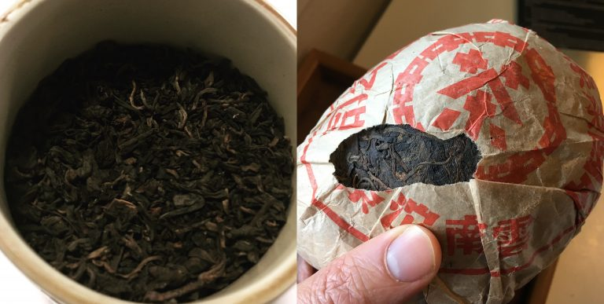
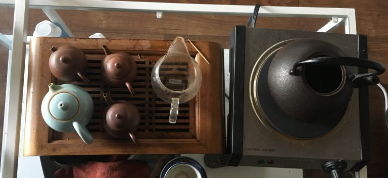
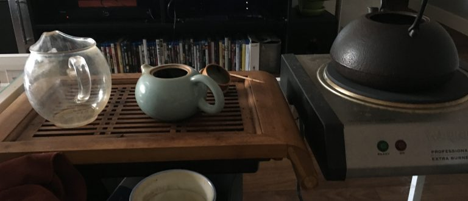

https://teadb.org/advice-id-give-to-someone-starting-with-puerh/

Please open the text file seperately to open the links

# Advice I'd Give to Someone Just Starting With Pu'erh
*October 6, 2018*

**Author:** James

One good thing about TeaDB is it encompaseses a large chunk of Denny and my tea journey. This includes when we were new and fresh in the western tea world and while it results in some early embarrassing episodes, it also helps to document our own learning and progression. 

Here's the advice I'd give to myself (beyond which specific teas to buy) if I were to rewind 6 years or to someone just starting in pu'erh now.

## Learning Resources

What I did: Despite a moderate sized tea community in Seattle, constantly visiting teashops is not really my preferred method of learning. I am naturally more inclined to poke around the internet and consequently read a ton of old TeaChat threads and blogs (i.e. Half-Dipper, Jakub, etc). 

I'd say the majority of this was to get actual recommendations on teas and the rest of the time was more about learning general things from blogs like Marshaln. I remember diligently looking over recommendation threads for vendors like Yunnan Sourcing and constantly fussing over my shopping cart.

What I'd redo: I'm not sure if I'd redo a whole lot. I'd take it a bit easier on reading reviews. Sure it is good to get recommendations on teas and vendors but sampling isn't a precision game. You'd probably do just as well to pick a generally respected vendor and sample a few examples each from a few different types of tea. The more established vendors have at least a base level of quality and consistency.

Something I don't regret at all is reading, re-reading, and referencing Marshaln's site. In my opinion, this is and continues to be the absolute best English-language resource for learning about tea in a productive way is Marshaln's site, A Tea Addict's Journal. There's enough depth there that it's worth reading over and using as a reference. It's also not as tea centric as other blogs, a characteristic that makes the content age better than a blog that just reviews teas.

## Be Skeptical & Don't Become a Follower of One Source

Too many times I've heard someone spouting off problematic or erroneous information on the internet, that they've heard from their "master" or "teacher". I think there's real danger and we should be really uncomfortable when we hear someone referred to as a "teamaster" or "guru". 

I think it's important to cultivate a diversity of opinions and take everything you hear with a grain of salt. Even more so from from anyone selling anything. Consume teas from multiple sources. The same with thoughts.

You should be wary of fantastical things about cha qi and "the leaf" or anything that over-inflates the importance of tea in one's life. There is a lot of bullshit in the western tea world. Be skeptical and don't fall for the absurdity. Something as simple as enjoying and appreciating tea as a drink is a perfectly fine reason to drink tea. Let's not overdo it.

## Don't Overvalue/Overgeneralize a Single Experience

Please, please, please don't try a type of tea once and assume it speaks for all teas of that type. One thing I feel we're doomed to be correcting for the next 35 years is teaching people that shitty Chinatown pu'erh doesn't represent the entire category of pu'erh or heicha. I'll also see people a single cheap 10 year old pu'erh and assume they don't like any aged pu'erh at all.

There is a huge range of variance within individual categories of teas. Even a category that is somewhat homogenous like ripe pu'erh, can vary by quite a bit. There are good examples and bad examples. It's hard to know if you're drinking a good or bad one until you get enough experience. 

It is also possible that a specific tea can be an acquired experience. Hell, the same exact tea can have a lot of variance depending on a number of factors. Try multiple examples from multiple sources multiple times before you pre-judge an entire category of tea.

## You Probably Will Ultimately Just Use A Handful of Teapots

I know a lot of veteran tea drinkers own a lot of pots. I also know some that just own a few (I own 6 or 7). Buying and dedicating more pots or teaware is exceptionally easy to rationalize. I've heard people buy a pot saying they will dedicate a pot to a certain brand of boutique pu'erh. 

For many people, enjoying teaware is a large part of their tea drinking experience. For others like myself, it has less of an impact. Even with these varying approaches towards teaware, just about every veteran tea drinker regardless of how many pots they actually own only uses only a handful (~2-8) regularly!! 

If you're a drinker and not a pot collector please think twice about dropping a couple hundred on your 13th pot.

## Yixing Teapots & Teaware Aren't a Magic Wand, Nor are they 100% Necessary

If teapots are an important part of your appreciation for tea. Great! What they aren't is a magic wand. The most effective way to make better tea is not to drop big money on an old teapot. Don't fall into the trap that expensive teaware is required material for a serious tea drinking person. 

I enjoy drinking tea from my teapots and have been fortunate enough not to have anything break on me. If they broke, I'd be fine. A gaiwan or a brewing device that retains heat well also works just fine.

## Don't Overvalue Value When Sampling

I'm naturally inclined towards "value teas" more than the nonpareil tea. It makes sense to want to get more for your money. However, when it comes to sampling and learning I think it makes sense to let loose a bit more. You are buying in smaller quantities and getting experience with higher-end tea can be very informative. 

Staying within budget is important, but for people really looking to explore tea spending $15-30 on a few sessions is a perfectly acceptable cost that can give a great reference point. Think about if those two or three sessions may be a more worthwhile experience than having seven or eight sessions of a less expensive tea. 

Curious about premium ripe or premium raw or that seemingly outrageously priced high-mountain tea? Just bite your lip, buy the sample, and delete your e-receipt so your spouse won't find out. Ultimately when you are more experienced and buying in higher quantities, value becomes very important. For sampling, I wouldn't worry so much.

## Tuition Tea is Inevitable

It's good to avoid unnecessary purchases. But early on it is impossible to avoid all bad purchases. Most of us have been there before. If you end up with a tea or two that you don't think highly of, don't sweat it and give it away or toss it.

## Avoid Unnecessary Stamp Collecting

Stamp collecting is where you buy a single of each cake. In my opinion collecting one cake from each mountain or one cake per brand is far more like collecting actual stamps than a serious attempt at learning about different teas. If you are a drinker, you should try to avoid owning for the sake of owning.

Sample whenever possible. My earliest cakes I bought on a whim as stamps have been the quickest to hit the compost. Some of these cheap teas are tempting just to cake out right. Many times for a newer drinker it is better to get an expensive sample than a whole cake of something mediocre.

## Don't Worry About Qi/Chaqi

I like to think of qi as flow within the body. For some this is nebulous. Understanding and expressing a clear definition of qi is difficult for everyone, myself included. It's really not worth worrying about if you are just starting to drink tea more seriously. Good tea has a lot of other qualities that are worthwhile.

## Aging Pu'erh/Oolong is a Very Long-Term Project. Take Your Time!

Actually aging pu'erh or oolong takes a very long time. Five years is a lot of time to be into tea and makes you a veteran out west. Five years isn't much when it comes to a teas trajectory.

When you are just starting to drink tea you can learn a lot about tea and your own preferences in half a year, drinking tea regularly. Half a year isn't much time at all for a tea to age. If you want to age tea, there is no need to rush getting a setup to store loads of it.

--
Rewritten with AI; Attempted to get it to not modify content.

End of file