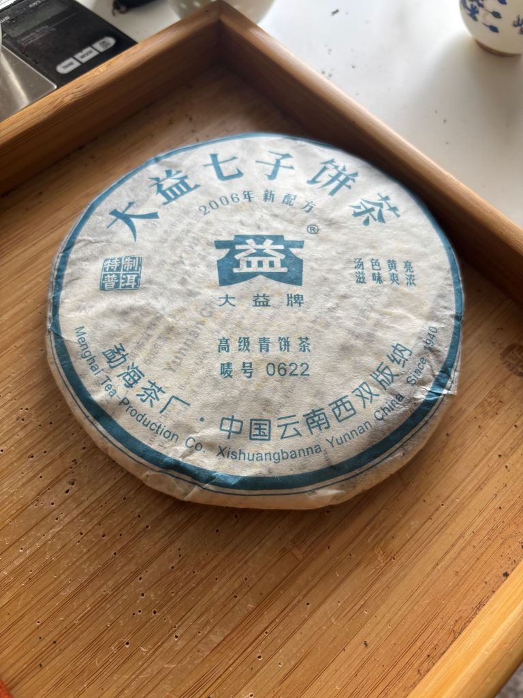

# Four Reasons Why You Should Get Your Baseline in Mid 00s Factory Pu'erh

*January 4, 2026*

https://teadb.org/four-reasons-baseline-mid-factory/

Please open the text file seperately to open the links

**Author:** James

Since diving back into tea at the end of 2024, I've done a lot of thinking on how the tea scene has changed and what the ideal intro to different tea types are.

In many ways the ideal way to approach Taiwanese oolongs or Yancha is the same as it was in 2012. Identify specialized vendors in that tea type and sample a bunch. You'll pay more and have less choices than someone based in east Asia but that is the reality of being based in a different continent.

As is often the case, pu'erh tends to complicate things more, due to the variety and diversity of approaches. The easiest way to make sense of this is to break down pu'erh into simpler components and categories, like *Five Types of Raw Pu'erh You Should Try*.

A decade ago the conversations mostly centered around young boutique teas and larger regions, like Yiwu. In reading about specific teas I was highly influenced by bloggers like Half Dipper and Jakub (MarshalN didn't focus on reviews). Scroll back to what they were drinking in 2013, and you'll see a wide array of young recently produced pu'erh, many under western vendors' labels.

Factory pu'erh seemed to be an afterthought. Not to say it wasn't around. Yunnan Sourcing sold some stuff or you could go to various eBay vendors who hopefully would sell the real deal. But factory teas simply weren't a huge focus of conversation in the pu'erh community 10-12 years ago. No doubt TeaDB was a part of this same movement pushing things in the young boutique.

Looking back, I think this was suboptimal and perhaps even a bit strange. If someone came to me and wanted to get into pu'erh, besides directing them towards the different types I'd encourage them to get their baseline from factory pu'erh made between 2005-2008.

Here's why.

---

## 1. They Are Old Enough Now & Have Aged Good Enough to Give a Good Baseline

This is a math problem. Factory teas are mostly made to be stored and not consumed young. Back in 2014, teas between 2005-2008 were not even 10 years old. Now they are 17-20 years old, firmly semi-aged. The time allows these teas to darken, mellow and get to a more drinkable place. I'd still generally recommend people try them from places besides Kunming where they've seen real heat and humidity (Taiwan, Guangdong, Malaysia, etc.).

As production expanded throughout the 1990s and 2000s, there was speculation as to how the tea would age. Generally speaking it seems like factory teas has aged fine. While the 2005-2008 productions are not nearly as strong as their predecessors (say 1980s/1990s Dayi), they do exist along a similarish aging trajectory, unlike many boutique teas.

---

## 2. It is Easy to Find

Yunnan factories crank out a ton of tea every year. These are not boutique single tree runs and even the limited special products operate at a certain scale.

But besides the handful of Dayi and Xiaguan teas that Yunnan Sourcing or other western vendors sold, these products were largely unavailable from the western market. Sure you could risk Taobao, but that is a lot of hoops to jump through.

Now it is much easier. You have all of the original channels, the generally reliable King Tea Mall, TeasWeLike, Quiche Teas, etc. Taobao is considerably easier to navigate than it used to be. There are multiple established Dayi flagship sources and there are a lot more people with Taobao experience that can help you (join a Discord!).

---

## 3. Reasonable Prices

You'd think with another decade of storage these would now be extremely expensive. Teas that were 17-20 years old were not cheap in 2012.

I'm happy to report that is not the case. A huge part of this is simply the quantity of pu'erh made. The last few years have not been kind to Dayi stocks and their prices remains at a bit of a low point, where you can snag cakes through reputable channels for under $100 a cake easily. Xiaguan and other factories are generally priced even less than Dayi teas.

You may ask, why not go a bit older if prices are so cheap? Unfortunately it remains difficult to find reliable pre-reform (earlier than 2005) tea. These teas are generally considered stronger and better, an assessment I agree with, but because of the more limited quantity they are much more expensive than an average factory production from 2008.

---

## 4. Boutique Pu'erh is Complicated and Weird (Not Just Western Boutiques)

Boutique pu'erh is weird. It is easy to be allured by the promise of fantastic tea leaves from old grove trees. Seems like a simple enough idea. Unfortunately it has ended up being anything but.

Boutique products being smaller runs allow more variability in how the leaves are processed. In trying to create a product that can taste better young, the tea can be processed in ways that make it taste good but age poorly (underrolled, green tea pu'erh, honged). This is fine if you want to consume the tea young, but not great for those that prefer aged pu'erh.

Conversations pop up regularly about certain products not aging well or being processed in a way that makes the tea taste good young but age poorly (see *Green Tea Pu'erh*). It has both complicated and expanded the variety of pu'erh by a wide margin. Now you have to learn about proper processing and be able to taste if there are processing flaws if you want the tea to continue being decent. It can be quite difficult and frankly tedious.

Being a pu-head in the 1980s/1990s would've been comparatively quite dull, choosing between a handful of traditionally stored productions. In 2025, the amount of productions, boutique and factory is quite overwhelming. It is part of the rabbithole, but it is easy to get confused. Factory tea from the mid 2000s (minus the wrapperology) is back to basics.

A veteran drinker complained about how drinking Taiwanese boutique pu'erh is generally not worth it because you have to drink through all their strangely processed perfumed house note to even get to their base taste. Now that I'm semi-experienced with pu'erh I immediately understood what they were talking about.

If I were to do over my tea hobby, I would not have focused nearly as much on boutique pu'erh from the get go and instead shifted it towards factory tea. In this alternate universe, I think I probably would've bought some boutique pu'erh at some point but I think I focused far too heavily on it for my first 5 or 6 years of tea drinking.

Imagine getting recommended Xizi Hao from the start as some sort of endgame of tea and getting your baseline set with these teas. Many boutiques will give you experience in a very specific little niche of the pu'erh game.

Many of my favorite pu'erh teas I own are boutique productions. These do have real upside if done properly. I tend to think of boutiques as a high potential ceiling, but also a low floor that comes with an expensive price tag compared with factory tea. There are good boutique teas, but it can be a morass getting to them.

---

## Which Teas?

So the list is still subject to change over time, but these are the recommendations as of Summer 2025. I think this list would be similar to one from 5-6 years ago or so as these teas are large scale productions and don't skate in and out of availability as much as boutique pu'erh.

My advice is to focus on Dayi and then Xiaguan, with potential add-ons from places like Mengku or whatever.

- 2006/2008 Dayi 8582
- 2006/2007/2008/2010 Dayi 7542
- 2005 Xiaguan T8653 Thick Paper (Early in the Year Batch)

There are a ton of factory productions but I think these three will give a steady foundation for pu'erh that you can use as a springboard to dive deeper into factory tea or branch out into the wild world of boutiques.

---

## Where Should I Buy These?

It is easiest to purchase these from TeasWeLike or Quiche (dropships Taishunhe). For those brave enough, the lowest prices are probably on Taobao (you need to use an agent like Superbuy or ShipForwarder).

You can try some of the Dayi flagships or Chentang for Menghai Tea Factory. For Xiaguan, MX is the most reliable and decent option.

--
End of file