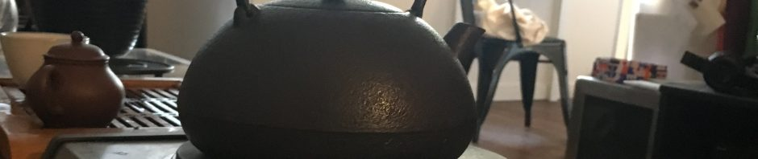
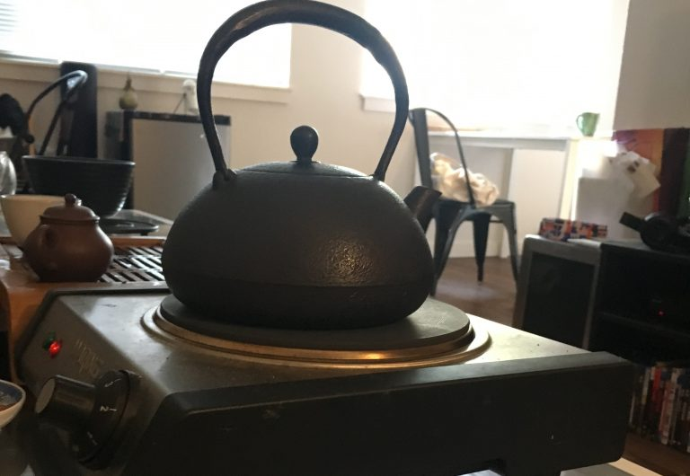

# Heat Retention Revisited: Size, Material, Underfilling, Kettles, and Pooling Water

https://teadb.org/heat-retention-revisited/

Please open the text file seperately to open the links

*June 11, 2026*

**Author:** James

## Introduction

I did some experiments on heat retention in 2019, and I've wanted to revisit this topic for a while. Similar to that experiment, I kept the experiments simple with a basic thermometer, several vessels, a couple of kettles and redid everything a few times to be sure.

All temperatures are in °F. Measurements were taken immediately after pouring (0m), at one minute (1m), and at five minutes (5m). Unless specified I used my main kettle, a Hario V60.

Here's the full table:

| Condition | 0 min (°F) | 1 min (°F) | 5 min (°F) |
|-----------|-----------:|-----------:|-----------:|
| **Vessel size & material** ||||
| 75ml porcelain | 195 | 185 | 170 |
| 120ml porcelain | 200 | 190 | 175 |
| Yixing | 195 | 190 | 170 |
| Big pot | 195 | 190 | 170 |
| **Preheating** ||||
| 75ml preheated | 205 | 195 | 175 |
| **Kettle conditions (starting temp only)** ||||
| 75ml — big kettle | 195 | — | — |
| 120ml — big kettle | 200 | — | — |
| 75ml — stovetop boil | 195 | — | — |
| 75ml — kettle lid off | 195 | — | — |
| **Underfilling** ||||
| Big pot, underfilled | 180 | 160 | 135 |
| **Pooling water (gooseneck)** ||||
| 75ml — immediate pour | 200 | 190 | 175 |
| 75ml — 10 min wait | 195 | 170 | 150 |

---

## Size, Material, etc.

For vessels, the spread was close: 195–200°F at the start. The small gaiwan, Yixing, and big blue pot all basically had the same performance. So, it'd be wrong to assume bigger devices or clay always have better heat retention. They all lost heat at around the same rate too.

That's not to say Yixing or material doesn't matter. There are real and interesting taste differences that come from clay interaction, seasoning, and pour characteristics. But if someone is selling you a Yixing specifically on the basis of Yixing always being better at heat retention, that case is harder to make than it looks, although it almost certainly depends on the pot.

I've always suspected one neglected factor is the pour time from teapots, which is often slower than the fast pour you can get from a gaiwan. I think in particular for early steeps this has a much larger impact than any sort of heat retention.

Interestingly, the 120ml gaiwan ran hotter. I was confused by this and ran it several times with the same results. It isn't obvious to me why, but it's still within a reasonable margin of error.

When I ran this experiment before, the big pot and Yixing ran similarly hotter like the 120ml gaiwan. In this experiment, I used a different big pot and Yixing so that may account for the difference.

In the end it is worth measuring and not assuming how a vessel will retain heat when testing a new device.

---

## Preheating Makes a Difference

As in 2019, pre-heating makes a clear difference. Starting at 205°F vs. 195°F and while that advantage slowly shrinks over time it makes a significant difference at the one-minute and five-minute marks (195 vs. 185, and 175 vs. 170).

It's worth noting that this implies a heat difference when you make two steeps in close proximity rather than spread out, when the gaiwan or pot has time to cool down.

---

## Kettles

I've seen concerns about electric kettles and gooseneck kettles not reaching a properly high boiling temperature so I wanted to test out that theory. The kettles were measured at starting temperature only, not tracked through the full retention window. The point here was simple: does the kettle type alter what temperature arrives in your vessel in the first place?

The short answer is: not much for the kettles I have on hand.

- 75ml with Big Kettle: 195°F
- 120ml with Big Kettle: 200°F (the vessel size effect again)
- 75ml with Stovetop Boil: 195°F
- 75ml with Kettle Lid Off: 195°F

If you're pouring promptly, the starting delivery temperature is essentially the same regardless of whether you're on a stovetop, electric kettle, or whether the lid is on or off.

This obviously does not discount the theory that some kettles are clicking off before they reach boiling, but it does reassure me that my kettles are functioning properly.

---

## Don't Underfill

Sometimes you see people talk about underfilling their pots halfway. This is just not a good idea. I got the same results in 2026 as in 2019 and there's no real excuse to do it.

You are essentially brewing tea at a lower temperature every time you underfill. Make sure you use a pot of an appropriate size if you want to be brewing at boiling. The alternative is a significant temperature penalty.

---

## Pooling Water (Works w/Caution)

Pooling water is where you brew with your brewing device in a bath of hot water. The idea is to keep the vessel nice and hot.

In order to test this, I made a pool of boiling water in a small bowl and put the brewing vessel in it immediately. I made the pool nice and deep, covering the majority of the vessel before dumping boiling water into the gaiwan. It made a difference, raising the temperature by 5°F.

But there's a catch.

I also wanted to measure if you left the pool for 10 minutes and then proceeded as normal. The results were that the gaiwan loses heat much faster than it normally would. So if you do put your gaiwan in a bath, dump it relatively quickly or it will work against you.

One case where getting too cute and lazy as a combination can give less than stellar results. Perhaps the cutest and worst combination would be lazily pooling an underfilled vessel, a recipe to brew at lower than desired temperatures.

--
Rewritten with AI; Attempted to get it to not modify content.

End of file