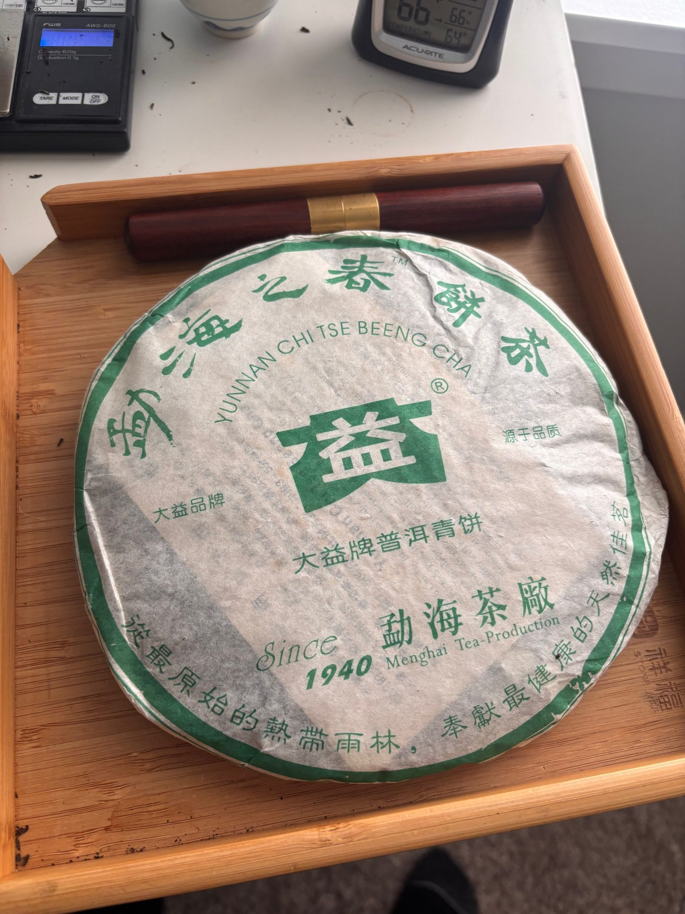
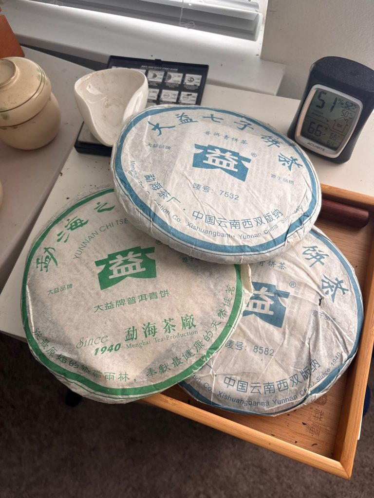

# In Debt for Dayi!!! Report

*July 21, 2026*

https://teadb.org/in-debt-for-dayi-report/

Please open the text file seperately to open the links

**Author:** James

In 2025, I compared Xiaguan to 1970s Toei, a Japanese B-movie studio, reeking of cigarettes and asphalt. Dayi is more elevated than Xiaguan. Perhaps like the Golden Age Shaw Brothers films of the late 1960s and into the 1970s. Polished, colorful, amazing sets, and often following effective formulas. Similarly, for a certain period Dayi had generally good standards and represented the gold standard of factory pu'erh. While many lower-end or poorly stored Xiaguan products probably belong in the gutter, there's usually a higher floor for Dayi products.

After dipping my toes in with the four digit 7542 report, I am back for some more Dayi. Last year I intended to do Xiaguan at the beginning and Dayi at the end but I ended up getting sidetracked and put off Dayi until 2026.

It's a pretty good time to be a Dayi fan. Quiche makes it all too easy to order and the Taobao options have opened up over time. One reason I ended up with so much Xiaguan was that it was easy to order from a reliable place like MX Tea, and now similarly reliable options exist for Dayi.

---

## Goals

- Update my own understanding of Dayi. I've already cleared out most of the lesser Dayi last year, so it's more getting a feel for what I do have and what other teas are around the open market. There are also some Dayi I have had in deeper storage that I picked up from Geraldo about 10 years back that I wanted to test to see if they're ready (they're not).
- Test and update benchmarks.
- Getting in rhythm and getting more of a feel for older Dayi. On one hand this is not so hard because Dayi is my most consumed brand of tea, but I don't know the older teas as well as I could.
- Map out some territory. Dayi has made a ton of tea. I think we've reviewed something like 70ish Dayi teas on the main show in the last 13 years. With this and the 7542 report we can add a lot to the list.

---

## Tea Selection

Many of these teas are not particularly expensive and it's not really desirable to try everything. So I mostly tried to select teas that were at least:

- 15 years old.
- Stored in a hotter/humid place (GD, TW, MY).

The exceptions are teas that I bought earlier on.

I tried to include at least one year of major and semi-major recipes (8582, 7532, 7742, 0622, Spring of Menghai), but this is mostly a smattering of non-7542 teas.

If I'm being honest I also filter out lower priced teas by cost frequently on Taobao (<$30). Dayi is well-traveled ground, and I'd prefer the hit rate to be a bit higher at perhaps a somewhat higher cost.

---

## The Teas

I am working with a tier system now, S/A/B/C/D/F. It is in line with how I view the tea at this moment, not the potential. In theory I could reserve the S spot for just really amazing teas like 88 Qing Bing, but I believe in using the actual top ratings if a tea stands out and not leaving them as some sort of empty gold medal spot.

Since it is on my own views/enjoyment the B ratings are a mix of more lofty teas that I don't feel quite meet the moment, teas that need more time, and teas that are humble and get the job done.

---

## Numbered Recipes + Repeated Recipes

### 2012 8582 (C)

From Denny via Quiche.

2012 8582 is pretty nice and better than expected. Good body, quite approachable now. Some sweetness in the aftertaste. Hasn't been darkened much with storage, but I think this blend needs less time than the 7542 of the same year.

### 2008 8582 801 (B)

I had two versions here, one from Malaysia which I liked a bit less and another from Taishunhe which was actually further along and hit the spot more.

Herbal, grassy, thick. Good conversion on the aftertaste. This is one of the core recommendations for factory tea to start with and I don't really have any disagreement. Of course not everyone will love it, but it is inexpensive, decently aged, good enough quality and hits one of the big two Dayi recipes.

Malaysian storage is also not always better. It still depends.

https://www.youtube.com/watch?v=X5Dfna1vlr4

### 2012 Spring of Menghai & 2006 Spring of Menghai (B/C)

These are solid enough and feel roughly the same quality. The 2006 is a little darker, but otherwise feel like the same recipe.

Florals, tobacco, aromatic, resin, the grassiness has aged a bit. Reasonable body, good Dayi base, mild bitterness, the aftertaste is not particularly deep or penetrating but it's a solid daily drinker and priced as such. The profile can also be a bit narrow in what it is doing.

I'm OK to drink this although there are other Dayi core recipes I prefer.

### 2007 7532 (C/D)

Not a fan.

A bit sweeter, richer, a bit brassy. Some resin and it's still a bit green and thin. It's nothing great, for me barely drinkable.

### 2006 7532 (B/C)

I don't think the 7532 is my type of recipe, at least not in this age range, but I do like this considerably more than the 2007.

It is still pretty green and features similar notes (grassy, florals, brown sugar), but feels a bit more whole and less thin than the 2007.

### 2006 0622 200g (B)

I'd bought about 10 of these small cakes from MX about a decade ago where it has been in and out of my rotation, and ordered one from Chen Tang to compare.

These are darker than the 7532 and a bit brassier and richer. There's a date-like sweetness and a good enduring aftertaste. Holds up pretty well and I still like this as a daily drink.

I do think the aftertaste is not as good and it is a bit slighter than other Dayi of the same era, which probably explains a lot of the modest price tag.

https://www.youtube.com/watch?v=od73eUeysAI

### 2006 8582 601 (B)

I bought a bunch of this from Taishunhe right before the pandemic and it's basically been my Dayi daily drinker since then.

Sweet, brassy, raisin. Woody, resinous, reasonably full. For me a tea that goes down quite easy, although it does not live up to the 2005. It also feels like it misses a bit of the herbaceousness of the 2005 and 2008.

https://www.youtube.com/watch?v=oKbhbbHDhcQ

### 2006 7742 (A/B)

Acquired from Mr. Jin in 2025 in a group buy.

This got blown out when compared with the 2005 but on its own it's quite nice. Still smoky and can use time. A bit sharper and rougher than the 2005.

Pretty straightforward tea but the aftertaste all resolves in a pleasing manner. I blinded this against a couple other recipes from this era and it holds up quite well, especially in the aftertaste department.

For something that still has a lot of calming down to do, I drink this a lot.

### 2005 8582 501 (A)

GD stored.

Thanks to Spice for the sample.

Simpler and easier going than the 2005 8582 504, although a similar structure. Nice body. Wood, fruit, lots of sweetness. I do think these 2005s are a significant step up from the 2006. Goes down very easy.

Then I had a separate version from TSH that reminds me a lot of the 504. Very active and pungent. Maybe not quite as herbaceous.

https://www.youtube.com/watch?v=B__vRu_d524

### 2005 8582 504 (A)

Impressive tea.

Very dark, strong, sturdy, resinous. Easily one of the highlight 8582s I've had. I think both a bit more potent and harder to drink than the 501. Much better than the 601.

### 2005 8582 505 (B)

Thanks to Hanji for this sample.

After the 504 I was prepared to be disappointed but this isn't bad. It's mostly fine and the basic structure of the 504 can still be detected here.

It is woody, herbal, resinous. Far sweeter up front but lacking a bit of the body and overall potency of the 504. I think this is probably better than the 601 but not by too much.

### 2005 8542 501 (B)

Brigmbg sent me a huge chunk generously.

I've had multiple people tell me this is kind of a mix between 7542 and 8582 and I can understand that. It lacks the extreme pungent strength of the 501, 502 or even 601 7542.

This version is still fairly green with some room to grow but it has an astringency and bitterness that resolves and a solid structure to its bones. Wood, resin and comparatively fruitier compared with the other 2005 7542s I've had.

https://www.youtube.com/watch?v=kbTRMB0F1aY

### 2005 7742 (S/A)

I really like this tea and it is very much my style.

Thick, oily, potent. I side-by-sided it with the 2006, which I know decently well, and it pretty much blows it out of the water.

Starting to move past the smoke and is satisfyingly deep and full, leaving a nice aftertaste in the throat and mouth. In blinds it's beaten the 2003 Purple before, and while its semi-rustic profile isn't for everyone, for me it's a very well-rounded Dayi tea.

---

## Yiwus

While Menghai TF has always been associated with teas grown in Menghai (duh), they have a number of well-known Yiwu productions released around the turn of the century. They still occasionally dabble in eastern Xishuangbanna tea.

I've had limited but positive experiences with their early Yiwus, which represent a very different sort of tea than the boutiques that would come to be heavily associated with the area.

### 2011 Yiwu (C)

Kind of gets the worst of both factory and boutique worlds.

Too weak compared to better Dayi and doesn't have that great of material to compete with boutique Yiwus. Taste-wise: some resin, honey.

It's not an awful tea but one that immediately bored me. It does not succeed at being a Yiwu tea or a Dayi.

### 2009 Yiwu (C)

Had two versions and found them both underwhelming.

Brown sugar, slightly oily, pine resin. Like the 2011 it suffers from being in no man's land. It isn't nearly the tea that early Dayi Yiwus are and lacks the fireworks of boutique teas and does not have the typical Dayi appeal.

Not a very good tea and one that I'd find difficult to fit into the rotation.

### 2006 Yiwu (A/B)

This is quite a bit better than I expected after drinking the 2009 and 2011 first, but unfortunately priced accordingly.

Somewhat boutique-like with a nice heaviness to it and a good aftertaste. It feels both much higher quality than the younger Dayis and quite distinct from earlier Dayi productions, lacking that resinous, old-school style.

Nevertheless it's clearly good material and still pretty enjoyable. Lots of sweetness. Foresty, pine. Not sure it's worth the price but it is a solid tea.

### 2005 Yiwu (A)

Thanks to Alex for the series of Yiwus (2005, 2002, and 2001)!

Despite being a year apart it couldn't be more different in style than the 2006. It resembles the older Dayis, especially the One Leaf, and feels like it has considerable upside and room to age.

Very full, resinous. A tangy woody pulp quality that reminds me a lot of my prior experience drinking through a chunk of the Dayi One Leaf. Good aftertaste and presence in the throat.

Unfortunately it feels like this was the last of a now extinct pu'erh subtype.

### 2003 Yiwu One Leaf (A)

Good deep aftertaste and concentrated strength.

I had this after the 2002 and it seems fairly similar. Good and getting better.

### 2002 Yiwu One Leaf (A)

Had a couple versions. One from Alex and another from the same Shenzhen vendor that sold the 2003.

I like this just a touch less than the 2005 Dayi Yiwu. It is softer, thicker, and also a bit more dry stored. It also has that tangy wood pulp quality but a bit less amplified.

A good aftertaste in the throat. Some drier notes, like potpourri. Still quite satisfying, good depth and aftertaste.

### 2001 Ivdashu 103 (S/A)

Somewhat similar to the prior Yiwus but bigger and better.

Wood, resin, sour. Having this a couple times, there's a strong camphor note especially in the early steeps. Great throatiness and expansiveness. Thick, and very satisfying tea.

---

## Other Special Products

As time has passed, the special productions have been promoted as the superior product over the more daily numbered recipes. Of course, some take off in popularity and price while others stay more modest.

### 2017 Xuanyuan Hao (B)

The youngest tea in the report.

Feels quite modern, especially for Dayi. Thanks to Tuna for sending it. Nice, substantive tea. Still very young, some florals and hay. Quite thick and it has a healthy bitterness but good conversion and expansiveness, especially in the aftertaste. Nice throat feel.

There's a heaviness to the liquor that is rare for a factory production. Since I haven't had very many Dayi from this age range it's a bit tricky to compare. To me it feels closest to some of the better Chensheng Haos I've sampled and not too similar to the traditional Dayi style.

Drinkable for its age. It's probably obvious, but I would not pay the asking price, though it is a good tea to try.

### 2015 Purple (B)

In a vacuum this is a pretty good tea and it's actually pretty drinkable now. It has many notes you'd associate with good aging: resin, tobacco, a decent aftertaste.

However, I encourage people to compare this with some of the earlier Dayis from a few years before and some of its weaknesses start to become a little more exposed.

I've heard 2014 cited as a year where the processing changed for Dayi and you can see it in this tea. Both the rolling and compression are lighter than something like the Jin and while I like the tea I'm not sure it's ever going to age as well as earlier teas.

Perhaps it should even be slightly concerning how drinkable this actually is at just 11 years of age. Nevertheless I think it's a very reasonable buy at the prices it is available now and I could absolutely be wrong.

### 2012 Yanyun (B/C)

Unusual Dayi tea.

The tea is fairly floral and I'd initially read that as more youth, but it feels central to the character of the tea.

It is mineral heavy. A bit lemony, floral. Very nice aftertaste. Material quality is clearly good.

I do not love this one for the price but it's one I'll need to play around with a bit to get a decent feel for.

### 2012 Longyin Dragon Seal (B)

Exceeds expectation.

Resin, wood, tobacco, a nice strong pungent mouthfeel that reminds me a bit of some of the earlier, good 7542s as well as the 7742. It also really tastes like a Dayi, which not all their more "premium" products do.

Apparently this is an aged maocha production. I think it still could use considerable time but this feels strong and the bones feel sturdy.

### 2012 Yin (B)

Decent but not great.

For a youngish Dayi I could drink this comfortably. Fairly standard Dayi taste: resin, wood, tobacco, mild bitterness. Medium but significant body.

When Marco reviewed this it cost something like $300. Thankfully the prices have come down quite a bit and you can get it for around $70 now.

The problem is this is just a bit better than 7542s and not close to the quality of the Jin a year earlier, which is a much stronger tea. You are basically paying for a marginally better tea in a fancy wrapper.

### 2011 Mengsong Tuo (B/C)

Thanks to Anna for sending the tea. Not a bad tea, but not one that quite does it for me.

I think it's an atypical Dayi that is thankfully not priced as high as some of their other special productions. This one has a nice soft entry point with a good body. Very mild bitterness, resin. Pretty smooth and ready now in a way that feels more modern than the Dayis that came before it.

I'm not sure if it's due to the less overall blending but this tea is not one that makes me super excited. Good value though.

### 2011 Jin (A/B)

Decent body, starts with a kind of grapey, muscatel sweetness paired with more of a Dayi wood/resin vibe. Becomes pretty tobacco heavy with a strong pungent mouthfeel. Stronger than the Dragon Seal with a better aftertaste.

It's not peaking but honestly not bad to drink now.

This has quite a bit of potential in my opinion. How good will it be and will it live up to its price tag? I'm skeptical but it probably has the best shot of any post-2006 Dayi I've tried.

### 2010 Golden Years (B/C)

From Taishunhe.

Solid tea albeit a bit generic. I had this late in the game and perhaps I had drank too much Dayi at that point as it failed to stand out.

Smooth, honey, a bit of resin/smoke. Good sweetness, but it is young for my preferences and doesn't have enough depth or a distinct enough character.

### 2008 Chunshui (B)

From Anna. Thank you!

Relatively straightforward, good intro to the Dayi/daily drinker category. Decent honey sweetness, body, some resin. Has the characteristic Dayi taste without ever getting too strong.

### 2007 Hou Qing Bing (B)

From the Penang Dayi store and presumably MY stored.

This is not great but the storage lifts it up towards something more palatable. Antique wood, spice. The storage makes it thick but the material isn't that great and it can be felt in a relatively lackluster aftertaste.

### 2008 Qiuxiang (B)

Nice elegant daily.

Soft wood, honey, not too much bitterness but nice and thick. For me this is a little boring and does not match the potency and brutality I want from Dayi but it definitely has some nice qualities to it.

Still, if you are in the market for smoother, drinkable Dayi this one should work fine.

### 2008 Gaoshan Yunxiang (B)

Atypical Dayi.

Plum, a big body, oily, has some nice pungency on the initial mouthfeel. Brown sugar. Low on bitterness, resin or Dayi taste in general.

Reminds me a bit of the Mengsong tuo with a superior body. Good material. Salivation.

Perhaps because I have certain expectations with Dayi this does not quite work for me. Not a bad tea, but for me this is missing something.

I was pretty shocked when I saw the substantial price afterwards. Would not recommend it for the cost.

### 2007 Anxiang, Raw (B, A/B)

From Taobao, where it was stored pretty dry.

Good body, gets quite bitter. Has quite a strong mouthfeel to it that leaves an anesthetic-like feeling on the palate for a few steeps. Resin, brown sugar.

For an almost 20-year-old tea this is notably very sharp, very astringent, and not close to being smoothed out. It does remind me a little bit of some of the Spring of Menghai teas that Dayi does, but is both a bit different and significantly souped up. It also isn't as broad a tea as something like 7542.

A tea I need to study a bit more, but definitely needs more time and I don't think it's the style of tea I'd go for anyways.

Then I got it surprisingly sent to me by Alex of TTO. TY! (https://taiwanteaodyssey.com/)

This one coming from Taiwan is considerably more appealing. It maintains a pretty nice concentrated strength, predominantly woody with some fruit. Pretty characteristic Dayi, but the material is above average and significantly above average for a weaker year like 2007.

It starts out a little tart, but the aftertaste lingers well and there's a nice depth, especially when contrasted with more of the Dayi regular line, with a nice throaty sweetness lingering.

Not nearly as sharp as the previous sample was.

### 2006 Chazhilu (B)

Via Tuna via Quiche. Thank you!

Very sturdy Dayi, feels mostly in the 7542 mold, lots of nice bitterness with good conversion and salivation.

Wood, plum, resin, mostly retired smoke. Good aftertaste.

Definitely more bitter than astringent in this session. Quite satisfying. More or less what I want from my Dayi. Might be better than 601 7542 but gotta compare more closely for that.

### 2006 Yanyun (B)

Like the 2012, an oddball.

Very minerally, not nearly as floral as the younger tea but has a lot of unusual notes, like plum. Some brightness to it, the florals of the 2012 are replaced with wood.

Seems pretty good but it's hard to evaluate this as a Dayi pu'erh.

### 2006 Bulang Peacock (A/B)

This has a very strong mouthfeel and pungency. There's good thickness and strength.

So why just an A/B?

Personally I don't love the slower conversion on its aftertaste. It does have nice texture and resin. I think a lot of people would rank this significantly higher but it doesn't quite do it for me.

### 2005 Early Spring Grade A (B)

Acquired a sample via MX.

Not sure if there's a relation to Spring of Menghai but it definitely feels stylistically similar. A bit better than the 2006, but in the same relative ballpark.

Pretty dry stored. Nice sweetness. Moving beyond what feels like former grassy notes. Still quite aromatic.

A decent body and aftertaste but not as dark as my preference. Pretty smooth overall.

### 2005 Zaochun Tuo (B)

Also in the Spring of Menghai family.

Better than I anticipated. This is an early spring production and a lot of those have a similar profile that leans towards more aromatics, aged florals/grass, honey, resin, and a bit of fruit.

I'm not sure I'd say this tip-heavy profile is my preferred Dayi but this is far more ideal than something like the thinner, greener 2007 7532.

### 2005 Elephant Mountain (C)

This is from Geraldo and stored by me since.

Unfortunately 21 years of Washington state storage does not move the needle that much. The tea is still quite green.

One difference between this and the Menghai Peacock is this appears on the softer side of Dayi. There's more perfume, sugarcane, some light nuttiness. The aftertaste is also pretty good.

I think if you are OK with drier stored tea this one is fine enough, but I've always leaned the opposite way now.

### 2005 Menghai Peacock (B)

The same storage history as Elephant Mountain. Twenty-one years of too-slow storage and the tea is similarly green.

However this tea is built different.

This tea on the other hand is more of the brutish-needs-time variety. It is thick and oily and quite smoky. Very classical and not at all close to ready.

Definitely gets me a bit amped drinking it.

---

## Pre-Reform

Where quality goes up and value goes down.

### 2004 Kongque Fujin (A/B)

Supposedly a Bulang tea and it feels a bit like one of the random Bulangs from this period rather than a Menghai TF tea.

Decent tea but not a huge standout. Leather, fruity, wood, resin, honey. Fairly bright.

Where does this tea fall short? I think it mostly just does not quite have the depth of superior teas. It is satisfying but not quite as full as something like 7542 from a few years earlier and I'm not even sure I'd take it over the 2005 7542s either.

### 2003 7212 One Leaf (A/B)

Found this a little underwhelming.

Still pretty green and can get a bit sour. Hay, dry wood, sour, post-florals.

There's some promise in the throaty aftertaste. Best brewed attentively as it can get quite astringent and drying.

An interesting slightly unusual example. This is probably a pretty reasonable price but there's not really enough there for me to call this a standout.

### 2003 Dayi Nannuo (S/A)

Really nice tea.

Good brightness, strong resin and mouth activity. I'm not typically a big fan of Nannuo teas and this one certainly fits the Nannuo stereotype but the dark leather, fruit brightness works well with the strong bones of the tea.

Compared against the 2002 Liming Nannuo, this easily defeated it.

### 2003 Jiaji Tuo (B)

Dryish stored, still somewhat green but advanced enough to be drinkable.

Sturdy tea, antique wood. It has a decent aftertaste and average-ish depth.

This is a good, but not great tea and probably amongst the more cost-effective ways to get pre-2004 Menghai TF.

### 2003 Jiaji Daqing Tuo (B)

Nice storage that's pushed this tea decently along.

Unfortunately I think its profile, while decent, just does not stand out. Roughly on same level as the 2006 7542.

### 2003 Jiaji Red Ribbon Tuo (B)

Similar level to the normal Jiaji but maybe a bit smoother, creamier.

I think differences here could easily be explained with storage as well. Pretty easy drinking without incredible upside.

### 2002 Jiaji Red Ribbon Tuo (A/B)

These are supposedly better than the normal tuos but to me it seemed along the same lines (mine is also missing the red ribbon).

Wood, incense. Decent bitterness, classic taste.

I think it doesn't feel overtly stronger than the non-red ribbon tuos, but has a nicely expansive mouthfeel and aftertaste ranking it solidly above the 2003.

### 2001 Jiaji Tuo (A/B)

Darker and better than 2003, but not significantly so.

Less of the green resin, and more of a dark wood. Feels slightly bigger, smoother and better.

These are a narrower form of Dayi, but do have some pretty good material and make a fairly decent brew.

### 2001 Simplified Yun 7502 (A/B)

I've had varied sessions with this one. Some pretty good and others just OK.

I currently think it's mostly a decent tea, with lots of wood and incense notes. Not sure it stands out as much as other teas and I'd take most of the other 2001 Menghai TF I've had over this.

Still, not a bad baseline with a pleasant well-rounded profile and a nice aftertaste.

I served this to a group of non-tea drinkers fully expecting them to hate it, but to my surprise they liked it significantly more than the 2005 Nanqiao Double Lion.

---

## What is Ideal Storage

Dayi is more forgiving in the storage department than Xiaguan. I think this is mostly because the tea is on average better.

Still, good storage definitely helps and Dayi is no exception. For instance, the 2005 Menghai Peacock featured is probably at minimum a decent tea, but due to its very dry storage in Washington State it needs at least another decade.

Most of the teas in this report could use longer periods of time to age.

So what is ideal?

Like Xiaguan, good storage in a very hot place like Malaysia probably hits closest to my ideal.

In the Xiaguan Masochists report I wrote about an age score. Over the past year revisiting teas in my own storage I sadly have to say the drier storage is maybe closer to a third of the speed rather than half as fast (as was projected in the Xiaguan report).

It's definitely not terribly precise but I find it useful for rough calculations. Teas that have been exclusively dry stored in the West like the Menghai Peacock or Elephant Mountain cake are decidedly still green. Seven years old sounds unfortunately about correct.

**Formula:**

> **Age Score = 3 × (years aged in humid storage) + 1 × (years aged in non-humid storage)**

---

## Dayi Portfolio Management Firm Recommendations

Many of these teas are significantly less than their peak price from 3-4 years ago. Some are only about 20% of the peak price while others are 70%.

Regardless, many are at a price point they were 10 years back when they were much younger teas.

Dayi being such a well-known commodity means teas are mostly combed over. You're not going to get any true unknowns, although there's so many teas that inevitably there are some perfectly decent teas simply outshined by other products.

### Dayi for All! Value MaXXing

- 3× $25/200g — 2006 0622
- 2× $50/357g — 2008 8582
- 2× $35/400g — 2006 Spring of Menghai
- 2× $10/357g — 2021 8592
- 2× $15/357g — 2021 7572

**Total:** $295 / 3542g

Five sufficient Dayi teas. Not a very exciting diet for the year but a way to drink 20ish-year-old Dayi on a tight budget. This costs under a dollar per day for two sessions of 5g.

Feel free to insert a number of other teas here: Chunshui, Mengsong Tuo, etc.

### Four Digits Only Daily Dayi

- 2× $50/357g — 2008 8582
- 2× $30/357g — 2010 7542
- 2× $50/357g — 2006 7532
- 2× $10/357g — 2021 8592
- 2× $15/357g — 2021 7572

**Total:** $280 / 3570g

If you want more of a classical approach with the best-known raw and ripe numbered recipes only. This is somehow even cheaper than the Value MaXX budget.

### Post-Reform Classics

- 2× $225/357g — 2005 7542 502
- 2× $225/357g — 2005 8582 504
- 2× $50/357g — 2006 7532
- 2× $65/357g — 2007 Anxiang Ripe
- 2× $50/357g — 2021 Golden Needle White Lotus (Ripe)

**Total:** $1230 / 3570g

A bit fancier, but this is still just a little over $3/day.

You'll notice that you have to spend up and we are already running into diminishing returns. These are on the whole more difficult to find, but do pop up now and then. This list is also a bit top-heavy with the 7542 and 8582 being pricier.

If you want to be a bit more value conscious, the 2006 7542 and 8582 are less than half the cost.

### Menghai Mortgage: Pre-Reform

If you can afford it, just buy whatever you can find.

Their pre-reform tea is not for the value hunters nor is it for material maxxers but it has a strong reputation for good reason. There are usually not many of these from western-facing vendors at one time.

The cheapest teas in this category are a bit under $1/g, but expect to pay $2/g+ for the majority of productions.

Buy samples from Quiche. Don't buy the first pre-2005 7542 you run into. Make sure it was actually made for Menghai TF and not just some random thing labeled as 7542.

Also well worth checking out pre-2004 Dayi Yiwu if you can find it and have the means.

### Dayi for the Kids (Aging)

- $115/357g — 2012 Longyin
- $265/357g — 2011 Gold Dayi

Unfortunately, like the Shaws, Dayi has fallen from their former heights. Rather than shut down and pivot to TV like Run Run did, Dayi continues on.

I focused on the higher-end teas here because if I want to devote time to aging something it's not going to be something cheap.

Having not tried their extensive lineup, these are the two that stand out from the few I have tried. I think the Jin Dayi is the surer bet and it is also closer to being ready, whereas the Longyin needs considerably more time but impressed me with its pungency and strength.

---

## Rapid Change: Dayi By The Years (2003-2007)

A decade ago you used to see people talk about Dayi as falling in quality around the reform (2004). While this does have some truth behind it, the decline was not quite precipitous or immediate.

These days I see post-2005 and pre-2006 mentioned more than the 2004 year mark, marking 2005 as the last all-around decent year for Dayi.

The 2000s were an important and wild decade for the pu'erh industry. For the most prominent factory, this meant a steep ramp-up in production.

Each year within this time period you'll see a step up in quantity and a step down in quality.

2003 is much more expensive than 2005, which is on average much more expensive than 2007. By 2007 and the bust, this pricing dynamic goes away, with 2008 Dayi not being markedly different in price than 2007.

While I think some later Dayi products are still pretty good, I think the numbered recipes in particular have gotten worse while the better material has shifted into special productions. For instance, the 2005 numbered recipes like 7542 and 7742 are often significantly better than the later equivalents.

In practicality this means on average if you go for the 2007 option versus the 2006 you are likely buying an inferior product in the bust year that had significant overproduction.

---

## Different Profiles of Dayi & Special Products

At its most classic level, the two big raw recipes 7542 and 8582 represent classic Dayi profiles.

But one thing drinking all this Dayi has made me realize is that they have a lot of range. This shouldn't be a complete surprise as they've had a long list of products for a number of years.

Still there's a few teas here that legitimately took me by surprise, sometimes in a good way and others more in a "huh" sort of way.

Good versions of the 7542 are more up front. Strong mouthfeel, resinous, denser but a nice aftertaste. Woody but also some plum/fruit depending on the age and storage. They're often bitter and punchy, especially when young.

The 8582 is more herbaceous, broader, and leans more into a thick wood profile with larger leaves that give it a nice big body.

You also have finer, more bud-heavy blends like the 7532 or Spring of Menghai or, on the higher end, Anxiang Raw. There's also the punch-heavy profile that pops up in something like the 501 7542 and Bulang Peacock. With these, there's bitterness but also a strong protracted mouthfeel that seems to be prized.

There are also some that fall somewhere in between. The 7742 uses aged Bulang material and is quite punchy like 7542 but also smokier and distinct.

I was also occasionally surprised by a completely different profile, for instance the 2008 Gaoshan Yunxiang and 2006/2012 Yanyun.

You could put the Yiwus in there too, but I kind of knew those would be pretty different than standard Dayi.

---

## Where To Buy Dayi? King Tea Mall Pricing Dynamic

The most accessible place would be a shop like Quiche/Taishunhe, who sells a good deal of Dayi teas.

The lowest prices would likely be Taobao where there are a number of authorized Dayi dealers.

Unfortunately neither of these offer samples for the majority of their teas.

A shop like King Tea Mall slots in nicely here since they sell samples. However, many of King Tea Mall's prices are out of date, meaning they are much higher than they should be.

Dayi prices peaked a few years ago and if a vendor does not adjust their prices down they will generally be inflated. How inflated depends on which production and how it was priced.

So you have the odd situation where the price of some KTM teas is laughably high compared with the current market conditions.

---

## What Do I Actually Own & Would I Do It Again?

I am a fan of Dayi and they will likely continue to be one of my most consumed brands.

Many of these teas are not expensive and are simply good brews. Things like the Chunshui cost around $0.12/g and are perfectly fine for regular consumption.

I did not do a good enough job early on with factory tea. My most consumed teas here were also some of the most basic: 2006 8582 (from TSH) and 2006 0622 (from MX). Decent and functional teas but not exactly outstanding.

I did manage to snag some good teas from Geraldo about a decade ago, but due to our shared unfortunate Washington State storage those still need time.

In retrospect I think I would've tried much harder on these teas to develop an in-depth understanding of the core factory recipes rather than being distracted by boutiques in my first few years of drinking.

In fact, a decent chunk of my buying and dumping has been with Dayi teas, in an attempt to improve what I own and drink.

| Tea | Tier | VOATO |
|------|------|------:|
| 2012 8582 | C | -1 |
| 2008 8582 801 | B | 0 |
| 2012 Spring of Menghai | B/C | -0.5 |
| 2006 Spring of Menghai | B/C | -0.5 |
| 2007 7532 | C/D | -1.5 |
| 2006 7532 | B/C | -0.5 |
| 2006 0622 | B | 0 |
| 2006 8582 601 | B | 0 |
| 2006 7742 | A/B | 0.5 |
| 2005 8582 501 | A | 1 |
| 2005 8582 504 | A | 1 |
| 2005 8582 505 | B | 0 |
| 2005 8542 501 | B | 0 |
| 2005 7742 | S/A | 1.5 |
| 2011 Yiwu | C | -1 |
| 2009 Yiwu | C | -1 |
| 2006 Yiwu | A/B | 0.5 |
| 2005 Yiwu | A | 1 |
| 2002 Yiwu One Leaf | A | 1 |
| 2001 Ivdashu 103 | S/A | 1.5 |
| 2017 Xuanyuan Hao | B | 0 |
| 2015 Purple | B | 0 |
| 2012 Yanyun | B/C | -0.5 |
| 2012 Longyin | B | 0 |
| 2012 Yin | B | 0 |
| 2010 Golden Years | B/C | -0.5 |
| 2008 Chunshui | B | 0 |
| 2007 Hou Qing Bing | B | 0 |
| 2011 Mengsong Tuo | B/C | -0.5 |
| 2011 Jin | A/B | 0.5 |
| 2006 Chazhilu | B | 0 |
| 2008 Qiuxiang | B | 0 |
| 2008 Gaoshan Yunxiang | B | 0 |
| 2007 Anxiang (Raw) | B | 0 |
| 2006 Yanyun | B | 0 |
| 2006 Bulang Peacock | A/B | 0.5 |
| 2005 Early Spring Grade A | B | 0 |
| 2005 Zaochun Tuo | B | 0 |
| 2005 Elephant Mountain | C | -1 |
| 2005 Menghai Peacock | B | 0 |
| 2004 Kongque Fujin | A/B | 0.5 |
| 2003 7212 One Leaf | A/B | 0.5 |
| 2003 Nannuo | S/A | 1.5 |
| 2003 Jiaji Tuo | B | 0 |
| 2003 Jiaji Daqing Tuo | B | 0 |
| 2003 Jiaji Red Ribbon Tuo | B | 0 |
| 2002 Jiaji Red Ribbon Tuo | A/B | 0.5 |
| 2001 Jiaji Tuo | A/B | 0.5 |
| 2001 Simplified Yun 7502 | A/B | 0.5 |

--
Rewritten with AI; Attempted to get it to not modify content.

End of file