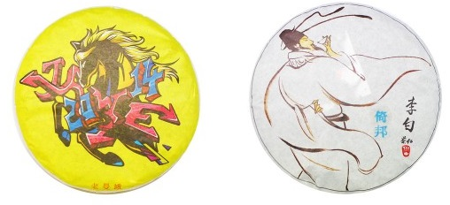
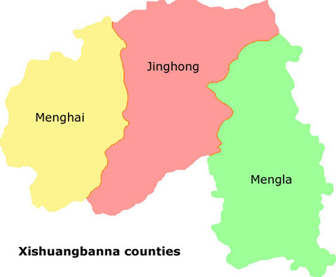
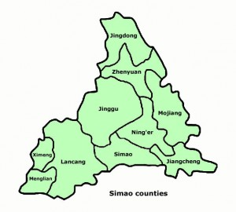
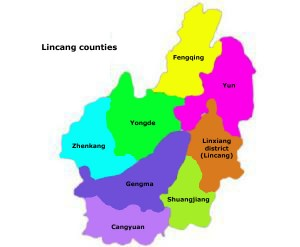
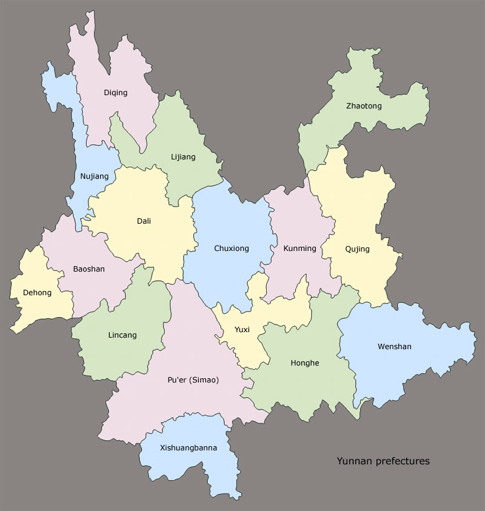

https://teadb.org/yunnan/

Please open the text file seperately to open the links

# Pu'erh Regions: Yunnan Overview
*December 27, 2014*

**Author:** James

Pu'erh tea has been associated with a specific area for a longtime. The term itself is a location (originally a city, now a province). In this way pu'erh is fundamentally different from oolongs, blacks, whites, or green teas. These teas nomenclature signifies the processing and not the location grown. 

The nomenclature places pu'erh in a realm with some other different consumables, i.e. champagne, Darjeeling tea, or Roquefort. Over the years these geographical ties have been nailed down in increasingly official manners. In 2006, the Yunnan Provincial Supervision Bureau of Technology and Quality specifically stated that Pu'erh tea is a geographically marked product of Yunnan, using large leaf tea leaves that have been dried in the sun (Zhang, Puer Tea Ancient Caravans and Urban Chic). 

There is tea grown processed and compressed in styles similar to pu'erh in neighboring areas (Laos, Tibet, Burma, etc.), but according to the geographical classifications of pu'erh this tea cannot technically be classified as pu'erh.

*Note: Oftentimes tea from neighboring regions is smuggled in and sold as pu'erh anyways.*

This article frequently references and links to [babelcarp](http://babelcarp.org/). Babelcarp is a Chinese Tea Lexicon that is an essential resource for tea nerds that want to dive in further and don't understand Chinese! This article also sources many maps from a TeaChat thread, original sources vary.

---

## Why Region is Important

With the exception of ripe pu'erh and plantation tea, geography in the form of subregion, mountain or village frequently plays a role in the selling of tea. This is in the description if not the title. Brand is also important, but raw pu'erh has an increasing number of smaller sellers who have less brand familiarity and reputation. These sellers will market their tea heavily with the regional location.

Region also influences the price of the tea. Assuming accuracy, region can also be a valuable way to drink, categorize and understand Yunnan's terroir.

## Why Region is Not Important

While much of the information is overtly about region, it is also marketing information and often nothing more. Information travels freely without much verification, moving from the top downwards towards the consumer. Base material is often extremely difficult for even the vendor to verify. 

Adding to the complexity, verifying age or base material several years is even more difficult after the tea has changed hands a few times. Remember, wrappers can easily be faked! If the information the consumer gets is not accurate or not even close to being accurate, how meaningful is it really?

---

## The Big Three (Regions)

Any regional breakdown is somewhat arbitrary. There are dozens of variations on what the important regions are. These are chosen largely based off of marketing prominence.

### Xishuangbanna Prefecture

The most sought after region for pu'erh tea. Xishuangbanna has an incredibly rich history, representing much of the base material for the most famous pu'erh productions. It is the southernmost of the Yunnan prefectures and is typically divided into two major subareas, east and west.

Eastern Xishuangbanna represents the six famous tea mountains and the greater Yiwu region in general. It is composed primarily of Mengla County (Youle is in Jinghong County). Mengla County neighbors Laos (Laotian tea is often sold fraudulently as Guafengzhai or Eastern Yiwu tea). Another common area that is masqueraded as Yiwu tea is Jiangcheng in Pu'er/Simao.

Many of the pre-PRC tea cakes were some combination of tea grown in this area. Eastern Xishuangbanna and Yiwu are more associated with raw pu'erh. After the formation of the PRC much of the tea production shifted westward to Menghai County/Western Xishuangbanna. During this period, much of the production was largely centered around Menghai Tea Factory. 

Many of the famous masterpiece cakes (Red Mark, Blue Mark, Yellow Mark) are believed to be predominantly Western Xishuangbanna raw materials. In modern pu'erh, Western Xishuangbanna is home to some of the most coveted pu'erh, most notably Lao Banzhang. Western Xishuangbanna and Menghai County are also associated with big factory productions and ripe pu'erh.

**Key Locations:** Yiwu, Youle (not Mengla), Mangzhi, Gedeng, Manzhuan, Yibang, Guafengzhai, Menghai Tea Factory, Menghai County, Mengla County, Lao Banzhang, Lao Man'e, Bulang, Nannuo, Pasha, Hekai, Mengsong, Bada, Naka.

### Pu'er/Simao Prefecture

Located directly north of Xishuangbanna, Pu'er was named Simao from the 1950s to 2007 (previously Pu'er) before being renamed back to Pu'er. Adding to the confusion, there was also a city named in Simao named Pu'er that had to change its name to Ning'er in 2007, in conjunction with the prefecture name change. During the tribute tea period, much of the tea produced in Yiwu would travel northwards through this area.

The Pu'er prefecture contains several different regions and isn't as easily subcategorized as Xishuangbanna. To the west are Jingmai and Bangwei. Jingmai and especially Bangwei are just as sought after as much of Xishuangbanna tea. To the east there are Kunlu and Jiancheng. Tea grown in south-eastern Pu'er (Jiancheng) is grown close to eastern Xishuangbanna and is often masqueraded as more expensive Yiwu tea. To the northeast, there are Wu Liang, Jinggu, and Ai Lao.

**Key Locations:** Simao, Jingmai, Bangwei, Kunlu, Ai Lao, Wu Liang, Jinggu, Jiancheng.

### Lincang Prefecture

North of Pu'er prefecture, Lincang is usually considered to be the largest northern region. Unlike Xishuangbanna and Pu'er, Lincang doesn't have the same history as a tribute tea. However, it is likely that Lincang leaves were used in the base of the famous Xiaguan productions (located further north in Dali) from the 1950s onwards. In modern pu'erh, Lincang is home to a few famous subregions/mountains, including Bingdao, Xigui, and Daxueshan. Shuangjiang Mengku Factory is also located in Shuangjiang County in Lincang.

Within Lincang, the major growing regions are Shuangjiang (includes Bingdao) to the southwest and Yong De in the north central.

**Key Locations:** Lincang, Yong De, Fengqing, Bingdao, Xigui, Nanpo, Bangdong, Baiying, Daxueshan, Mang Fei.

---

## Others

There are other areas within Yunnan that grow and produce pu'erh tea as well. Here's a few other notable spots.

### Kunming

The capital of Yunnan. Kunming is home to Kunming Tea Factory and also houses one of the major pu'erh hubs in the world, the Kunming tea market. Kunming doesn't really have any notable spots where pu'erh is grown and is located northeast from Xishuangbanna, Pu'er, and Simao.

### Baoshan, Dehong, Dali

Baoshan is located directly north of Lincang, Dehong northwest of Lincang, and Dali northeast. These regions don't have as much tea advertised under their names but do grow and produce pu'erh. Dali is also home to the famous Xiaguan tea factory.

--
Rewritten with AI; Attempted to get it to not modify content.

End of file