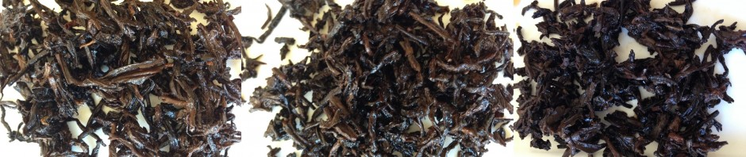
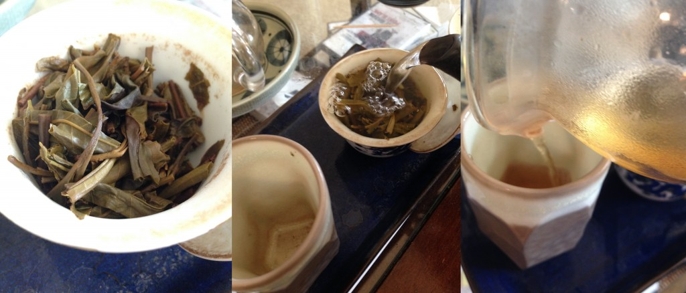
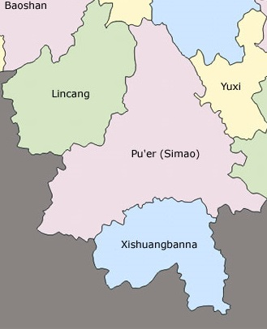
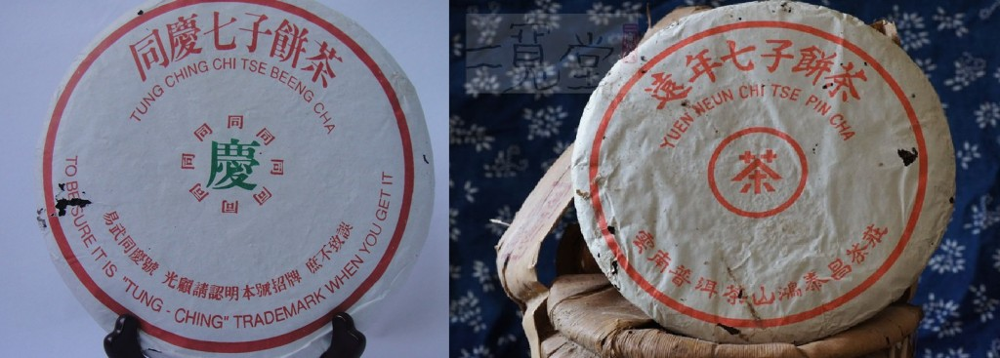
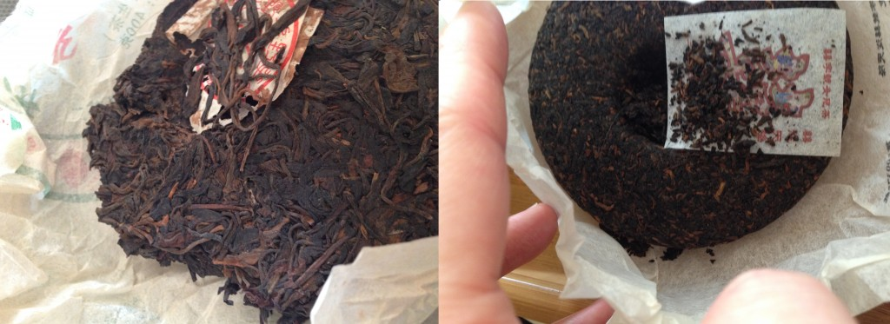

https://teadb.org/what-is-puerh/

Please open the text file seperately to open the links

# What is Pu'erh?
*May 16, 2015*

**Author:** James

> This article heavily references Zhang Jinghong's book, *Ancient Caravans & Urban Chic*. Do yourself a favor and read her book!

At the height of the pu'erh craze in 2007, the Simao prefecture changed its name back to Puer. At the same time, a ceremony was arranged to welcome back the Golden Melon Tribute Tea back to its supposed birthplace in Simao. This event was not without controversy and was not well-received in the neighboring Xishuangbanna. 

The Golden Melon's base material was from Yibang (located in Mengla County, Xishuangbanna) and Xishuangbanna-based people felt that their association with pu'erh's history had been compromised and hijacked. Many also complained the name change would lead to confusion, because pu'erh was primarily known and marketed as a tea.

---

## A Dynamic Definition

In Zhang Jinghong's *Ancient Caravans and Urban Chic* there is a constant debate between various parties and factions (Jianghu) about what actually qualifies as pu'erh. This debate has become increasingly lively with the rise of pu'erh in both visibility and market size. Historically pu'erh has been classified as a dark tea (heicha), but with its rise to prominence the official definition has changed with a push to create a seventh tea type outside of the original six.

*Note #1: Some regard this push to classify pu'erh as the seventh tea as a negative. By freeing pu'erh tea of the heicha (dark tea) category, it has helped pu'erh's market stature but some believe it also makes pu'erh susceptible to the whims of the market (see 2007 pu'erh bust).*

*Note #2: Even in the west, this debate is alive and well!*

---

## A Rough Timeline of Pu'erh Production/Consumption

1. **Mid-1800s to 1930s:** Modern day Mengla County-centric. Raw pu'erh only. For export to Tibet, Hong Kong, and tribute tea to Beijing. Not necessarily intended to be aged long-term.
2. **1950s-1990s:** State-run industry, largely Menghai County based (Dayi). Export primarily to Tibet, Hong Kong/Southeast Asia. More emphasis on post-fermentation.
3. **1972/1973:** Ripe pu'erh is invented to primarily accommodate Hong Kong's (+Southeast Asia's) taste in more mature pu'erh. Ripe pu'erh occupies much of the same niche as traditionally stored pu'erh.
4. **1990s-Present:** Pu'erh hobbyism grows and different storage thoughts start to emerge elsewhere (natural, dry, etc.). Up until now there was very little pu'erh consumption centered around Kunming. This is described as a "New Tradition" by Zhang Jinghong.

---

## A Definition: Historical + Geographical Argument

While the definitions of pu'erh have changed throughout the years, pu'erh has long been associated with Yunnan. Pu'erh tea was originally named after Puer Prefecture where the tea was taxed and distributed. In 2003 as pu'erh was starting to get bigger and bigger, the first official definition was created by the Standard Counting and Measuring Bureau of Yunnan.

> Puer tea is made of large-leaf tea leaves that have been dried in the sun. The tea leaves should be produced within a certain area of Yunnan. The final product is loose or pressed via post-fermentation. Its appearance is brown-red; its tea brew is bright and dark red; it has an "aged aroma"; it tastes mellow, with sweetness following bitterness and after infusing the tea leaves are brownish red.

Zhang notes in her book that this classification is very different than the classifications of the other six types, with a much stronger emphasis on its growing location (Yunnan). This is more similar to subcategories of teas (i.e. Darjeeling) than to the six major teas. In contrast, the other major tea types (Green, White, Black, etc.) are defined largely by their processing.

In 2006, the official definition was updated to include more specific categorization of raw and ripe pu'erh. The new definition still featured a strong emphasis on the large leaf varietal and Yunnan. Uncoincidentally, Yunnan has an abundance of large leaf varietal whereas other growing regions in China are principally small leaf (a few exceptions).

*Note #1: Puer prefecture was renamed Simao later on and then back to Puer in 2007 (outlined at the beginning).*

*Note #2: Another interesting part of the official definitions is the emphasis on the large-leaf varietal. While many argue that the small leaf varietal will not age as well, certain areas of Yunnan with strong associations with pu'erh (Yibang, Jingmai, etc.) have small or mixed leaf varietals.*

---

## Border Tea

Proponents of the pu'erh is from Yunnan school argue vehemently in favor of the terroir. This is a good point. Yunnan is a unique area in Southwest China tucked well away from many of the other Chinese tea-growing areas. Still, the combination of a hot market, a lack of quality control and a strict-geographical definition makes fake pu'erh somewhat of an inevitability. 

According to some estimates, over 90% of the tea sold as pu'erh can't actually be from Yunnan. Abiding by the official definition, this tea technically does not qualify as pu'erh.

Much of this fake pu'erh in the market are poorly-done imitations (i.e. lower-quality, small leaf varietal) that can be quickly weeded out. However, there's an interesting case in the nearby Laos, Vietnam and Burma. These areas are very close to Yunnan and share many similar characteristics in terroir. Eastern Mengla County includes a few of the hottest pu'erh areas (Guafengzhai, Wangongzhai, etc.). These hotspots are smushed right against the border and nearby Laotian tea produced in the pu'erh-style is regularly smuggled in and is frequently masqueraded and sold as high-end "authentic gushu pu'erh".

Border tea (Bianjingcha) or tea produced in a pu'erh style that is not actually from Yunnan isn't an especially new thing. Tea produced in a pu'erh-like style outside of Yunnan (in China/SE Asia) has gone on well before the 1990s. There are some well-acknowledged examples (1960s Guangyungong) as well as others that tried to mask themselves as authentically Yiwu (1980s Hong Taichang, 1980s/1990s Tongqing Hao). 

Why was there fake tea even before the pu'erh hype really began? While pu'erh wasn't nearly as hot before the 1990s, Vietnamese/non-Yunnanese tea has nearly always been cheaper. Also contributing, the inconsistent availability of pu'erh grown in Yunnan during the 1950s-1990s.

*Note #1: Fake pu'erh has been around forever! The (original) old-family label Tongqing Hao in the 1920s and 1930s was faked commonly enough that they changed their logo as an anti-counterfeit measure.*

---

## Another Definition: Post Fermented

Another trait commonly associated with pu'erh tea is aging viability. From the 1950s to the 1990s, raw pu'erh was mainly produced for export with the intent of aging. The demand for traditionally stored raw pu'erh was high enough that ripe pu'erh was developed in the 1970s to satiate the thirst for fermented tea. The key emphasis to this definition is the post-fermentation of the tea.

Young raw pu'erh is initially processed very similar to green tea and some pu'erh drinkers brew it in a similar manner, opting for lower temperatures similar to Chinese or Japanese green teas. The controversial Zou Jiaju (head of the Yunnan Tea Association) referred to this unaged raw tea as raw rice. This is compared with ripe pu'erh (or aged raw tea) which he defined as authentic pu'erh or fully cooked rice. 

Zou believes that there needs to be a chemical reaction within the tea which happens either through time or artificial fermentation. Proponents of this thought believe that post-fermentation is what distinguishes pu'erh from other teas.

*Note: The old-family productions done in Yiwu before the PRC weren't necessarily intended to be aged long-term. This makes a historical counterargument to the "pu'erh has always been aged" concept.*

---

## The Taiwanese Expedition & Conclusion (or lack thereof)

In 1994 the first group (in decades) of Taiwanese pu'erh collectors visited Yiwu. They had just gained access to China and were excited to see if Yiwu had continued to produce or store pu'erh tea. Their tour guide was confused by this and recommended against it, being completely unaware of Yiwu's history and only knowing of ripe pu'erh. When the Taiwanese group arrived at Yiwu they were extremely disappointed to find the locals had no conception of aged pu'erh and the industry had laid dormant for 50 years.

As the story of the Taiwanese expedition illustrates, pu'erh is a tea made up of both old and rediscovered new traditions. A unique entity in the tea world that is both laced in history and modernity.

*Note: The Taiwanese tea men ended up being instrumental in the reconstruction of the tea industry in eastern Xishuangbanna.*

--
Rewritten with AI; Attempted to get it to not modify content.

End of file