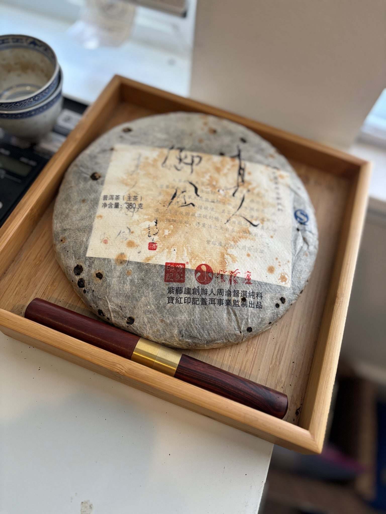
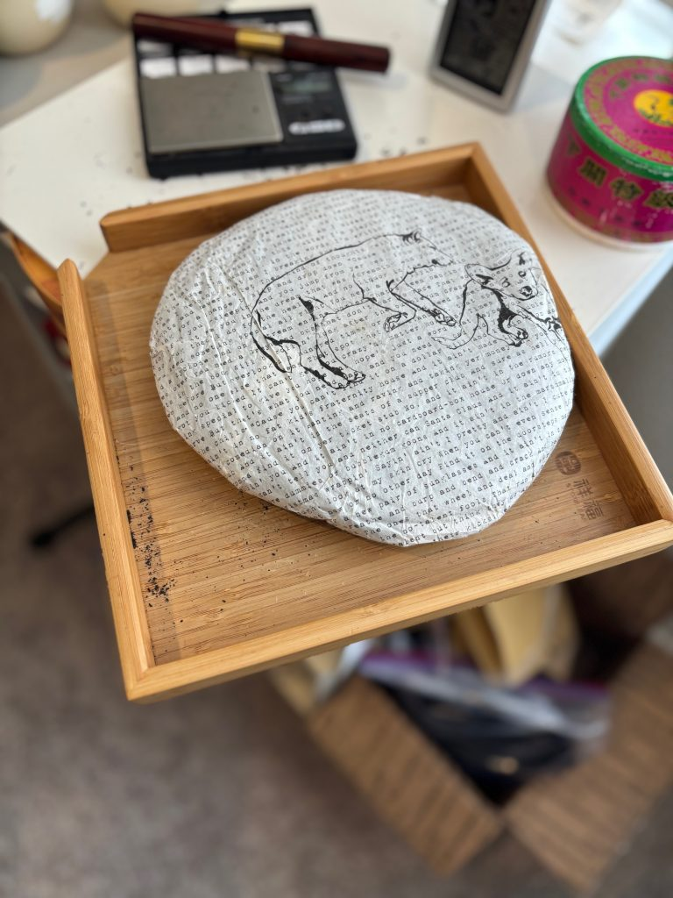
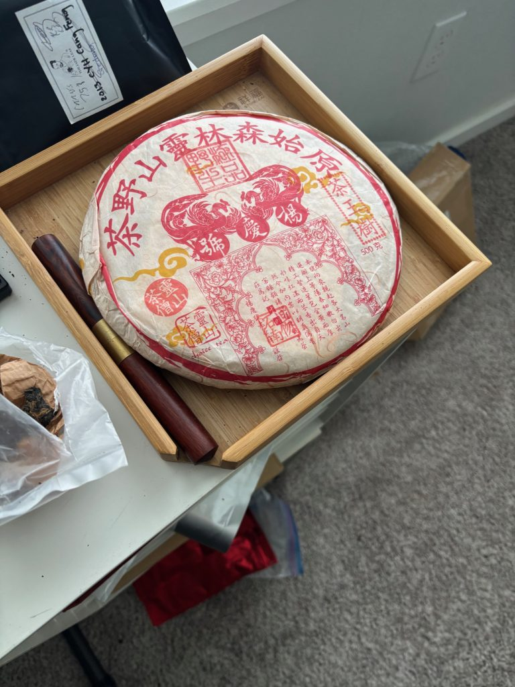
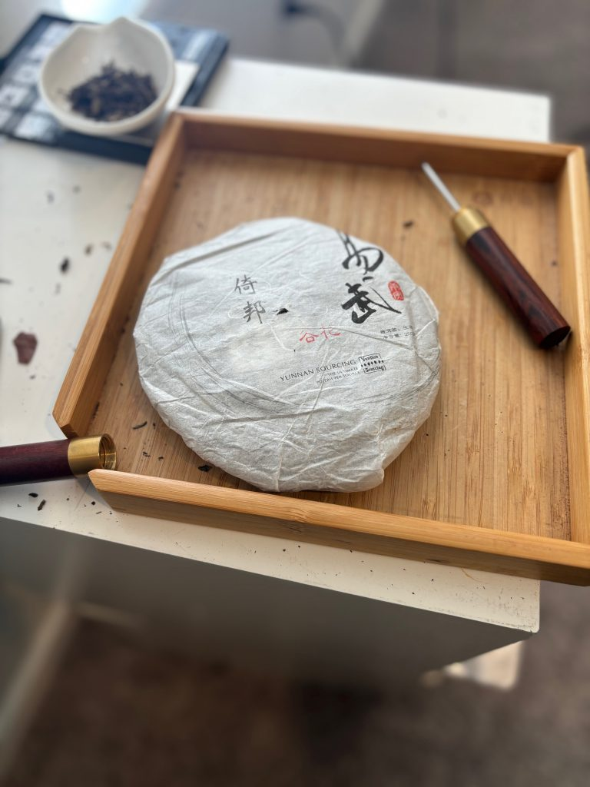
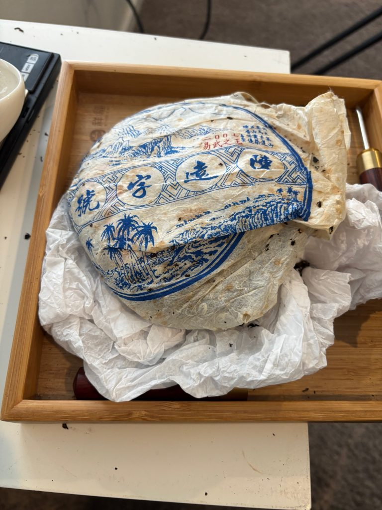
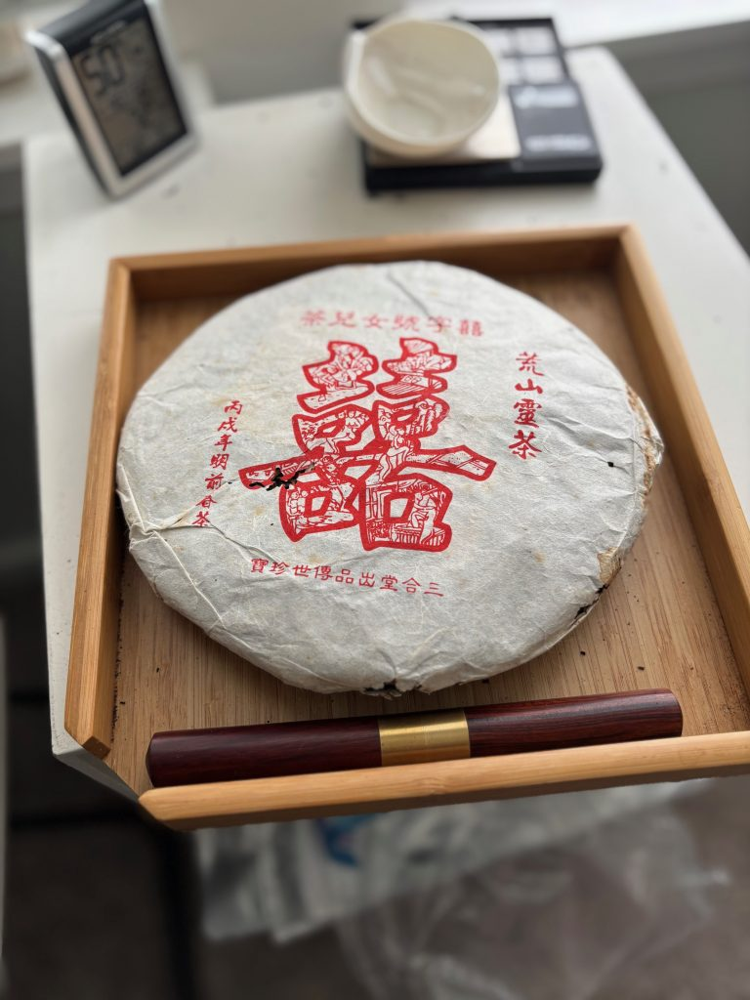

https://teadb.org/yiwu-mega-report/

Please open the text file seperately to open the links

# Yiwu-ish Enjoyers Mega Report. 103 Teas Reviewed!
*September 30, 2025*

**Author:** James

The pu’erh scene has dramatically changed over the 11 years since I started my pu’erh journey (documented with the Yiwu Pu’erh Report and a flurry of Yunnan Sourcing and White2Tea teas). Unlike say Xiaguan I’ve always liked Yiwu teas and they remain a substantial chunk of tea I consume. 

The availability of Yiwu tea has changed and fluctuated since that time period. In 2014, the TW boutiques previously sold by Houde in the mid 2000s were not easily acquirable so the bulk of teas were youngish pu’erh under western vendor’s own labels. In 2015 I did a semi-aged Yiwu report filtering out most of the western boutiques, which had a particularly unimpressive roster of teas that were available at the time. Later that year, Emmett started doing group buys for Yangqing Hao which would eventually cascade into a variety of availability for a handful of Taiwanese boutiques that continues til today. 

Flash forward a decade and we have quite a few boutique Yiwus with varying degrees of age and a robust selection of $/g+ Six Famous Mountains Teas. Some of these are from western labels like YS and W2T that were still young in 2014, while others are from Taiwan and mainland producers. So in the spirit of my original tea of the month reports, I ordered a bunch of samples and called upon the teas already in my stash.

## My Own Evolution As A Drinker & Yangqing Hao

One of the first brands that I really connected with was Yangqing Hao. They were originally introduced to me via Origin Tea, who sold the Zhencang Chawang, Qizhong, and Jincha. I was only just getting into pu’erh towards the end of Origin’s existence and bought a 50 gram sample of the Jincha as Origin was shutting down. Meanwhile things like the Qizhong were getting more than solid reviews and recommendations from places like TwoDog (W2T). 

This small 50 gram purchase ended with me (over)buying quite a bit of YQH, a result of a starving semi-aged market as well as appealing bulk prices. In the end this was not a significant mistake, as I can easily sell these at a profit. But I think the sudden availability of multiple YQH teas in a relatively short amount of time ended with my palate being overindexed on a certain type of soft, smooth, and gentler pu’erh. 

I liked their storage (still do), liked Yiwu (still do) and became acclimated with the sort of Yiwu tea they were making in the mid 2000s and most importantly leaned too heavily towards this combination as a marker of quality. I think this can be chalked up to my inexperience and the lack of other reference points (competing boutiques, MHTF Yiwus) that were available at the time. XZH started to become more available a little later, but it was very unclear at the time if the Taiwan boutique pipeline would close up and shut down at any moment. Instead the opposite happened (YQH/XZH are still very much around) and other brands like CYH, BYH, and DTH (HK Boutique) would become available around 2017/2018, two years after YQH, largely thanks to TWL.

One example of my over-Yanged palette is when I tried Dragon Tea House for the first time in 2017. The taste was very different from my benchmarks of YQH teas and I found their tea challenging to evaluate and appreciate.

## Will These Age? & Windows & Single Origin

This is one of the more important things I’m looking out for in this drink through. My overall opinion on boutiques aging well long-term has trended down throughout the years. Unlike say a very strong, densely packed factory tea, a lot of Yiwu tea has a less obvious aging trajectory. Some of this is that boutique processing can be tweaked to create approachable young pu’erh (allowing the leaves to oxidize, less rolling). It is also partly related to the terroir of Yiwu which tends to produce on average less aggressive teas than western Xishuangbanna. Even though these are more drinkable than young factory tea, I still prefer these teas with some degree of age. It is nice and a very helpful data point that we can drink many examples with more age than 10 years back.

Another way to think about aging is in windows. Thanks to Seo on Discord this sort of thinking has started to become more prominent. The window concept is straightforward, a tea will hit a peak at some point and should be consumed within a window of time. At a certain point, the tea will start to thin out, potentially losing strength and become less interesting. Due to my slow western storage, there’s not a ton of teas that have really thinned out on me. And I may indeed be the last person to know, so the samples of more aged teas from others might offer valuable hints.

A second concern is the materials that are used and how blended they are. Yiwu products sold are dominated by boutiques. These boutique outfits have frequently veered into more specific villages and batches, resulting in smaller and smaller runs with less blended materials. Since I am not interested in consuming pu’erh when it’s young, I am most curious about how well these are aging. A concern is that these can age in particularly uninteresting ways despite having good material.

## Storage Match

I think unlike Xiaguan where you want a certain degree of humidity, it is less necessary and in many cases preferred for these teas to have had drier storage. The powerful blunt instrument of HK traditional storage would not be my first choice for most of these teas.

How these teas are stored will also impact their drinking window and when they could be termed as ready. While I still prefer these teas with a bit more aging from a hot and humid place (I like darker teas) I think if the tea is good enough, it can still be fairly drinkable given enough time. One good example is the 2010 WWSF Manzhuan, a tea that has been solidly dry stored and is very drinkable now.

## Goals

1. **Stash check.** Having a new family member has been a soft reset on a lot of things, my tea hobby included. Unlike many of the Xiaguan teas pulled out of deep storage I do drink these regularly but there are some that have fallen out of favor. There are also others that are now old enough to try.
2. **Establish an average tea (VOATO, Value of Average Tea Owned)** to benchmark against. As stated in my reflections I’ve previously overindexed on a YQH profile, so I want to have additional measuring sticks to compare teas.
3. **Crank out my thoughts** on a ton of teas in a helpful way for myself and hopefully for a few others. Like the XG Masochists Report you are getting more than a year’s videos worth of thoughts in one report. There are over 100 (!!) teas listed in this report.

## Ratings/Tiers

I did not want too much mental gymnastics in grading the tea, so I am rating purely on my own appreciation of the tea at the moment I drank it. Some folks suggested I switch to a tier system and I do think that makes sense. While I don’t wish to be memed, I do find rating to be an effective way of capturing my own thoughts at the time of drinking. They are purely a reflection of how I enjoy the tea at this moment and not of a tea’s potential.

---

## Chenyuan Hao

Chenyuan Hao is one of the most famous of the Taiwanese boutiques and has made quite a lot of tea in the last 25 years. While they’ve never been my favorite boutique, I’ve generally enjoyed their older productions. They do not make up a very large part of my collection but the few I do own have some undeniable qualities. They also have a number of teas that have gone in and out of availability. Unlike a YQH or XZH, you can also find Malaysian and Taiwanese stored CYH which adds another layer to explore.

### 2020 CYH Mansong (A)

https://youtu.be/S28G_tlU1n8?si=7-1xoIegtgHnZVit

I fully expected to be disappointed by this but it is actually a very pleasant drink, albeit nothing I’d buy (that price!). The taste profile is familiar and not unusual (sugarcane, florals, fruit, light bitterness). The broth isn’t super thick but the tea’s activity in the first five or six steeps is very enjoyable. It thickens up in the throat and has a great deal of sweetness in the back of the mouth and the throat. Pushed it has a mild bitterness. Feel-wise it also left me feeling great. Doesn’t last forever, not totally sure how this will age, it’s very expensive but it is a very enjoyable tea.

I recently had a much cheaper “Mansong” from a different boutique and it was a pale imitation. It takes quite a bit for a young tea to grip me, but this one did.

### 2016 CYH Yiwu Calligraphy (B)

Had this sent in from Tuna. Thank you! TW Natural storage. This is a hard one to rate. It is quite tasty and easy to drink now but IMO does not have a ton of strength to develop beyond where the storage has moved it. Very sweet, woody, and herbal. Decently thick. It has clearly seen some temperature/humidity, but is reasonably clean for my taste.

### 2013 CYH Gedeng (C)

https://youtu.be/fVs06HKxm1E?si=mj_b9jLRjzZiaS-j

From Emilio, Taiwan stored. I’ve had good sessions with this and some worst ones. Unfortunately when I did this report it wasn’t satisfying. Herbal, wood, dates. A bit thinner and more bitter. Curiously not too sweet. To me this one lacks the depth of the better CYH offerings.

### 2013 CYH Youle (B/C)

Thanks to tea related putrefaction for sending in the Cang series. A similar profile to their older Mansa. Dark fruit sweetness, raisins. I think overall its decent, but basically has less depth and penetration than the 2003 CYH Youle.

### 2010 CYH Yibang (B)

Fruity. Nice protracted mouthcoating and texture. Overall this is much preferred over my encounter with the 2013 Cangle series. For a somewhat inexpensive 6FM tea this is sturdy and decent. Pretty easily the favorite of what I’ve tried from the Cang series.

### 2007 CYH Mansa (B)

From LP, Taiwan stored. This is an enjoyable Yiwuish tea. Sweet hay, raisins, a nice aftertaste. It isn’t super strong or thick, but overall pleasing. This would be a good buy for a daily drinking Yiwu if it pops up again. Not too heavy but will get bitter when pushed.

### 2007 CYH Yiwu Zhengshan (B)

From LP, Malaysian stored. Has that nice thick spicy Malaysian stored feel. In the end, this is a bit simple for my taste and I wish that it was blended more, but it is undeniably nice. Big thick, wood, incense, with some nice sugarcane sweetness.

### 2007 CYH Yiwu Ziwang (A/B)

MY stored and been in Seattle for like 8 years. Most of the time this is a really nice Yiwu tea. It is thick, sweet, resinous, satisfying, with great depth. The tea is firmly semi-aged still maintaining some more youthful characteristics. Pushed it still has a fairly healthy amount of bitterness.

I’d heard this has some hong-ish characteristics, which did not show up in most of my sessions with it and I was ready to write that off. However, on a few more recent sessions those hongcha aspects really showed up and dominated the session, both in terms of texture and its sweetness. It was very nice hongcha, but difficult to overlook. I will keep sessioning this tea to see how it does but I’ve had to downgrade my rating a couple grades as a result.

### 2005 CYH Shanzhong Chuanqi (A)

https://youtu.be/xYRqeganx1Q?si=Qj8xyyG1VK8_10po

A six famous mountain blend. Had this four or five times within the past couple months. It can really vary depending on what parts of the blend you get. Some sessions present a lot more like an Yiwu tea, with that sweet throat aftertaste while others have a bit more fruit and body. It is almost always enjoyable, sometimes more than others but I do wish it produced a more consistent experience.

Not super thick, but thick enough. Good strength and backbone to this tea. More fruit and less throatfeel than a conventional Yiwu. Despite being a bit less sweet in the throat the tea has decent depth and there’s sweetness that lingers in a nice way. Changes quite a bit throughout the session. I would guess the material is a fair bit worst than the Dashu, but the blending helps make it a bit more engaging.

### 2003 CYH Dashu aka 2003 CYH Gushu (A)

https://youtu.be/SNwMUhR0QZI?si=GIbboHfQ5fRpmPnR

MY stored. I have gone up and down on this tea a bit. It is clearly very good quality material but for my tastes a bit simple. Thick, oily, smooth, strong aftertaste, with good depth. It has some nice body feel, that feels generally relaxing and downwards. Tastewise, menthol, wood, and lots of sweetness. On the downside I think I prefer something like the SZCQ which offers significantly more dynamism at the expense of better material. To me, this is ready to drink and while I don’t think it’s going to thin out soon I don’t see a huge point in aging it for another decade.

### 2003 CYH Yiwu (B)

A very agreeable Yiwu production. The storage is a little muddier than the Malaysian storage of the Dashu but overall good enough. Soft, silky texture. Has a nice mouthcoat. It is overall thinner, but a bit more layered than the Dashu. Pretty sure this is expensive, but as a tea this is a very easygoing one that I would not mind having often if it were cheap enough.

### 2003 CYH Mansa (A/B)

Darker, fruity, sweet tastes. It is a bit narrower than the Yiwu and a bit more cleanly stored. It leans towards woods and muscatel/plum notes. I am a fan of these darker Mengla County profiles and this one hits the spot provided expectations aren’t sky high.

### 2003 CYH Manzhuan (A)

https://youtu.be/SCl1ex9OqIg?si=ua_SHqu7Sw8WvRZE

I like this a touch more than the other 2003 CYH mountains. A bit brighter but also less active than other Manzhuans I’ve had from the same era. It has a pleasing oily, raisin-like sweetness. A calming profile that goes down very easy. There’s a pleasant mouthcoating sweetness. Like a few other of these, there’s not a huge amount of bite. Although the taste profile itself is a bit light and subtle it reaches quite deep and warms me in the core. I like this a good deal, but I do think it suffers from comparison with other teas that are out in the surrounding years. To me this does not match the expansive oiliness of the 2004 BYH product, which is a profile I tend to prefer. Still I would not begrudge anyone that picks this tea.

### 2003 CYH Youle (B)

This is a good tea but also my least favorite of the 2003 CYH I’ve tried. This has a sturdy and decent profile but lacks a bit more of the depth from the other 6 famous mountains focused teas CYH made. Tastewise it is more upfront, with acidic apple, wood, and herbal flavor note. Nice mouthfeel. More or less ready to drink as there’s not much bitterness or astringency when pushed. It is interesting that Chen elected to make the SZCQ blend a few years later. This is a nice enough tea, but I think I might prefer it blended.

### 2003 CYH TQH (S)

My favorite of the 2003s that are more available. This feels like a good combination of a more traditional profile, with a more rustic profile heavier on wood and resin, with some fruit in the background. Wood, fruit, good salivation. The depth of the tea stands out especially when put into contrast with the Youle consumed the previous day. The longevity isn’t the highest, but I’ll almost always take 10 steeps of quality than 20 steeps of less quality.

Having compared with others who aren’t as big of fans I still think quite highly of this tea, although the flavors are in general not as surface level appealing. I also think this has a decent amount of room to continue aging. Unfortunately did not have access to the 2004 SPH reproduction.

### 2003 CYH Yiwu Yesheng (S)

https://youtu.be/uS4F_WLaWic?si=3baq8RaQWF_ncbPE

Perhaps my favorite of the report? Throat balling almost immediately off the bat. A bit light up front but has loads of depth and downward feeling. Strong, resinous profile. Protracted mouthcoat. A very strong, impactful Yiwu tea. Interestingly the less blended nature of the tea does not bother me as much as other ones perhaps due to the sheer impact of it. Seems like it has the fuel to age as well. Thanks to Peter for allowing me to acquire some.

---

## Yangqing Hao

Summary of my current views on YQH:
* YQH is not my favorite Taiwanese boutique.
* I still enjoy drinking YQH teas.
* For the price I paid for YQH, they’re my best cost performing boutique and my most consumed.
* These prices are no longer available.
* Their top teas sold in the 2004-2006 range (Dingji Yesheng, Teji, etc.) have flaws and nits to pick and are not really on the same level of the top teas from other Taiwanese makers (CYH Repros, BYH MZ/Yiwu).
* I do not know the post 2007 teas well.

### 2007 YQH Qizhong (A/B)

https://youtu.be/EGDsLU8HKuE?si=VKUUkyM51HdLBUSD

I finished a cake of this around 2021 and waited to open another. So I opened a cake for this occasion. It is very much the tea of my memory. I am immediately greeted by the distinctive notes from what has been described as Yang’s Tainan sweatbox. Very sweet and heavy menthol notes, but when pushed gets astringent and drying. Some of the notes early do resemble Hongcha, which is a bit concerning but it quickly dissipates after the initial two steeps. The heavyish astringency is very quick to convert and leaves a great throat coat. The original mouthfeel is a little thin, but it thickens up over time. The longevity is also very good.

Fortunately or unfortunately this tea is not too different from my memory of it in 2015. It has not developed or turned the corner into its next phase. However, it hasn’t faded. Perhaps due to its hype Qizhong has always been a polarizing tea, but as one can tell from my rating and the fact I’ve drank a decent amount of it and am on the pro-Qizhong side of things. To my tastes this remains a solidly strong and enjoyable YQH. This still sells for a reasonable price IMO.

### 2007 YQH Lingya (A/B)

The calmed down Yiwu version of the Qizhong. It is soft and not nearly as active, but it is a very ideal daily drinker with similar notes (heavy menthol/toothpaste) that is smooth and goes down real easy. I’ve heard some concern that this is going downhill quickly, but after several sessions with it this year I feel its doing just fine in my storage. It is not strong tea, but a perfectly fine daily brew. At one point I decided I liked this more than Qizhong and it is a little smoother to drink, but I think the Qizhong is the more engaging and interesting tea to drink.

### 2007 YQH Tuo (D)

https://youtu.be/o2Izy3omFLU?si=xF58zcEI99HBZF9a

Was given this as a gift from Yang (I think?) when I visited in 2016. Didn’t know much about it then and apparently it is from Yibang? Unfortunately this is pretty uninteresting. The tea is thin and not strong enough. It does offer a little bit of raisin-like sweetness, some floral notes, and a nice texture but lacks the oomph to make much of an impression.

I went back for a second session, the tea this time is fairly sour/sweet. It has a nice aroma, but fails to impress again. I had the 2007 YQH Jincha after to confirm my own impressions, which I found to be far more satisfying.

### 2007 YQH Jincha (B)

https://youtu.be/zGrRoUpLRBQ?si=dGIWYqTLhB-HM4bS

I’ve always liked this tea ever since I first tried it in 2015 when it kicked off my YQH enjoyer era. The tea remains quite enjoyable but has one fatal flaw that has prevented me from polishing off several, it’s damn compression. This tea is compressed like Yang found a Xiaguan tuo and thought it was pressed too loose. Similar to other heavily compressed teas it takes some experience and patience to get it to open up and brew evenly. It is easy for the initial brews to be too watery, or too strong (if you’re brewing dust) but I’ve become accustomed to it.

It is a dark Yiwu (a fast way to my heart) and is mentholy, woody, leathery, resinous, with a nice texture and a sweetness that reaches far back. Oddly enough in notes, it echoes a lot of the XG 8653 notes, but in a more Taiwanese boutique way. Reaches to the back of mouth and top of throat. The price and quality are beginner friendly, but the compression is not.

### 2006 YQH Qixiang (B)

https://youtu.be/x-27iqNHM40?si=ATyZvt31WAdoK7AB

This is a YQH that never quite lives up to the potential for me and I like it a fair bit less than the CYH SZCQ (it is decidedly better than the 2005 YQH CL). Overripe fruit and wood profile. Oily, medium body. While it does have some decent depth and does go down easy (like most of YQH) I mostly prefer the 2007 Yang profile or something like the Chawangshu.

### 2006 YQH Chawangshu (A/B)

https://youtu.be/3uQQGYcQDuM?si=4dHSy6xervq5qksM

In the last few years I drink this one frequently with my buddy Garrett on Zoom, but otherwise hardly at all. Oddly it feels like I know this less than others. It is a simple, but broadly appealing tea. In some ways this is like the inversion of the YSSL, which has some strong characteristics but feels thin in others.

Camphor, menthol, some mouthcooling early on. It has an oily medium body. Lots of sweetness early on. Pushed it maintains the same menthol/wood profile and picks up a bit of bitterness. There is some bodyfeel, that does not penetrate as deeply as some of the older YQH products, although this one always has a generic, reasonably appealing profile. Probably one of the more middle of the road YQH in terms of distinct Yang-y characteristics. I kinda feel about this like I do over some CYH teas like the Dashu, nice tea, but a bit duller than the material should be and wish it was blended for a bit more dynamism.

### 2005 YQH Yuanshi Senlin Huangshan YSSL (A)

https://youtu.be/SdrWG0zoWmA?si=RQ0K3QTcs3Jyyhfg

Otherwise known as long name. This tea is a bit different from 2006 or 2007 Yangs and I bought it a bit later. While the YSSL has some familiar Yang notes, I do believe it has a distinct profile from other YQH in the 2004-2007 range. This tea first caught my attention when I met and interviewed Yang in 2016 and I noticed the deep energy of this tea sinking down on me. This was otherwise in a context, when I would likely not notice (I was trying to focus on the interview). In my conversation with a close tea friend, we remarked that this is kind of the opposite side of the Yang’s that are relaxed and go down easy (Teji/Lingya), it’s more challenging and takes a bit of attentive brewing to tame. Likely the YQH in this report with the most potential for the future.

When I was first brewing it I found it to be erratic, but with increased familiarity I have a much better feel of when to push in and out with a tea. Much moreso than the 2004 teas (pretty easy to brew) this can get over brewed and quite strong. The flavor notes are typical Yang, menthol, mint, wood, fairly sweet but the presentation is different. The tea starts out narrow. The body is thin, especially at the start but it has a good huigan reaching deep into the throat. I also get significant deeper depth and body feel from this tea that is on the sedating side of things.

I also had the YSSL with Bev and while decent, it fared a bit worst when compared with the admittedly steep competition (other Yiwus brewed were the 2007 CYH Ziwang and 2005 BYH Yiwu). As a result this is a bit tricky to rate. On the downside I think it’s weaker and less well rounded than some of the other brands top hitters of this era. It is especially a bit thinner in the mouth. That being said, it is still reasonably strong with good, penetrating aftertaste and deep feelings.

### 2004 YQH Dingji Yesheng (A)

https://youtu.be/NSBrkY0yt3M?si=NFf1LIoCccY1IAYP

DJYS is deep, dark, heavy and gives me a fairly stoned feeling. Tastewise it has a bit of that Yang menthol, dark wood action, thick oily mouthfeel. I’ve been brewing a bit closer to the core so it has a bit of a pungent green resin to it. Buzzy mouthfeel.

The traits this tea has are uncommon and quite rare which makes it tempting to rank high. However.. I think there are other teas that are more of the complete package which stop me. Not something I can drink often, but one of the nice things of getting experience with a tea is knowing exactly when you want to have it, especially for funky niche teas like this. There’s been some talk about this tea dying, but it feels more or less the same as it did in 2015. Weird and atypical. Strong in very specific ways and weak in others. I’d definitely pick the top-end CYH/BYH of this era over it, but I still am happy to have this around.

This is a bit of a controversial tea with pretty varied opinions. In the end, I come down close to where Marco and Matt.

### 2004 YQH Teji (A/B)

https://youtu.be/kdwomC1Vk9o?si=JT_SAFg29jaIJ7wO

I revisited my notes of this about 10 years ago and if you want to make a case that some YQH cakes are fading this would probably be one of the pieces of evidence, behind the Yiwu Chawang and Cangliu (not reviewed). It however, still has many enjoyable qualities. Tastewise it is medicinal, herbal, woody, fairly sweet. Oily with some textured mouthfeel. It is not nearly as dark as the Dingji. The tea has very little astringency or bitterness to it, so I’ve come to prefer it with about 7-8 steeps pushed quite hard. Brewed this way it has a great sweetness that coats the throat and it generally feels nice and goes down easily. Unlike the Dingji which is more stoning this is uplifting and easier to take in. Good depth overall although not as much as the Dingji.

One of the concerning aspects is the lower longevity overall. If you read my notes from the 2015 report where Grill comments on the very impressive longevity and I comment on the density of the tea and then compare them with Matt’s as well as my own current one, it’s not a tea that is getting stronger and might indeed be fading.

---

## Biyun Hao

Less well known than CYH, YQH, and XZH in Taiwan. I still think the early Biyun Hao run of teas in 2004-2005, is my favorite of the boutiques I’ve tried. Major credit to Pedro, Teaswelike and The Jade Leaf for providing access to BYH. I’m a bit less familiar with the later teas, but have generally found them to be quite agreeable, especially their Manzhuan. Many of their products are either from Manzhuan and Yiwu. Both can be excellent, but I tend to gravitate towards their Manzhuans.

### 2023 BYH Mansa (B/C)

Decent young tea. Lots of mouthcooling, reasonable thickness, fairly sweet. This is the sort of tea I’m not great to judge as I drink so little. The mouthcooling more than anything indicates the quality leaves here.

### 2018 BYH Walong (A/B)

Late addition thanks to Emilio. This is amongst my favorite of the teas in the last decade. Nice protracted mouthfeel, some mouthcooling. A decently strong bitterness when pushed. Some grape/muscatel and has aged a bit already. Has that nice Yiwu-ish aftertaste that coats the back of the mouth.

### 2015 BYH Pure Mahei (B)

Thank you to Emilio for the sample! This is a really good classic Yiwu. Good thickness, wood, sugarcane, light fruit, light but present bitterness. The profile reminds me a little of a more developed Last Thoughts.. Some of the time a lot of these Yiwus will lack the density or punch. Not the case here. While it is undoubtedly a TW boutique Yiwu it packs good strength and density.

### 2015 BYH Lishan Gongcha (B)

https://youtu.be/qq1FzdnYpx0?si=IY-1XUAzXSkgKUkQ

A nice blend. Some mouthcooling early and some sugarcane. Due to being a blend there’s a lot more dynamism than something like the Pure Mahei. Can get a bit herbal, some decent bitterness, hay. Like a lot of BYH has a nice concentrated, dense feeling to its core.

### 2009 BYH Xiao Mannai (B)

Concentrated, sugarcane, plum. Back of the mouth sweetness. Fairly classic Yiwu profile.

### 2006 BYH Manzhuan (A)

I tried this originally in the 2017-2018 range when BYH was just starting to get western exposure but did not remember it well. Starts out really nice with a darker, brassy, pleasing sweet plum profile. The depth and feeling is quite good. Flaw-wise most of it comes down to not being quite on the same level as the 2004. The body is only slightly oily and it leans a bit sour without the depth of the 2004.. The sourness lingers a bit even though it mostly does resolve into sweetness. Perhaps it will be better in a few years. Comparing it with the 2004 is a very high bar and this is a perfectly good Manzhuan in its own right.

### 2005 BYH Yiwu (S)

https://youtu.be/yM7N4DLuTUU?si=rHZyLPJqfKI63lhV

A very good classic Yiwu. Wood, plum, thick. Lots of sweetness and mouthcoating. In the end I do find this doesn’t quite have the extra depth and does not quite zonk me in the way that I love about the Manzhuan. It is also interesting that most of the BYH have not gone in the camphor direction. It is nevertheless a very pleasant and nice Yiwu. Feels nice and goes down real easy. I would happily drink this very often.

### 2004 BYH Manzhuan (S)

https://youtu.be/y2hqd1qdOys?si=htxAnBvx2abejO0l

Even more of a personal favorite than the Yiwu. Thick, woody, oily, with some mouth cooling. I do like the overall taste profile which is nicely concentrated, but the tea is particularly impressive in its heavy deepness. Definitely a tea that gets me zonked most times I have it. Still a bit of resin, and a nice dark sweetness that I find very appealing. I prefer this over the more broadly appealing BYH Yiwu (2004/05), but would not begrudge anyone who has the opposite preference.

### 2004 BYH Yiwu (S/A)

A very solid Yiwu that I almost like as much as the 2004. It is a bit more wood-focused and less fruit. Less of the BYH classic taste, with only faint plums in the background. There’s a pleasing herbal taste and this is both easy to drink and easy going down. It is a little less dense than some of the other ones which makes the difference between this and a higher rating.

---

## Wistaria/Baohongyinji

Zhou Yu is the tea maker with perhaps the most varied output that spans across a decade but in a non-continuous way. I’m lumping in BHYJ here as Zhou has worked with them on a handful of products even though I don’t think he has anything to do with something like their Bohetang. Mr. Yu’s Wistaria products I think come with some of the highest approval ratings. While I can’t blame anyone for balking at tea prices, if someone told me they flat didn’t like Wistaria, I would have questions.

### 2014 Baohongyinji Bohetang (B)

(not a ZY tea) Thank you to Peter for the sample. This is more expensive than the CYH Mansong and while undoubtedly decent it isn’t remotely worth the cost. Nice sweetness, some light mint and brown sugar. It is medium thickness and does coat the mouth nicely. It does have some nice throatiness but it isn’t as intense as I would’ve hoped. Feel-wise I found this to be OK, but not to the level of the Mansong. It is overall a perfectly decent Yiwu bound to both attract and let people down due to its name.

### 2013 Baohongyinji Yuema Wangong (C)

I figured I’d tried this once when I got it 6 or 7 years ago but had not apparently even touched this cake. The tea is in what I hope is an awkward stage. It is woody, floral, and has this dry potpourri aroma. Overall the taste is not that great. It however, does have a decent thickness and pretty good depth. It is a subtle tea, especially right now. It hints at a sugarcane and being a bit more bold but it doesn’t really happen. From the persistent lingering sweetness you can tell there is good stuff here, but it feels pretty far from its potential. This is a harsh rating, but I think this tea will hopefully wake up in a few years. This is going back into storage for now.

### 2013 Baohongyinji Zhenren Yufeng Spring (A)

Made by Zhou Yu. I acquired this right before TWL and Quiche released it, thanks to Stein for the hookup! Somehow I never had this until recently, and it’s in a much better state than the Yuema Wangong right now. It is satisfying right now but also unusually hard to pin down. It lacks distinct up front flavors but has a ton of secondary intangible qualities, nice texture, good body, huge sugarcane like sweetness, resin, and lots of throatfeel. It tastes pretty different from most semi-aged Yiwu of the same age and very different from the Wistaria’s 2003 run. The tea hasn’t filled in like others have at this point and I really don’t know how it will continue to evolve. Not to say it will be bad, I simply don’t know.

I had this in a session with Skylarke on Discord, and the tea got outshown by the BYH Zhengjialiangzi by quite a wide margin. To me that session showcases how context shapes impressions, and if you want a flavor-lite tea like this to show well, you’ll need to carefully consider what you are brewing around it.

### 2007 Wistaria Hongyin (A)

https://youtu.be/WkBFjbkQPwE?si=kI7wW52ZO47JMutZ

This is a tea that has gone up in my estimation a lot. It is honey sweet, woody, incense, reasonable thickness. Very good depth, coats the throat. The longevity isn’t the longest, but it is very good while it lasts. I wish I bought way more of this.

### 2006 Wistaria Longpa Youle (A/B)

https://youtu.be/efEwLnMM2fk?si=qfnrF7L6cMEofySK

Might be overrating this, but it’s actually quite good and rarely talked about. It is a fair bit greener than the 2003s but is definitely further along than I recall. It has a more broadly decent pu’erh sort of appeal, with good strength and pungency. Some mouthcooling early on. A bit of an acidic sweetness, not incredible depth but good enough with a nice throat coating effect. Like a lot of Wistaria this is a solid drinker. I think once it is a little more aged I’d move it into tier A.

### 2005 Wistaria Zipin (A/B)

This tea lingers in my memory a bit worse than it actually is, mostly because the 2003 is such a classic. It is a good tea and in a vacuum a decent imitator of the classic 2003. Nice textured powder, great Yiwu sweetness and depth. The sort of tea that easily passes the speed test, feels good and goes down easy.

### 2003 Wistaria Zipin (S/A)

https://youtu.be/Zf5NEP5YKy4?si=1LcaB7AiW2VjJ4WD

22 years strong. Not much to say about this tea that hasn’t been said already. Thicker in throat with more depth than the 2005. Very satisfying tea, neither too heavy nor too light and one that manages to still grow in my estimation. It’s one I’d grade lower but I never complain about drinking it, so I end up with a very high rating.

### 2003 Wistaria Ziyin You (B)

https://youtu.be/WakAV9xQNfs?si=RM81cdOXQ9r9PvO4

Originally bought on accident from Wistaria a decade ago when I intended to pickup the Zipin. Like a cousin to the Zipin. It is more straightforward in taste and has a nice body, but suffers in comparison with the Zipin. Less depth and a bit drying. This is a good Youle tea but I prefer the 2006 (suspect I’m in the minority here).

---

## Yuanyuan Tang

I did a blind of these in 2023, but don’t really have a strong understanding of the brand. Peter who runs a restaurant in New Jersey was kind to send over 10 YYT samples over. In the end, I don’t love all their teas but they did have a few stand out.

### 2013 YYT Yiwu Chahuang (B)

After a couple of fairly mild YYT that were just not quite cutting it for me, this tip heavy tea did the trick. It is potent and decently thick. A bit fruity up front with an expansive mouthfeel and texture. Pushed it does get a little sour.

### 2013 YYT Luoshuidong/Sifang (C)

Grouping these two teas together. Vaguely sweet, hay. These are either in a bit of an awkward phase or too mild for my tastes.

### 2012 YYT Bannaqing (A/B)

A blend of allegedly LBZ and Tongqinghe. This is a pretty solid tea and IMO a successful blend. It is easier to tell where this is going than the TU Miles Birthday. I think it’s possible I’d rank it higher upon subsequent tastings. It is thick, coats the mouth and offers some interesting mouthcooling, a bit herbal. It is not a brutal tea but one that strikes an interesting balance between the two terroirs.

### 2012 YYT Jingchanghe (B)

This is I think in a bit of an awkward phase but I think the material is decent enough. The storage seems dryish, with a lot of stale floral notes at the beginning. It does however have some nice sugar-like sweetness and depth. The aftertaste goes decently far back.

### 2010 YYT Tianmenshan (A/B)

This one caught me a bit off guard. A lot of mouth cooling. As much as I’ve experienced with a tea. I thought it started a bit thin, but it thickens up. Good throatfeel as well. Nice texture and sweetness lingering. In the end this is a fairly straightforward tea, but a satisfying one.

### 2010 YYT Luoshuidong (B/C)

Decent tea, that seems a little bit oxidized. Nonetheless it is decent material. It is very fruity, juicy, leathery. Easy going down and a generally pleasing tea.

### 2007 YYT Lengshuihe Guafengzhai (B)

Decent quality Yiwu tea. Presents lighter initially but darkens and thickens up quickly. It is thick with some light mouth cooling early on. Flavorwise moving into darker fruits from sugarcane and hay.

### 2005 YYT SZCQ (B/C)

Like a lot of the six famous mountains which were popular during the mid 2000s, this one might be prone to inconsistency. It is quite different from the more Yiwu focused teas I had around this time. There is more fruit, a rich woodiness and a bit of depth that lightly touches the back of the throat. It does however get a bit sour. I think there’s probably some better sessions in here.

---

## Western Boutiques

This used to be the main place where people scrapped and tried teas they had higher hopes for. Now a lot of these are older and we can see how they are doing.

### 2023 W2T Last Thoughts (B)

https://youtu.be/VVRbwf7WxSk?si=4YAHXtvDVEA75XW4

Solid Yiwu but not on the level of the 2014 one. It has many of the same characteristics as that tea, but amped down by 20-30%, enough to feel the difference. The tea is very thick, floral, and has a very nice aftertaste that is good but not quite as expansive as the 2014. Qi-wise I find it doesn’t do nearly as much as the 2014. It is overall a very decent Yiwu (Wangong-ish) profile that leaves me reasonably satisfied.

### 2016 W2T Diving Duck (D)

This tea smells good but is unfortunately not in a very appealing place right now. It smells like dark berries, hay, wood. Unfortunately it is still very grassy and not that sweet. It has a fairly sturdy base to it but does not give much aftertaste either. Feels a bit like the Tea Urchin Zhangjiawan. Quite possibly not aging well (green tea pu’erh?) or optimistically in an awkward phase.

### 2014 White2Tea Last Thoughts (A)

The thought is that this is a Wangong tea. For better or worst, my very slow Seattle storage is good at maintaining a tea’s character. As a result this very much fits my memory of it (consumed 9-10 years ago?). The tea is thick with a sweet sugarcane note. Maybe a touch of fruit, light dry wood, but mostly still fairly floral. Not terribly dark (by base material or by storage). Good throatfeel. The tea stands out in particular with its impressive aftertaste and overall feeling. Relaxing and enjoyable. Back into storage.

### 2013 YS Xiangming (B)

https://youtu.be/LjSEQfe17RY?si=PjvSzKo2BandFVkJ

This hit the upper bound of modest expectations. Good, thick sweet, base. Moving into this raisin like sweetness. Despite some attention towards these early YS Yiwu productions, I think this is aging as expected.

### 2012 YS Purple (C/D)

https://youtu.be/VxIU5Bl00dU?si=gt8W25lk9uJ1Lely

Had this right after the Xiangming and it comes off a lot weaker. The tea has a grape-like sweetness but comes off fairly thin and needs to be pushed. Eventually moves to a dry, floral profile. It’s not awful, but the tea is not convincingly strong, something that probably should’ve been clear when I tried this in 2014.

### 2012 TU Zhangjiawan (C)

Dark, leathery and sweet, but a bit lacking in substance. Reminds me of some of the Mansa teas with a raisin like sweetness. While it does have some mild bitterness and has a darker Yiwu profile I gravitate towards. I have just a cake of this and may just play around with it and see how it develops. Not too nice to drink now.

### 2012 TU Miles Birthday Blend (C)

80% GFZ and 20% something else (LBZ?). Good thickness and a strong aftertaste. The bitterness weaves in and out. At times it is quite persistent, at others a bit more manageable. It’s not too dark, but coats the mouth nicely. The thick mouthfeel reminds me a bit of the Last Thoughts. I think this could be interesting in the future as there’s some nice material in here but right now it’s pretty muddled.

### 2011 TU Gaoshanzhai (B)

https://youtu.be/GkzFJjxLa_4?si=I0BPzX5fyyIGyDsM

From my buddy Garrett. Good body, back of the mouth sweetness. Some astringency but accompanied with a good aftertaste. Moves into a dry, floral profile. Fairly standard but aging normally and decent enough.

### 2010 YS Yibang (B)

I had this immediately after the YQH Yibang Tuo and had become a bit concerned this may’ve gone a similar path. After all it is small leaf varietal and autumn material. However, the tea while not too far along is quite enjoyable and offers quite a bit more than the Tuo. This has a honey, brown sugar, raisin profile that is loaded with sweetness. Can be pushed pretty aggressively and while it does still have a bit of astringency there’s a nice richness here. Good protracted sweetness that coats the mouth.

It raises some interesting questions about dry western storage for these. With a similar storage path to Yang’s Tuo, would this be equally weak and uninteresting? I’m not sure, but the combo works well enough here even if you’re unlikely to ever get that deeper, darker aged profile with western dry storage. The tea also does not seem to be green tea pu’erh as it doesn’t have an overwhelming bitterness that does not resolve.

---

## Other Boutiques

### 2015 Zhensilong Walong (B)

https://youtu.be/zp-ABzRW6to?si=_DQmvTmweZnLX8sp

Very sturdy Manzhuan, that is strong and dense. Not too sweet in that raisin/brassy way that MZ often develops into. Still fairly floral and grassy. This is not quite ready but has nice density and strength.

### 2013 DTH Yiwu (A/B)

Thanks to my tea friend Dennis for making me a sample of this! This is a nice tea. Like the 2012 it is very sturdy. It has a bit of that camphor and mouthcool starting to set into the tea. Dense, woody, pungent mouthfeel. Like the 2012 these are quite strong right now, and I’d probably prefer to wait to drink it.

### 2012 DTH Yiwu (A/B)

https://youtu.be/VtBL1_Z8pNU?si=PbT8iS7TeZYmPmh2

Since I was introduced to this brand I’ve always liked but not totally fallen in love with DTH products. Their traditional processing and leaf selection results in material that is very different from most other boutique Yiwu productions. In a blind tasting in 2024, I ranked their 2006 product last behind teas from BYH, CYH, and YQH. This resulted in me buying a cake of the 2012 determined to study and learn from it more.

For those unfamiliar, the storage is dry and not remotely HK trad-like (they are a HK based operation). Up front it is still a bit green. But it does have a good strong mouthfeel, good thickness, a long deep aftertaste. It has what I think developing camphor. Despite the considerable overall strength and staying power, I don’t find the level of depth that I would on my favorite Yiwu productions. It really defies the expectation of what Yiwu should be. Overall, the stiffer parts bring a different sort of appeal than other, predominantly Taiwanese boutiques, which tend towards softer, far sweeter profiles. I appreciate TWL and Marshaln for bringing it over. I will continue to drink and study this tea. In the end, this tea very well may justify its price. It has uncommonly strong bones and I have no doubts it is well made, the rating is sheerly based on my own enjoyment of the tea right now.

### 2017 & 2015 WWSF Private Collection Yibang (A)

Very nice Yibang productions. Good sturdiness and density and very nice feeling to them. They coat the mouth. I don’t really have complaints other than they’re still young (age+storage), which isn’t my exact preference. Great longevity, all around solid teas. I think Yibang enthusiasts will in particular really love these.

### 2010 WWSF Manzhuan Arbor (A)

https://youtu.be/FUawmYWfxSA?si=Nh0WPLNW5Wo4leXq

Pretty solid Manzhuan that is now available via TWL. Good, thick. Decent depth. The storage is definitely on the drier side of things, which doesn’t bother me too much in this case. Pretty drinkable now.

### 2008/2009 WWSF Private Collection Manzhuan (S/A)

Thick satisfying Manzhuan teas. They have that brassy taste, moving towards plum. Good depth. The Yibangs offer more fireworks but I’d be more likely to pursue something like this. Still somewhat green due to the slower storage. In a side by side I preferred the 2009, but in individual sessions they’re both pretty satisfying teas.

### 2007 WWSF Manlin (S/A)

This is a very good Manzhuan tea that has been slowly raising in my estimations I almost prefer to my favorite MZs from BYH. My own preferences towards darker tea prevent me from doing that, but it is close. Rich (plum, light smoke), textured, thick, deep into the core. This is in my opinion better than the 2008 and 2009 but not enough to move it up.

### 2007 CGHT Yiwu Chawang (A)

I picked up three of these in 2015 for about $85 each and have had it aging away. I have a decent memory of my sample of it as a quality darker Yiwu. These darker Yiwus tend to hit my soft spots so I was looking forward to revisiting this a decade later. The tea very much fits into my memory. Decently thick, oily, darker wood, grain. There is a nice chestiness and good flow to this and the tea feels good. Florals come out in later brews. The longevity is decent, but not as good as some of the top teas in this report. Just a very nice enjoyable tea. A good example of my aging, only slow moving, but not degrading the tea. Yay for C- debatably adequate storage!

### 2006 CGHT Yiwu Yecha Autumn (B)

https://youtu.be/V_8lWGBE8mo?si=VmMfK8tSiZyDT1jo

Exceeds modest expectations. Nothing crazy but it definitely has turned a corner. Pushed it a bit and it’s still pretty drinkable. Not super potent but pleasant as a daily drinker. Wood, plum, light throat sweetness. Longevity not great but perfectly acceptable for something like this. Rewatched my episode from 2016. And the tea is considerably less astringent than it used to be. Probably too weak to really age a ton more, but it is easy to drink.

### 2003 CGHT Yiwu (B)

I don’t remember how exactly I ended up with a sample of this. It is a classic Yiwu. Woody, hay, straw, nice sweetness at the back of the mouth. A little bit of interest with the texture but mostly routinely enjoyable.

### 2012 JXJS Senlin Yun Forest Allure (B)

A late addition thanks to Emilio. A weird tea, perhaps due to being a product of being Yishanmo. It has some nice intangibles and is already pretty smooth. I had this after the 2018 BYH Walong and I do feel it suffers in comparison from more conventional Yiwu type teas.

### 2008 JXJS Guafengzhai (B)

My favorite of the JXJS which really reminds me of Taiwanese boutique brands. Has the same soft, spicy, woodiness going on but a bit more distinct character. Camphor, menthol. Similar to the others it is quite green but maintains a bit more bite when pushed.

### 2007 JXJS Dingjiazhai (B)

Spiced wood, soft sweet raisin-sweetness, decent depth. Raisins. I think this is a good enough Yiwu with good storage.

### 2007 JXJS Daqishu (C)

Similar to the Dingjiazhai. Waves of sweetness, spicy, woody. It doesn’t have much bite back and is OK enough tea to drink now. Not much room to grow.

### 2007 XZH Yiwu Chahuang (D)

Sent in by Emilio I believe. Thank you! Smells rich and nice of fruit and wood. In the end it is flavor forward but lacks depth. It gets a bit sour. Maybe messed up by its storage or its processing or a combination of both.

### 2006 XZH Youle (B)

A challenging tea to rate. The material seems good, but the storage or processing has done this tea a disservice. I originally saw this as more of a standard, naturally dark tea, but after several years in my storage it hasn’t really changed much. Menthol, camphor, cream, wood. The quality of the material presents itself with a strong mouthfeel and mouthcoat. It doesn’t have as deep of an aftertaste as an Yiwu tea but you can still feel the strength of the material. I do get some greater depth for it, but I find its easily overshadowed by above average teas I drink regularly. For instance, one day I had aged oolong after this that completely blew the tea out of the water, despite it being considerably less expensive. I don’t think the cake I have will ever live up to its full potential but it’s not a bad brew.

In some ways this is an interesting comparison to the Dingji, which has similarly dark bassy tones that are caused by some combination of processing and storage. I’d take the YQH over this tea 9 times out of 10 though.

### 2007 Sunsing Mangzhi (C)

From LP. A bit more dankly stored than I expected. Camphor, menthol, woody, chocolatey smooth. Not too much more to it, but it is a smooth daily drink, provided you like the profile.

### 2003 Sunsing Manzhuan (C)

From LP. Basically the same deal as the Mangzhi. Very big leaves. Smooth, thick, camphor, easy to drink. Not too exciting. Sunsing teas have never been a favorite and this hasn’t changed my opinion.

### 2004 Jujun Hao Ruiron Manzhuan (B)

A bit less humidly stored than the Sunsing teas but again serving the same purpose. Petrichor. Maintains a bit more mouth activity, not as thick, nice sweetness. A little more activity but not by too much.

### Kyarazen Yiwu (C)

Thanks to Grill for the tea. This has a couple good characteristics but isn’t very enjoyable. The aroma is quite strong and a bit weird. Perhaps perfumey? Taste-wise it is still very young tasting. I actually don’t know how old the tea is, and it eventually moves into a fairly sour profile that I just don’t care for. On the positive side, it has a nice enough mouthfeel, body.

---

## Other

### 2012 CSH Yiwu (D)

Had this tea twice and it failed to standout. It is very sweet, nutty, floral, smooth and sugary. It is watery and weak and takes too much to coax something out of the leaves.

### 2006 Fuyuanchang Mangzhi (C)

From LP, natural HK storage. A bit spicy, woody, hay. Old school Yiwu with some HK storage. Has a floral, potpourri thing going on. To me it’s not terribly interesting.

### 2005 Purple Yisheng (A/B)

https://youtu.be/NtWM52AYaXo?si=YAHQ23QqtiODRCpJ

Picked these up via Marshaln a while back. Satisfying Yiwu tea. Hasn’t changed a whole lot in my storage. Has that characteristic Yiwu sweetness, decent body, perfumey, nice texture. A good regular performer that does well on the speed test.

### 2003 XMTF Manzhuan (B)

Sold by TShop NY. Decent, comfortable daily drink. There’s some depth, it’s a touch brighter and a bit more mouthfeel than the YPH. Mostly an easy drinking comfort tea.

### 2002 Shunshixing?? Yiwu (B)

https://youtu.be/JvHAuuUXAFA?si=0beoZpnNIjDUXLzD

My memory is not great for how or why I ended up with these about 7 or 8 years ago, but they were inexpensive and it turns out fine for casual drinking. Quite possibly a fake or a different batch. It does not feel too similar to the naked Yiwu or ZCYH knock offs I’ve had. The tea seems to be mostly dry stored. While it is definitely aged it still has strong notes of hay and straw. It is also not super strong but more potent than I expected with a nice protracted mouthfeel that coats the back of the mouth with sweetness. Can definitely still get properly bitter and astringent. Like the 2006 CGHT Yiwu Yecha, some of these Yiwu teas I do not mind the drier storage as much as I would a factory tea.

### 2002 Songpin Hao (A/B)

Pretty good, semi-wet stored Yiwu. Huge leaves, good mouthcooling early. It is fairly straightforward in taste, wood but it has decent thickness and is quite comfortable. I would easily take it over the 2001 YPH.

### 2001 Yichanghao Yiwu (A)

From Yee On, traditionally stored. Trust tea from the storage specialists! This tea is very nice. It is woody, herbal and has some of that Yiwu aftertaste in the back of the mouth and throat. It is also decently strong still. Good body. I’d take this anyday over the Sunsing teas. Too bad it is quite expensive.

### 2001 Green Sun (A/B)

https://youtu.be/HcbiEjFdybI?si=AAlaM7-w5M0OZ468

Also featured in the XG Masochists Report. From Yang’s storage (thanks Emmett). Very different than the Xiaguan productions he made of the same year and feels more like a predecessor to the Yiwu cakes that would come out plentifully a half decade later. Pleasant, soft, sweet, potpourri, resin, wood. More “Yiwuish” and boutique-like than the Xiaguans. Has a nice throat sweetness.. I am a sucker for these teas, even if this has relatively short longevity.

### 2001 Xiaguan Yiwu Chawang Huangyin (A)

https://youtu.be/FXWz6yg243I?si=jlXJg1fWYwuhc58_

Just a solid all around tea. Camphor really developing. Good depth. Lingering sweetness. Not mind blowing, but solid all around. Wish this style of factory Yiwu was still possible without being extremely costly.

### 2001 Yangpin Hao (B)

Big leaves. A little humidly stored. Woody, a little creamy sweetness. Fine and comfortable to drink but not ultimately that interesting.

### 2001 Spring Buds (trad. Stored) (A)

https://youtu.be/B2nK19wYg6o?si=k0dseiCEEx7r6vTI

The sort of tea/storage combination that is hard to find but makes tea that is agreeable. Very smooth, and mellowed but still maintains a lot of brightness. It has that Yiwu throat/back of the mouth sweetness that I love but is still unmistakably raw. Wish I could buy more..

### 2000 Zhenchunyahao (A) (Chen Huaiyuan)

From Alex of Taiwan Tea Odyssey. This is I believe an unauthorized production by Chen Huaiyuan (CYH). Very interesting to try, as it is a very early production from a Taiwanese producer, besides the earlier Zhenchunyahao’s made by Lv Lizhen. I like this tea quite a lot. The tea is mellow but has good thickness and is still fairly active. Tastewise it’s quite woody with some good sweetness. Nice aftertaste. Very relaxing and easy to drink. Pushed, the tea only has a bit of bitterness but does reward with a thicker mouthfeel.

### 2000 Zhenchunyahao (B) (from JP)

From JP, thank you! He knew this was a fake, but a decent tea. Thought it’d still be interesting to try it in comparison with what it is faking. This tastes quite a bit younger and much sweeter. There’s some decent depth, but it loses out in thickness and depth to the Chen Huaiyuan tea. It feels a lot more modern boutique-like and less rustic as well. My guess is this is younger than the purported age. A decent tea in my opinion, but it doesn’t match up well against the Chen Huaiyuan tea.

### 2000 Naked Yiwu (C)

https://youtu.be/I-K3mI9LJtc?si=UolINE39PUT6kCkz

I’ve always had mixed feelings about this tea. It has some nice characteristics but has always been a bit rough for my tastes. Unfortunately my slow storage hasn’t changed it enough. Still too green for me to enjoy and comparing it with the “ZCYH”s from 2000 further emphasizes this. The taste is floral, hay and a bit drying. I can believe that this will be pretty good one day. But not yet. I ended up putting this back into deeper storage.

### 2000 Yiwu Brick (C)

Picked a couple of these up about a decade ago in Taipei. The material is just OK. It has a nice Lychee like sweetness and woodier. Definitely more of a daily drink, but fine for what it is.

### 1998 Yiwu Brick (B)

https://youtu.be/b72I3sjEpas?si=S5EhonUE7ZMFKovO

Also picked up from Taiwan about 10 years back. I believe this was lightly traditionally stored. Earthier, darker and fuller than the 2000s. This feels neither extremely dense and concentrated nor very rustic or modern in its processing. Lots of characteristic Yiwu sweetness focused on the back of the mouth. It’s not super active but does have a little astringency when pushed but is mostly ready to go. Not a ton more upside but a reliable brew.

---

## Semi-Aged Budget Teas Cr. YS

Wanted to include some cheaper things to compare.

### 2008 CNNP Blue Mark Yiwu via YS (D)

Not a huge fan of this one, it has a nice body but is otherwise too soft for my preference. It also gets a bit sour at different points. The price point is perfectly reasonable but for me this would not pass the speed test.

### 2008 Yiwu Zhengshan Tongxing Laozi Hao (B)

My favorite of the YS samples. Good body, strength, still very clean. Has a bit of menthol and camphor. Overall it has enough sweetness to be enjoyable now but maintains enough intensity to keep me interested. Still a fair bit of astringency and can get drying. This is a good buy if you’re looking for one of those elusive cheapish semi-aged Yiwus.

### 2006 Chang Da Hao Yiwu Zhengshan (C)

Decent overall tea. Taste is more on wood and earth but is still overall clean. A bit chocolatey and has enough oomph to it. I prefer the Tongxing over this but this isn’t bad at all.

### 2005 Youle Old Tree (C)

Medium body, clean. Earthy, soft, wood. Decent mouthfeel and relatively smooth. Compared to an Yiwu this is a bit more straightforward with a bit less depth.

### 2004 CNNP Qiaomu Laoshu Yiwu (C)

This is the easiest of the YS to drink and has some pleasing aged notes. Menthol, camphor. Very soft and smooth. The body isn’t heavy but strong enough. There’s not a ton of fuel left in the tank here, but for a 20+ year old Yiwu for daily drinking this is nice.

### 2003 Yiwu Chunzhengpin (C)

This is a decent tea but not really my style. It is greener than most of the other YS sourced ones. Sugarcane, florals. The age has smoothed it and the tea is appealingly sweet but the overall greenness of taste is not for me.

### 2011 Baohexiang Autumn Yiwu (B/C)

A decent daily drinking Yiwu. Has huge leaves, a sturdy base and some nice floral notes, some acidity, apple. Doesn’t have huge sweetness in the back of the mouth or depth but is perfectly fine. Reminds me a bit of the 2006 CGHT Autumn Yiwu Yecha when it was younger.

### 2006 Zhongcha Yiwu Zhengshan (C)

Sold by Quiche/TSH. Denny gave me a sample of this one. Mellow, sweet, maybe a bit of apple. A good starter Yiwu but not very exciting. For the price it is nice and I think if you are just getting started this is a good entry point.

---

## How I Feel About My Yiwu/6FM & VOATO

One of the changes I’ve made in my drinking is a conscientious effort to drink teas I really enjoy that I own. So as a structured thinker/drinker, once per week I do the torturous task of drinking one of:

* 2003 Wistaria Qingteng
* 2004 Biyun Hao Manzhuan
* 2005 Biyun Hao Yiwu
* 2004 Yangqing Hao Dingji Yesheng
* 2005 Yangqing Hao YSSL
* 2003 Chenyuan Hao Tongqing Repro
* 2007 Chenyuan Hao Yiwu Ziwang

As you can tell from that list, only Qingteng is outside of the scope of this report, meaning I gravitate towards Yiwu and 6FM teas. While I enjoy my factory teas, there’s not many I own that I would put on the same level of enjoyment as these teas.

My average quality tea is probably something like the 2007 YQH Qizhong or 2005 Purple Yisheng, both teas I enjoy drinking. All of the teas I bought as more daily consumers are still more or less fine and I will continue to drink them without any evictions. In comparison my average Xiaguan baseline would be a tier B/C tea like the XG Jiaji. Because the average Yiwu in my collection is enjoyable I will lean towards higher-end teas for any future pickups. My favorite run of the Taiwanese brands is early BYH, 2004-2005 range, and I bought a bit of 2005 BYH Yiwu at the end of 2024.

## Recommendations

For those shopping regardless of prices, I think the ones I rate in the S and A tier speak for themselves. In terms of value recommendations the Jincha remains a decent buy at $0.40/g and the 2008 Yiwu Zhengshan Tongxing Laozi Hao at about $0.25/g is well priced for the quality.

## A Few Observations On Yiwu/6FM

1. **Western boutique teas need to be judged case by case.** The 2012 YS Purple Yiwu does not seem to be heading in a good direction (maybe avoid NSV if you want standard outcomes) but others seem to be on a pretty typical path. Nothing I am super excited for, but nothing alarming either. I did hear recently of a few teas that are green tea pu’erh, but I don’t think the limited amount of teas I’ve had here qualify. After Marshaln’s post I did retry several and have found a couple such as the Bosch which was quite awful on a retry. Reading my notes the Diving Duck may have gone on a similar path.
2. **What is missing?** Despite a huge range of tea it is very boutique centric. I wish I had more access to things like early 2000s Yiwu products made by factories like Dayi.
3. **The $0.25/g-ish mid-range selection** I did a report on years ago feels more thinned out than 10 years ago without a ton of value friendly options even accounting for some degree of inflation.
4. **Higher-end, $/g+ tea.** This was a pretty pricy report with a number of cakes hovering over the $/g mark. A decade ago, these would’ve been the highlight of the report. The availability of high $ Yiwu/6FM has never been higher, provided you have $$ to burn. 10 years ago you could’ve bought $/g ish young Yiwu like Last Thoughts, but nothing like the selection now. You could argue that 7 or 8 years ago you could find stuff like the CYH Shanzhong Chuanqi for quite a bit less. Yes, but only if you had the right connections. These were not teas that were available to go onto a site and buy like they are now. I think we can largely thank Teas We Like for introducing many of the boutiques that are now sold multiple places and for filling in this range for people to enjoy and learn from.

And with that. Yiwu teas, I’m out! See you again in 10 years, maybe..

---

## Tea Ratings Summary

| Tea | Tier |
| :--- | :--- |
| 2020 CYH Mansong | A |
| 2016 CYH Yiwu Calligraphy | B |
| 2013 CYH Gedeng | C |
| 2013 CYH Youle | B/C |
| 2010 CYH Yibang | B |
| 2007 CYH Mansa | B |
| 2007 CYH Yiwu Zhengshan | B |
| 2007 CYH Yiwu Ziwang | A/B |
| 2005 CYH Shanzhong Chuanqi | A |
| 2003 CYH Dashu | A |
| 2003 CYH Yiwu | B |
| 2003 CYH Mansa | A/B |
| 2003 CYH Manzhuan | A |
| 2003 CYH Youle | B |
| 2003 CYH TQH | S |
| 2003 CYH Yiwu Yesheng | S |
| 2007 YQH Qizhong | A/B |
| 2007 YQH Lingya | A/B |
| 2007 YQH Tuo | D |
| 2007 YQH Jincha | B |
| 2006 YQH Qixiang | B |
| 2006 YQH Chawangshu | A/B |
| 2005 YQH YSSL | A |
| 2004 YQH DJYS | A |
| 2004 YQH Teji | A/B |
| 2015 BYH LSGC | B |
| 2009 BYH Xiao Mannai | B |
| 2006 BYH MZ | A |
| 2005 BYH Yiwu | S |
| 2004 BYH MZ | S |
| 2004 BYH Yiwu | S/A |
| 2014 BHYJ Bohetang | B |
| 2013 BHYJ Yuema Wangong | C |
| 2013 BHYJ ZRYF | A |
| 2007 WS Hongyin | A |
| 2006 WS Youle | A/B |
| 2005 WS Zipin | A/B |
| 2003 WS Zipin | S/A |
| 2003 WS Ziyin You | B |
| 2023 W2T LT | B |
| 2016 W2T Diving Duck | D |
| 2014 W2T LT | A |
| 2013 YS Xiangming | B |
| 2012 YS Purple Yiwu | C/D |
| 2012 TU ZJW | C |
| 2012 TU Miles Birthday | C |
| 2011 TU Gaoshanzhai | B |
| 2015 ZSL Walong | B |
| 2013 DTH Yiwu | A/B |
| 2012 DTH Yiwu | A/B |
| 2010 WWSF MZ | A |
| 2007 WWSF Manlin | S/A |
| 2007 CGHT Yiwu Chawang | A |
| 2006 CGHT Yiwu Yecha Autumn | B |
| 2003 CGHT Yiwu | B |
| 2012 JXJS Senlin Yun Forest | B |
| 2008 JXJS GFZ | B |
| 2007 JXJS DJZ | B |
| 2007 JXJS DQS | C |
| 2007 XZH Yiwu Chahuang | D |
| 2006 XZH Youle | B |
| 2007 Sunsing Mangzhi | C |
| 2003 Sunsing Manzhuan | C |
| 2004 Jujun Hao Ruiron Manzhuan | B |
| Kyarazen Yiwu | C |
| 2012 CSH Yiwu | D |
| 2006 FYC Mangzhi | C |
| 2005 Purple Yisheng | A/B |
| 2002 SSX Yiwu | B |
| 2001 YCH Yiwu | A |
| 2001 Green Sun | A/B |
| 2001 Spring Buds | A |
| 2000 ZCYH (CYH) | A |
| 2000 ZCYH (fake) | B |
| 2000 Naked Yiwu | C |
| 2000 Yiwu Brick | C |
| 1998 Yiwu Brick | B |
| 2008 CNNP Blue Mark | D |
| 2008 Yiwu Zhengshan Tongxing Laozi Hao | B |
| 2006 Changdahao Yiwu Zhengshan | C |
| 2005 Youle Old Tree | C |
| 2004 CNNP Qiaomu Laoshu Yiwu | C |
| 2003 Yiwu Chunzhengpin | C |
| 2017 WWSF Yibang | S/A |
| 2015 WWSF Yibang | S/A |
| 2011 BHX Autumn Yiwu | B/C |
| 2001 YPH | B |
| 2003 XMTF MZ | B |
| 2001 XG Chawang Huangyin | A |
| 2006 Zhongcha Yiwu Zhengshan | C |
| 2013 YYT LSD Danzhu | C |
| 2013 YYT Sifang | C |
| 2005 YYT SZCQ | B/C |
| 2010 YYT LSD Gushu | B/C |
| 2013 YYT Yiwu Chahuang | B |
| 2012 YYT Jingchanghe | B |
| 2010 YYT Tianmenshan | A/B |
| 2012 YYT Bannaqing | A/B |
| 2007 YYT Yiwu Lengshuihe | B |
| 2023 BYH Mansa | B/C |
| 2002 SPH | A/B |
| 2009 WWSF Manzhuan | S/A |
| 2008 WWSF Manzhuan | S/A |

--
Rewritten with AI; Attempted to get it to not modify content.
End of file