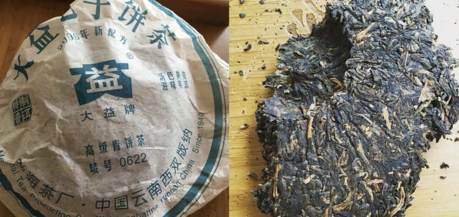
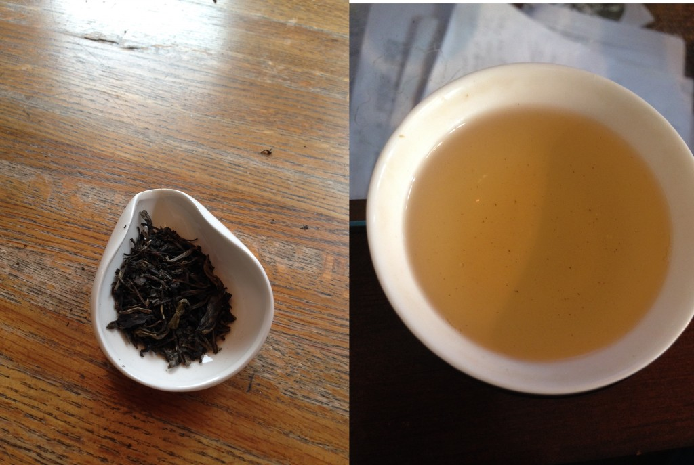
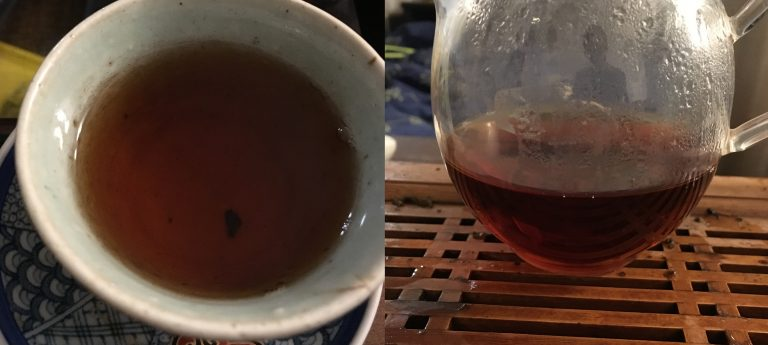
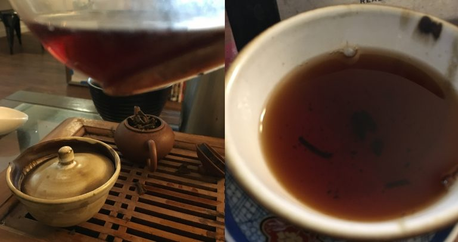

https://teadb.org/puerh-for-beginners/

# Pu'erh for Beginners

---

Written by
James

in
Aged Pu'erh, Raw Pu'erh, Ripe Pu'erh, Tea Learning
January 28, 2017

The pu'erh compendium and vendor guide were written nearly three years ago and the content on this site has become increasingly pu'erh focused. 
This is fine for those of us already living in a house made out of bamboo tongs, but there's a large chunk of people that are very fresh and new to the hobby.

2006 Dayi 0622 Mini-Cake. Semi-aged.

## What Should I Buy? The Big Types of Pu'erh

Pu'erh is a very diverse category of tea that can be divided, subdivided, and subdivided again into many categories. The aging, storage, region, leaf grade, maker, etc. 
It can all be a bit overwhelming for anyone just starting. Advice for newcomers? Ignore all the noise and keep everything as simple as possible. Here are the big categories of pu'erh. 
When you're ordering for the first time pick a couple samples from each category to try.
1. Young Raw Pu'erh
2. Raw Pu'erh with some Age
3. Ripe Pu'erh

### Young Raw Pu'erh

Raw pu'erh is the original type of pu'erh. Young raw pu'erh makes up a huge part of western facing vendors catalog and marketing. This gives people plenty of options.

What qualifies as young? The answer is ambiguous, but choose something made in the last two years.

How the hell do I brew this? Good question. Young raw pu'erh benefits from using gong-fu brewing (higher leaf, low steep time). It's not a tea that should be brewed black tea style. 
Use a ratio of 1g:15-20ml and brew for just a few seconds. From here you can adjust the parameters to your liking. There's also various opinions on the “correct” temperature to use for young pu'erh. 
If you're drinking for your own enjoyment and want to avoid bitterness and astringency, try brewing at around 190. 
If you like your tea strong or are trying to evaluate the full contents of it, hit it with a boil and moderate the strength through steep time.

What color does this brew? Usually a light yellow.

    Young pu'erh really wasn't consumed young until the pu'erh boom in the 1990s. Production, processing, the environment have all changed a lot over the years. 
    In today's modern Jianghu world many people legitimately enjoy the taste of young pu'erh.

Young Pu'erh.

### Raw Pu'erh with Age

Historically speaking, this is closer to how pu'erh was consumed. You should try to follow two goals here when selecting stuff:
1. Choose something that's at least 7-10 years old, preferably 10+.
2. Choose something that has been stored in a humid climate (i.e. Guangdong or Menghai). Drier stored teas (i.e. Kunming) will have a different profile.

What qualifies as aged pu'erh? This really depends on who you ask and the storage. A tea can develop much quicker and differently depending on the conditions it's stored in. 
Things around this range 7-20 years should show their age and generally fall into the semi-aged category.

How the hell do I brew this? Same as above, except don't use cooler water.

What color does this brew? It should get darker as it matures. Look for an orangeish or red color depending on the age and storage of the specific tea.

Is this more expensive than young pu'erh? Not necessarily.

Aged Raw Pu'erh.

### Ripe Pu'erh

Created in the 1970s as a way to mimic aged pu'erh, ripe pu'erh is largely a wholly different thing than raw pu'erh (young or aged). 
Ripe pu'erh basically has an extra step to its processing where it is introduced to high heat and humidity for a certain period to speed up its fermentation. 
It's then usually left to air out before being sold.

How the hell do I brew this? There's more flexibility for this tea. Boiling water is typically used. You can experiment with the gong-fu parameters listed above. 
Ripe pu'erh will also generally be less finicky in larger vessels or with more steep time than the other two primary categories of pu'erh.

Is this more expensive than the other types of pu'erh? Except in special cases it's usually cheaper than both young raw and raw with age.

What color does this brew? Dark. Red or black.

Does ripe pu'erh age? Yes, but the ripening process is intended to create a more drinkable product quickly. Changes will in general be less dynamic than for raw pu'erh.

Ripe Pu'erh.
## Where Should I Buy From?

Buy from a pu'erh specialist. Pu'erh really needs to be treated as a specialty type of tea. Don't worry about sampling from multiple vendors in the beginning. 
Pick one to start and buy 2-3 samples from each category above. Buy from one of these places:
1. Yunnan Sourcing (US domestic)
2. White2Tea
3. Bana Tea (if US is preferred)
4. Crimson Lotus Tea (if US is preferred)

## How Much Should I Spend?

You should be able to pickup a crash course of samples for around $40-50 minimum. This $ amount provides a good variety of samples that will take a couple weeks to go through. 
If you're OK with committing and spending more, $100 will get you an even better intro.

## Common Mistakes
1. If you're serious about trying pu'erh. DO NOT BUY LOCAL. Don't buy from Chinatown. Don't buy from Teavana. Don't buy from your local teashop.
Pu'erh is a specialty tea and needs to be treated differently than normal sorts of tea. You might get lucky but in all likelihood will end up with crap that acts as a deterrent rather than a gateway.

2. Pu'erh can inspire collection. Do not worry or obsess about owning or buying whole pieces. While it might seem like a lot of money to spend on not a lot of tea you will learn far more from from a two $15 25gsample than a $30 cake. In the end it's better to avoid the allure of mini-cakes and mini-tuos from generalists. Buy samples and learn!

https://www.instagram.com/p/BI7tKBmgs-v/?taken-by=teadborg

### ---RaTea Dev update, 2026---

Bana has been bought out in 2026 and some of their selection has been trimmed. CLT is not preferred anymore. W2T is an ok spot for ripe or young sheng. YS is an ok spot for ripe. 
QuicheTeas and TeasWeLike are good for all types of puerh. 
ListeningToLeaves is a good spot for the very pricy boutique style puerh. 
BYH is the best spot to start with boutique offerings imo, though this commits at least $100ish in tea.

---
End of file